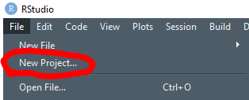
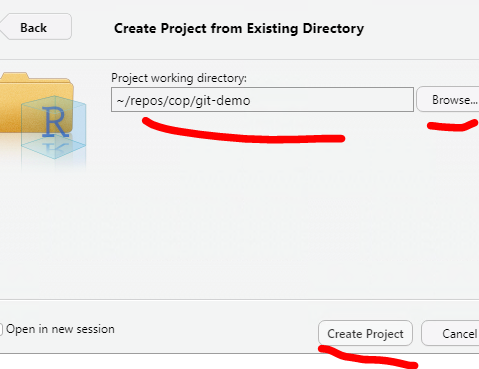
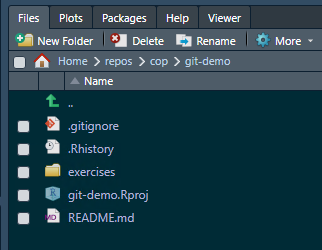
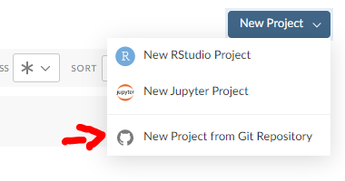

# Overview
This page is intended as a starting point for R users who are new to using Git. It shows you the basic commands and the workflow to use Git on your own, in conjunction with using RStudio desktop or RStudio Cloud. 

To use Git as a team you should complete this section and the following section on [using git collaboratively](02_using-git-collaboratively.md).

# What is version control?
Version control is the practice of tracking and managing any changes on project's code, files or folders over time. This allows you to observe a detailed history of the changes made and enables your team members to collaborate on the same project.
 
In Git, each user has the entire repository (project's working directory) on their computer (offline), hence, they can work separately offline until they opt to push their updated version of the code to the remote (online) central repository. 

Remote repositories are versions of your project that are hosted on an online Version Control System. In NHS Digital, we store that in GitLab, site for internal users (GitHub, site for the public).

## Why should I care?
Using version control is one of the fundamental skills needed by analysts to produce high-quality analytical outputs. Git is **the standard** for tracking code over time and is the way that NHSD has chosen. While Git has a steep initial learning curve, the payoff is huge and so we strongly recommend taking the time to learn this as a team.

The benefits of using version control include:

* Understanding what happened in the past. E.g., what did we change last time we ran this code
* Restoring previous versions
* Tracking changes - avoid accidentally breaking code
* The ability to review someone's changes and to leave comments
* The ability to plan development work more effectively through being able to assign small, discrete changes
* Avoid code being hidden away on someone's machine
* The ability to set up an approval process for changes
* The ability to make changes without breaking anything - through running automated tests
* The ability to try out experiments without the risk of breaking your main code

# Glossary of terms
Here's a list of commonly used Git terms, that will help you understand the technical jargon mentioned in the next sections:
* [Git terminology](https://www.javatpoint.com/git-terminology)

# Common basic commands:
Below is a list of common commands for reference. We only list basic commands here. This is just to flag to you that these commands exist. 

* [Git commands cheatsheet](https://training.github.com/downloads/github-git-cheat-sheet/)

* Create a new Git repo locally: `git init`. The init command is short for "initialise", it's the command that will do all of the initial setup of a repository. The folder needs to actually exist before we can create a new repository with Git.
 
* Clone an existing Git Repository: `git clone <url>`. Happens only once, when you need to create a local copy of a Git repository.

* Check whether any files have changed in a repository: `git status`. It lists the files you've changed and those you still need to add or commit. It displays the state of the working directory and the staging area. It lets you see which changes have been staged, which haven't, and which files aren't being tracked by Git. Status output does not show you any information regarding the committed project history.

* Create and switch to a new branch: `git checkout -b <your branch name>`.

* Check out a branch: `git checkout <your branch name.`. Check out an existing new branch.

* Add file contents/stages changes from the working directory to the index: `git add <filename>` or `git add .`

* Commit staged files with a message: `git commit -m "<message>"`. Committing changes in this way captures a snapshot of the project's currently staged changes. Committed snapshots can be thought of as “safe” versions of a project

* Update your branch with the online/remote branch info: `git pull`. Pulls the latest changes from the repository, only affects the current active branch you’re in.

* Check the history of commits: `git log`. 
 
* Show unstaged changes between your index and working directory: `git diff`. Press `Q` to exit the diff log.

* Ignore files: `.gitignore file`. This file specifies untracked files that Git should ignore such as the sensitive information related to security or the data itself. Files already tracked by Git are not affected.

* Display a list of all branches in the repository: `git branch -a`.

* Delete a local branch: `git branch -D <your branch name>`.

# Setup for Git Basics exercise
## Creating your access token on GitHub
There is an excellent step by step guide on [How to Create your Access Token](https://docs.github.com/en/authentication/keeping-your-account-and-data-secure/creating-a-personal-access-token) on GitHub by GitHub Docs. The process is exactly the same as GitLab (see [credentials for GitLab](https://github.com/NHSDigital/rap-community-of-practice/blob/main/development-approach/01_intro-to-git.md#creating-your-access-token)), simply input your GitHub username and access token to verify your credentials.

When selecting the access token's scope, the default options that should be ticked are: repo, admin:repo_hook and delete_repo.

**Do not** forget to paste/save your access token somewhere safe as you won't be able to access it again. 

### Video: How to create an access token on GitHub
Here's a video on how to create the access token on GitHub: [Access token video](https://vimeo.com/678170438)

### HTTPS vs SSH key
You might come across SSH protocol keys, as it is essentially another option to create a password and verify your credentials. This section on [HTTPS vs SSH](https://happygitwithr.com/https-pat.html#https-vs-ssh) protocol options of setting up credentials on GitHub explains the differences between these two options. There are pros and cons for both, we would recommend the HTTPS option for Git beginners.

## Troubleshooting credentials
You might see something like this at any point:
```
remote: HTTP Basic: Access denied
remote: You must use a personal access with 'read_repository or 'write_repository' scope for Git over HTTP.
remote: You can generate one at https:// etc etc...
remote: Authentication failed for 'repository address you're attempting to git clone'
```
This can mean a number of things: either your access token has expired or you have entered the wrong access token for your password (or username even). If your access token has expired or about to expire, you can check by going to Gitlab Profile -> Preferences -> Access Tokens then scroll all the way down and see if there’s an Active Access Token and check the expiration date. 
* These steps will help you fix your access to the repository:

1. To fix this we need to create a new access token (don’t assign a date this time, so it will never expire).

2. In the command terminal type ```git pull -v``` (v stands for verification). This should prompt a new Git credentials window.

* If you don't have an existing repository, and can't do step 2, then:

1. In the terminal type ```git clone <git repo's copied clone url>``` but with the new credentials included in the URL, so:
```
C:\My_documents>git clone https://<username>:<password>@<domain>/example.git 
```
So, in my case it would be:
```
C:\My_documents>git clone https://<username>:<MY_NEW_ACCESS_TOKEN>@<domain>/example.git 
```
# Exercises 1 - 6: Accessing a Git repository, creating a branch, adding a new file, uploading your changes to GitHub
**Getting started** - tasks 1 and 2 will be relevant only when accessing a repository for the **first time**.

### Video: Solution to exercises 1 - 6 (Using RStudio Desktop)
Here's the video solution to exercises 1-6: [Video exercises solution](https://vimeo.com/678172959)

## Using RStudio Desktop

### 1. Creating your local Git repository folder

i. Open a Command terminal. This can be any terminal, Anaconda Prompt or Git Bash etc. To access the terminal, click the Search option on the Windows toolbar and type "Anaconda Prompt" and open it. The file directory address that's displayed in the terminal will usually be the default top level C drive address or something similar.
```
(base) C:\Windows\system32>
```
ii. Create a folder in your local directory, this is where the GitHub (remote) repository will be copied/downloaded to. In the Anaconda Prompt terminal type ```cd <windows explorer repo folder address you just created>```, ```cd``` stands for Change Directory, and what this means is that the default terminal address will be directed to the new directory, the new folder address. Any Git commands applied in the terminal will apply to the current directory.
```
(base) C:\Windows\system32>cd C:\Users\<username>\Documents\my_project_folder\demo
(base) C:\Users\<username>\Documents\my_project_folder\demo>
```
### 2. Git clone (copy a GitHub repository)

> If you're using GitLab instead of GitHub, these [steps](https://github.com/NHSDigital/rap-community-of-practice/blob/main/development-approach/01_intro-to-git.md#2-git-clone-copydownload-a-gitlab-repository) will help you set up.

i. The repository's clone URL will be on the GitHub repository's main page (see image below).


ii. Type ```git clone <repository's clone url>``` the git-demo repository using your local terminal. Enter your credentials when prompted (GitHub username and access token for the password.)
```
(base) C:\Users\<username>\Documents\my_project_folder\demo>git clone <paste the repo url address from the image above> 
```
iii. Type ```cd <windows explorer repo folder address>``` (open the newly downloaded git folder) in the terminal to assign the root level of the directory to the top level of the repository. This because the terminal is assigned to the folder containing the Git repository, not the folder that IS the Git repository.

iv. Type ```git status``` in the terminal. You should see the this message:


### 3. Create and switch to a new branch

Notice how in the image above, the first line says "On branch main". In Git, **"main"** is a naming convention for a branch. After cloning (downloading) a project from a remote server, the resulting local repository has a single local branch: the so-called "main" branch. This means that "main" can be seen as a repository's "default" branch. The main branch should always be locked, to protect the main build of your working code and/or documentation. To add new code/documentation/make any edits to the main branch, you need to submit a [pull request](01_intro-to-git.md#general-how-to-submit-a-pull-request).

**"Branch"** is another word for "version". Usually when developing a document or slides for a presentation, we could have numerous versions of the same slides, with small or major differences. By using different branches (or versions) of the same code, we can safely work and test without breaking the publication code, that resides in the default master branch of the repository.

i. To create a **new branch**, head over to GitHub, on the repository's main page, same webpage we used to find the Git clone repository's URL. To create a new branch on GitHub simply click on the "main" button underneath your repository's title.


ii. Once in the dropdown menu, type in the branch's new name and hit Enter. You should now have a new branch, copy of the main branch.


iii. In the above image notice how it points the original branch we are copying from, in grey letters: from "main". If you wish to create a new branch, which will be a copy from a different branch to "main", then set the repository to the branch you wish to copy from and then repeat steps i. and ii.

iv. Back to the terminal (e.g. Command Prompt/Anaconda Prompt/Git Bash etc.), type `git branch -a` to view a list of all available branches existing in the repository. The branches that contain the `remote/` path are the branches online, on GitHub. Have a look at the list. You will notice your new branch is not there yet. To update your local master branch with all the lastest updates on Gitlab, type ```git pull```. Type `git branch -a` and you should see your branch available in the list now.

v. To start working on your branch and select, type in the terminal `git checkout <your branch name>`.

vi. Type ```git status``` and this way you can confirm that you are in a new branch. Git will display a message showing the current branch name and the current branch's information.


_**Reminder:** any changes you make while in the main branch won't be uploaded to GitHub, as the main branch is protected and locked, so make sure you are in your own working branch! You can confirm this with step vi. above._

#### Branch naming strategy

Following an agreed naming convention will make it much easier to keep the team's work organised. We follow use this approach:

    <project_id>_<initials>_<ticket_number>_<brief-description>

Here the project_id refers to our project ID in confluence (DS218). The initials are from my name. The ticket number refers to the jira ticket number. 
E.g.:

    DS218_CQ_167_Add-field-definitions

Naming branches in this way helps to make it very clear what change should be happening in the branch. Sometimes code review will reveal that a branch that was intended to make one specific change in fact makes several changes. This should be avoided and the code review should reject the additional changes.

### 4. Add a new file

By adding a new file to the project, you can avoid conflicts as each analyst will create and upload their own file.

There are many ways to add a new file to your branch. One way is to upload a file directly to your branch on GitHub. 

The easiest way is to simply create the file (any type of file) in your working directory, while in your branch. You can also copy a file from another directory. The file you create or copy can be any type of file.

For this exercise, create a file while in RStudio, with simply right-clicking on the repository's folder and then selecting the Create New File option:

* To view and edit the repository's folders and files in RStudio:
    1. Open RStudio
    2. On the top toolbar go File -> New Project, this will open a Create New Project dialogue.

    

    3. In the Create New Project dialogue, select existing directory (since we have already cloned the GitHub repository to your local machine and have a folder) and in Location select the Open Folder icon to select the existing folder repository and click Create Project.

    

    4. You should be able to see the project structure on the lower right hand side windown as it is displayed on GitHub.
    
    

    5. On the top toolbar select File -> New File -> Rscript and save the file somewhere in your repository (don't forget to name your Rscipt!).
    6. Add something into that file, a simple print statement or a comment.
    7. Save it on RStudio.

**Tip:** RStudio will have created a .Rproj/.Rhistory configuration file when you create an R project. To avoid having this uploaded to GitHub, a .gitignore file that contains those file formats will automatically block them from being pushed to the repository. See [.gitignore](01_intro_to_git.md#general-the-gitignore-file) for more information.

### 5. Commit your changes (follow standard Git command workflow)

In the Anaconda Prompt (or any terminal of your choice) type the following. I suggest you read through the git messages displayed after each command entered in the terminal, to familiarise yourself with the logic.

i. Type ```git status``` to see the modifications that haven't been staged yet (in red colour).

ii. Type ```git add <filename>``` to stage your changes. Or ```git add .``` to simply stage all changes automatically (use with caution).

iii. Type ```git status``` to see the file modifications now have a green colour. This means that Git add was succesfull.

iv. Type ```git commit -m "your commit message here"``` to commit these changes.

v. Type ```git status``` to view the status of your repo. There should be no modifications visible (or colours!).

vi. Type ```git push```. This command will upload all your commited changes to GitHub.

### 6. Check the repository on GitHub to view the changes updated
Simply head over to GitHub, and the repository page on GitHub, select your branch and compare the changes between your branch and the master branch.

## Using RStudio Cloud
To use GitHub with RStudio Cloud and not RStudio desktop, first create an account with RStudio Cloud. RStudio Cloud has a detailed [guide](https://rstudio.cloud/learn/guide) on how to create projects, how to manage workspaces within the Cloud, how to handle permissions and teaching spaces.

* To create a project from GitHub, select the "Your Workspace" option on the left hand side once in RStudio Cloud and select New Project on the far right of the top toolbar, in the Your Projects space.



* This will open a new dialogue that will ask for the Git Repository URL, this is the URL you copy, as described in [Step 2](01_intro_to_git.md#2-git-clone-copy-a-github-repository) of this guide. 
* You will be prompted to enter your username (GitHub username) and your password, which is the access token created from the [Create Access token step](01_intro_to_git.md#creating-your-access-token-on-github).
* Once the Git repository is deployed, you will notice the repository file structure on the right hand side panel.


* Steps [3](01_intro_to_git.md#3-create-and-switch-to-a-new-branch), [4](01_intro_to_git.md#4-add-a-new-file) and [5](01_intro_to_git.md#5-commit-your-changes-follow-basic-git-command-workflow) will be the same, the only change being that instead of using your local terminal to input Git commands, you will be using the RStudio Cloud built-in terminal.


# General: How to submit a pull request

**Pull request (PR)** is the application you submit on the GitHub repository, to announce to other collaborators working on the repository that you have a new change ready to be merged/part of the main build, the main branch of the repository. Then, either your collaborators or someone you assign will review the change and the branch you have been working on to determine whether the change is ready to be merged with the main branch. The equivalent term for GitLab users is Merge Request (MR).

To submit a pull request:

1. Simply head over to GitHub and to the respective repository

2. Select Pull requests on the top bar menu. 

3. Either select New Pull Request (big green button) on the right hand side or select Compare & pull request if you recently pushed new changes to the branch.

4. Base ref will default to the main branch, head ref will be the branch you wish to merge with the main branch. You can change any of these options, there will be occasions you won't always aim to merge every branch to the main branch.

5. Click Create Pull Request.

6. Fill out any information related to the Pull request, title, description, any comments. On the rigth hand side you can assign yourself as the Assignee, and assign someone in your team to be the Reviewer. Then, select Create Pull Request.

# General: How to accept a pull request

Once you are assigned the pull request's reviewer, you should receive an email notification from GitHub with a link to the pull request's webpage. You can also view any active pull requests by clicking on Pull Requests on the top bar menu.


On the Pull request page, there are four tabs: Conversation, Commits, Checks and Files changed:

### Conversation

**Conversation** is the main pull request page. It contains the pull request's description, timeline and comments left by the assignee or reviewer. To merge a pull request you have 3 presented options:

* Merge pull request: this will keep all commits history of the source branch and will be added to the target branch. Creates a symbolic commit.
* Squash and merge: ticking this will merge the history of commits for the source branch into one commit. This can be useful when the pull request is not a major update and you don't want your repository's history of commits to contain commits with messages such as "fixed typo", "replaced incorrectly placed image". Creates a symbolic commit.
* Rebase and merge: adds all source branch commits in front of the target branch's commits. Does not create a symbolic commit.

### Commits

**Commits** tab displays a history of the pull request's commits. So for example, if the reviewer decides that minor adjustments are required and the assignee pushes these changes to Gitlab, then these commits will be captured in this tab.

### Files changes

**Files changed** tab, here you can see all the new changes in the pull request's source branch. You can also opt for a side-by-side comparison, and see line-by-line how the master version and new branch version compare. You can also leave comments on each file's line, which will also be recorded in the Conversation tab's timeline.

### Checks

**Checks** is part of the GitHub Actions functionality, which enchances your code review processes with apps and automated reviewing checks. This is inactive on default.

If you are happy to merge the two branches, then select the type of Pull Request you wish to apply and the pull request should be completed in a few seconds.

# General: How to update your local main branch to the latest remote main version on GitHub/GitLab

1. Open the Anaconda Prompt terminal or Git Bash or any other terminal you wish to use. This can be accessed by typing, for example Anaconda Prompt, in the search bar, after opening the search icon on your Windows toolbar.

2. Type ```cd <paste your work directory address>``` in the terminal to switch to your working directory. This is where the Git repository is cloned/copied/downloaded to, on your local machine (or RDS environment or any environment you're using). This will cause the default terminal address to be directed at the new directory. (see [Git Clone instructions above](01_intro-to-git.md#3-git-clone-copydownload-a-gitlab-repository)  for more info)

3. Type ```git status``` in the terminal to ensure that ```ii``` happened successfully and you are on the default main branch. You should see this message: 


4. Type ```git pull``` to update your local main branch with the latest version of the remote/online GitHub main branch. This might take a few seconds.

(Optional) 5. If you're in a different branch and not the main branch, then type in the terminal ```git checkout main``` and then ```git status``` to confirm you are on the main branch.

# General: the .gitignore file
.gitignore is a text file that contains file extensions and directories' paths that we wish Git to ignore. For example, we have created a repository on GitHub that should never contain any sensitive data. To ensure this, in the repository's .gitignore file we will include ```.csv```, `.xlsx` or any other file format that can contain data.

GitHub has a .gitignore [template](https://github.com/github/gitignore/blob/main/R.gitignore) available to analysts and developers to use in their projects. Notice how in the template, line 22 contain RStudio project settings, which are configuration files created by RStudio when you first open your repository as an RStudio project. Sometimes these configuration files can contain information you don't want to publish on GitHub/GitLab, thus by including them in the .gitignore file you are ensuring that these files will never leave your local machine.

# External links
* [GitHub Docs - Pull requests](https://docs.github.com/en/pull-requests)
