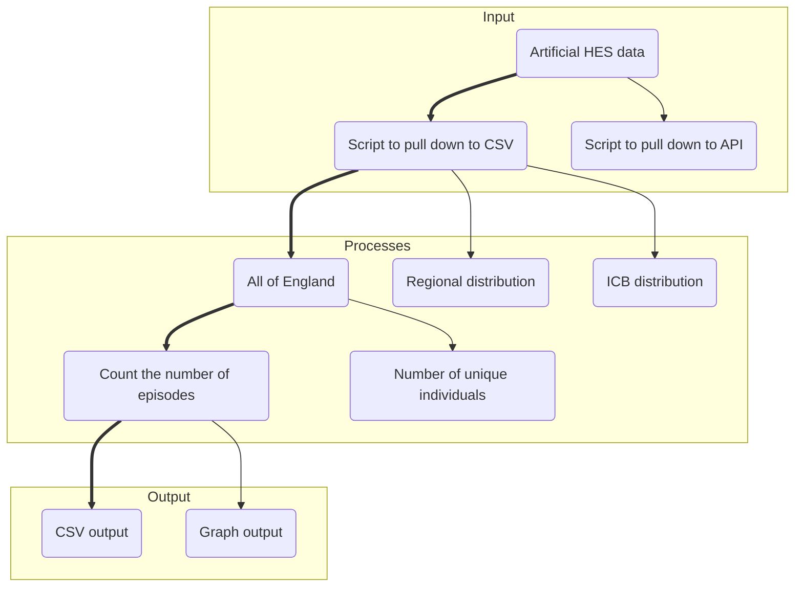
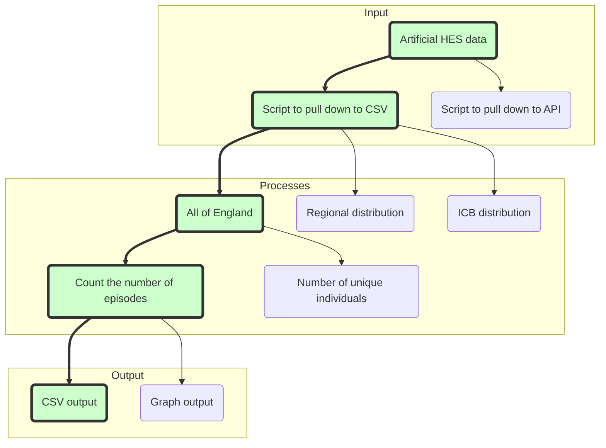
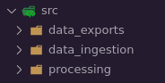
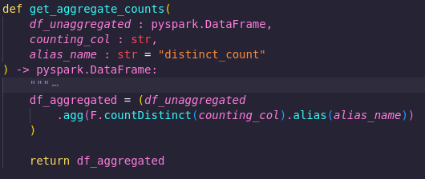

#

!!! tip "TLDR"
    - This is an [example of a pipeline](https://github.com/NHSDigital/RAP_example_pipeline_python) made in Python with RAP principles in mind
    - It was made using our recommended approach - including process mapping, creating a thin slice
    - You can download it and run it yourself!

## Introduction

What does a working pipeline based on RAP principles actually look like? How is it structured? 

There’s a lot of great guidance on this site and elsewhere around how to [map our your process](https://nhsdigital.github.io/rap-community-of-practice/implementing_RAP/process_mapping/), [create a "thin slice"](https://nhsdigital.github.io/rap-community-of-practice/our_RAP_service/thin-slice-strategy/), and write [high quality](https://nhsdigital.github.io/rap-community-of-practice/implementing_RAP/coding-best-practice/), [version controlled](https://nhsdigital.github.io/rap-community-of-practice/training_resources/git/introduction-to-git/) code.

But a picture (or a codebase) tells a thousand words, and it can be really useful to see good practices put into action in an actual project. While we have a [RAP package template](https://github.com/NHSDigital/rap-package-template) that you can use as a base for your own project, this doesn’t show a fully armed and operational pipeline.

That’s where the [RAP example pipeline (python version)](https://github.com/NHSDigital/RAP_example_pipeline_python) comes in! It's a simple pipeline that performs some aggregations on [artificial HES data](https://digital.nhs.uk/services/artificial-data) - and you can download and run it yourself!

Read on to find out step-by-step how we made this pipeline…

## Project Plan

In this project, we decided to use the artificial HES data, as it’s freely available and replicates data that's actually in use by the NHS.
Our plan was to download one financial year’s data, perform some aggregations, and save the results as new files. Nice and simple.

Since we were building this example pipeline from scratch, rather than RAPifying an existing one, there was no existing process we needed to map out. But we did create a map for the new process.

## The Thin Slice

Once you’ve got a process map in place, we recommend deciding on a ["thin slice"](https://nhsdigital.github.io/rap-community-of-practice/our_RAP_service/thin-slice-strategy/). This is an end-to-end slice of the pipeline that you can build first, and then expand on – for example, create one output file, produce one statistic, get the output for one Trust, etc.

In this example we opted to count the number of hospital episodes in the HES data file.

To do this, we’d have to get several key pieces of the puzzle in place – getting the data, performing the aggregations, and exporting the results. This makes it a good skeleton to expand upon if we needed to add further analysis in the future.

## Project Structure

We used the RAP template as the base structure for the pipeline which breaks the project into three stages, which are each represented by subfolders of the `src` folder:

* data_ingestion
* processing
* data_exports

You can read more about the project's structure in its [readme](https://github.com/NHSDigital/RAP_example_pipeline_python/blob/main/README.md), and there's more general advice in our [project and package structuring](https://nhsdigital.github.io/rap-community-of-practice/training_resources/python/project-structure-and-packaging/) guide.

## The RAP Approach

There are a few points in the pipeline where you can see [RAP principles](https://nhsdigital.github.io/rap-community-of-practice/introduction_to_RAP/levels_of_RAP/) in action…

### Open Source Tools

We used [open source tools](https://nhsdigital.github.io/rap-community-of-practice/introduction_to_RAP/what-is-open-source/), namely Python and Spark, to create the pipeline. This means that anyone can download the pipeline, run it, and get the same outputs we did. 

If we’d used something like SAS, or SSMS, then only people who already have access to these tools would be able to run the process, making it less reproducible.

### Loose Coupling

Loose coupling means two components of a process have a low level of dependence on each other - they are essentially independent.

Tight coupling means two components have a high degree of dependence on each other – which includes things like:

* one must directly follow the other for the process to work
* there are highly specific requirements for what the inputs and outputs need to be
* a change to one component requires a change in the other

In RAP we aim for loose coupling – modular components that can act independently as much as possible. 

Here’s an example of loose coupling in this pipeline. 

In `src/data_ingestion`, we have a function called `download_zip_from_url`. This function grabs a ZIP file from a specified URL, downloads it, and extracts the contents to a specified location.

In `src/reading_data`, we have a function called `load_csv_into_spark_data_frame`, This function grabs a CSV from a given file path, and creates a Spark dataframe from it.

These two functions are loosely coupled. The first function doesn’t "care" what you do with the CSV after it has been downloaded and unzipped. It's a single, independent process that just does its own thing. And the second function doesn’t care where the CSV file came from - it just finds it and reads it. 

Because these functions loosely coupled, you can more easily lift them out of this project and reuse them elsewhere.

By writing your code this way, you develop a library of functions that you can reuse, saving you time creating and testing new functions in the future.

It also makes it easier for you to reuse other people’s code. For example, perhaps you have a better function for downloading and extracting a zip file. If so, we could easily plug your function right into this code. 

## Reproducibility through parameterisation

Another way we increase reusability in this pipeline is by using parameters in functions. 

Now, some people will tell you that the ideal number of parameters for a function is zero. There is some truth to this - the fewer parameters functions have, the easier they are to use and understand - generally speaking.

However, if you stick too hard and fast to this rule, then your gain in simplicity will come at the cost of reproducibility.

For example...

In `src/processing/aggregate_counts.py` we have a function called `get_aggregate_counts`. It takes a parameter called `counting_col`, as well as one called `alias_name`, and returns a new dataframe containing the distinct count of that column, with the specified alias. 

In the thin slice of this pipeline, we wanted to get the distinct count of the `epikey` column. So why not just make a function called `get_distinct_epikey_count`? See below:

That would certainly be a nice, simple function with a clear, single purpose. However, it would be tightly coupled to this process. It requires a dataframe with a column called 'epikey' as its input - otherwise it won't work.

That limits reusability - we'd couldn't use this function in other projects unless they need that exact aggregation.

Also, what if later in this project we decided we wanted to count ICD codes, or hospital codes, or something else? We’d have to write a whole new function and a test for each one! And then if we wanted to modify this function in some way, we’d have to make that same modification to multiple functions, and perhaps update all their tests, too.

That could get time consuming!

But by adding this `counting_col` parameter, we solve all these problems, as it enables us to get the distinct count of any column using just this one function. We can then reuse it more easily within this project and others.

You can find more general tips on functions in the [Python function guide](https://nhsdigital.github.io/rap-community-of-practice/training_resources/python/python-functions/).

## Have a go!

And now over to you - why not try running the [example pipeline](https://github.com/NHSDigital/RAP_example_pipeline_python) and seeing what results you get? The full instructions are in the [readme](https://github.com/NHSDigital/RAP_example_pipeline_python/blob/main/README.md).

Once you get it going, look at the process map and try expanding upon the thin slice. (hint: there’s a function in `src/processing` that hasn’t been used yet, but might be useful…). As you do this, think about if there are any places you could apply the methods described above in your own projects.

As of course, maybe you'll see a way the example pipeline might be improved. If so, let us know!
