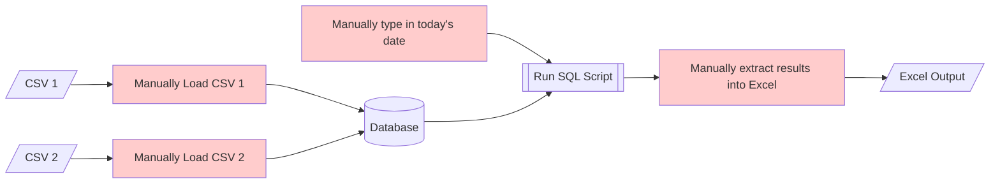
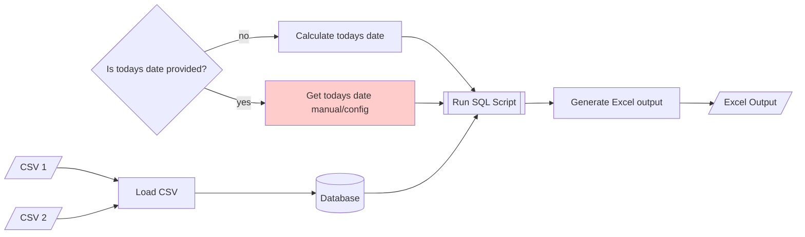

#

## How to Describe your Processes

!!! tip "TLDR"
    - **A picture speaks a thousand words** - it's a great way of describing your process
    - Go through your process, identifying each step and map it out
    - There are loads of tools you can do this in,  such as [Miro][8], Visio, [Draw.io][9], [LucidChart][10], or even PowerPoint
    - Some tools, might allow you to work with your colleagues in real-time, making collaboration easier
    - [here is a nice guide which explains how the symbols should be used][5]
    - Don't just map out what you currently have - start moving those post-its around to improve it!

??? question "Why should we care?"
    - Process documents can be dry and difficult to follow - a picture can make a process much clearer
    - Mapping out a process can highlight redundant areas, showing you where quick wins can be made when improving it
    - It can allow new or less technical team members to get up to speed and feel a part of the RAP process.

??? success "Pre-requisites"
    * Some information on what someone might need to be familiar with before they can use this page

    |Pre-requisite | Importance | Note |
    |--------------|------------|------|
    |**None!**||Anyone can do this - it's the first thing you should do when starting some RAP work|

Before we dive in, **here is a fun example of a process map** from [XKCD](https://imgs.xkcd.com/comics/tech_support_cheat_sheet.png):

{ width="450" } 

RAP deals with improving processes, but before doing any programming, it really helps to understand what we already have; **a great process map really helps with this!**

Be the envy of your peers, and the talk of the time, by making a visual journey through your process, and you might even come across some quick win improvements on the way!

## How to map a process

There is a nice guide to process mapping [here][1], however in brief:

- Write down your process (or if you've got a process document already, lucky you!)
- Split this into steps.
    - it can be helpful not to go too granular initially; keep it high level - we don't need "click this button, then this button, etc."
    - instead, write what is intended, not how it is implemented, e.g. step 1: load the data into the database
- Use [flowchart symbols][5] (or some other way if you prefer) to describe what each step is

You can then take this further by analysing the process map and identifying repeated or manual steps - RAP can help with this!

### Example (using Markdown and Mermaid)

Let's imagine we had a simple process: Analysts get given a CSV, which they load into a SQL server, enter today's date, after which they run the SQL script and take the output into Excel. Splitting this into the steps:

- Take two CSVs and load them each into the database manually. 
- Manually type in today's date, then run a SQL script that produces some analytical output in a table. 
- Manually extract this into an Excel spreadsheet.

We can then transform this into a flow chart:
(this uses [Mermaid][2])

## Using a process map to find improvements

Because a flowchart lays out the process clearly, it can make it easier to find things to improve, such as:
- redunant steps or similar tasks being done several times
- manual steps
- pull out complex tasks into "sub tasks" -> which might also need flow charts!
    - this can also help you structure your code and decide when to break the code into different files

Following on from our example above:
- we can see a few manual steps - could these be automated?
- There are two tasks which "load CSVs" - could we make one automated process which can be run twice to load both? Or even just one task which loads both?

Considering this, we could imagine an improved process diagram, which might then form the basis of our RAP work:

We can see above that we made a new "load CSV" task and that we changed many manual tasks to sound more automated "Generate" rather than make.
!!! note 
    [perhaps you could use Python][3] to automate the manual tasks?

We also added a bit of logic, where the process will calculate today's date if it is not given it - so we haven't removed every manual step (someone might still need to "give" the correct date to the process) - but we've managed to [minimise the manual steps][4].

## Common standards

Whatever makes sense to your team is the crucial part - however if you want it to make sense to other people too, there are some common flow chart standards you can follow.

[Unified Modelling Language][6] is an ISO standard which is widely used, and [here is a nice guide which explains how the symbols should be used][5].

## Tools

We won't go into tools so much here, as the right tool for you often depends on what is easiest to use in your organisation.

There are loads of tools for process mapping though, and some options be [Miro][8], Visio, [Draw.io][9], [LucidChart][10], or even PowerPoint.

## Where now?

- You've mapped your process, so perhaps consider using the ["thin slice strategy"][7] to get going with RAPifying it?

[1]: https://www.lucidchart.com/pages/process-mapping/how-to-make-a-process-map
[2]: https://squidfunk.github.io/mkdocs-material/reference/diagrams/
[3]: ../training_resources/python/intro-to-python.md
[4]:https://analysisfunction.civilservice.gov.uk/policy-store/reproducible-analytical-pipelines-strategy/#section-12
[5]: https://www.lucidchart.com/pages/process-mapping/process-map-symbols
[6]:https://en.wikipedia.org/wiki/Unified_Modeling_Language
[7]: ../our_RAP_service/thin-slice-strategy.md
[8]:https://miro.com/
[9]:https://app.diagrams.net/
[10]:https://www.lucidchart.com/pages/
