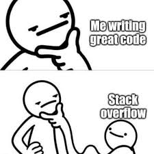

#

Anyone who codes, uses other people's code. Being able to find, adapt, and use code you find online is just a part of the job these days.

In fact - unlike other industries - in the coding world, we _want_ other people to use our work. We love sharing code! This makes for a great support community of programmers online. And of course it's a key [principle of RAP](../../introduction_to_RAP/what_is_RAP.md). 

However, even when open-sourcing their code, developers sometimes put _some_ restrictions on what people can do with it. For example, they might state that you can only use their code in other open-source projects. Or they might require people to document any changes made to the code.

So, if you find some open-source code, how do you know what those restrictions are, if any? How can you tell people what _your_ restrictions are?

That's where **open source software licences** come in.

## What is a software licence?

A software licence is a little bit of legal text telling people what they can and can't do with the code.

There are many different licences, each with their own nuances. There's a nice desciption of them on the [Choose a Licence](https://choosealicense.com/licenses/) website.

## Which licence should I use?

We recommend the MIT Licence. It's a simple and permissive licence, stating people can use the code for anything, as long as the MIT licence is also included whenever the code is reused. It's a Licence to Share!

This type of permissive licence is recommended in the [Goldacre Review](../../introduction_to_RAP/gov-policy-on-rap.md):

>"In our strong view all code whose production is paid for by public funds should be shared as open source code for review, re-use, and iterative improvement under open licenses, such as the MIT Open License; but with a robust and publicly documented exceptions framework using clear prespecified criteria whereby researchers or vendors can request special treatment, where this can be shown to be in the national interest, or provide some other comparable benefit."

So essentially, use MIT unless there's a justifiable reason not to - for example, your code if subject to regulatory requirements. For more information, see the [Analyst X guidance on licences](https://github.com/nhsx/open-source-policy/blob/main/open-source-policy.md#c-licences-and-regulatory-requirements). 

## How do I apply a licence to my code?

If you're using GitHub:

Follow these steps: [Add a license to a repo](https://docs.github.com/en/communities/setting-up-your-project-for-healthy-contributions/adding-a-license-to-a-repository)

If not using GitHub (or want to create a licence manually):

Create a file in the root directory of your repo called "LICENCE" (without a file extension is common, you'll also see "LICENCE.txt" sometimes).

Then paste the text of the licence into that file, which in the case of the MIT licence is:

>Copyright <YEAR\> <COPYRIGHT HOLDER\>
>
>Permission is hereby granted, free of charge, to any person obtaining a copy of this software and associated documentation files (the “Software”), to deal in the Software without restriction, including without limitation the rights to use, copy, modify, merge, publish, distribute, sublicense, and/or sell copies of the Software, and to permit persons to whom the Software is furnished to do so, subject to the following conditions:
>
>The above copyright notice and this permission notice shall be included in all copies or substantial portions of the Software.
>
>THE SOFTWARE IS PROVIDED “AS IS”, WITHOUT WARRANTY OF ANY KIND, EXPRESS OR IMPLIED, INCLUDING BUT NOT LIMITED TO THE WARRANTIES OF MERCHANTABILITY, FITNESS FOR A PARTICULAR PURPOSE AND NONINFRINGEMENT. IN NO EVENT SHALL THE AUTHORS OR COPYRIGHT HOLDERS BE LIABLE FOR ANY CLAIM, DAMAGES OR OTHER LIABILITY, WHETHER IN AN ACTION OF CONTRACT, TORT OR OTHERWISE, ARISING FROM, OUT OF OR IN CONNECTION WITH THE SOFTWARE OR THE USE OR OTHER DEALINGS IN THE SOFTWARE.

Save and commit your change. That's it!