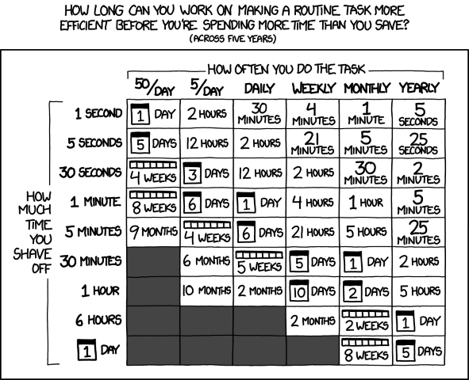

#

!!! tip "TLDR"

    Knowing when to stop coding is important, so time and resources are well-spent. Typically this comes at the [point of diminishing returns][diminishing-returns] when the effort spent outweighs the benefits gained.

    Knowing when to stop coding can help your code be [well-engineered], which can be achieved using the principles of [YAGNI][yagni] (You Ain't Gonna Need This) and [KISS][kiss] (Keep It Simple & Straightforward),  as well as following [Agile practices][agile-practices] as per the [NHS Digital Service Standards][nhs-digital-service-standard]. To ensure your code is well-engineered, ask yourself these questions:

    * Does your code solve your problem?
    * How likely is this thing going to change?
    * What is most important during delivery? Is this feature key or nice to have?
    * Are you introducing new features into the system in a controlled manner, following NHS Digital Service Standards?
    * What is the reason behind your approach - are there simpler alternatives?
    * Is your code, function or pipeline trying to be a Jack of All Trades - can it become less generic and more focused?
    * How simple is it to maintain and build on your code or pipeline?

    [Refactoring][refactoring] is an integral part of the development process and should be done correctly. Work with your team to understand when to refactor your code and what standard you work towards; these standards could be linked to the [Level of RAP][levels-of-rap].

    Finally, it is important to know when to stop writing tests so your code is [well-tested][testing]. Well-tested code is well-engineered, so use similar principles and strategies. Help ensure that your code is well-tested with the following questions:

    * What could a user do wrong?
    * How could an input be wrong?
    * How will your pipeline respond to these scenarios?
    * Do we have tests to cover these scenarios?

## Why should you care about when you should stop coding?

When developing code of any type, it is important to know when to stop, especially when constrained by time or skill demands. When do you stop "improving" your code to handle more features, be more optimised, fit coding standards better, or have greater testing coverage?

Deciding when to stop is a balancing act; if you stop coding too early and release code that is not "complete", it might be:

* Hard for another coder (or your forgetful, future self) to understand and maintain.
* Inefficient and consume unnecessary resources.
* Hard to add new features to.

Understanding when to stop coding can also be important when considering which [level of RAP][levels-of-rap] your team is working towards, especially when working towards Silver and Gold levels of RAP. Knowing which level of RAP your team is working towards will shape your approach to the following concepts and questions.

## The Point of Diminishing Returns

Essentially, the answer comes down to reaching the point of diminishing returns. **The point at which the effort you put into your project outweighs the benefits you get from that effort.** One of these benefits might be the time saved vs the effort of time spent. The webcomic [xkcd][xkcd-comic] has a relevant comic for this case, showing how much time you can work on saving time in the future for it to be worth it.

For example, suppose you wanted to make your inefficient monthly report pipeline more efficient, saving 5 minutes in run time. In that case, for it to be worth it, you need to spend less than 5 hours working on the improvements (assuming you will see those benefits over five years). However, suppose your pipeline is already efficient, and you will only save 5 seconds on your total run time. Then, you will only have 5 minutes to implement improvements for it to be worth it - a tough ask!

!!! note
    The above comic and examples are a simplistic look, best for back-of-the-envelop guestimations. It doesn't account for commonly unappreciated factors such as time saved by not doing rework caused by flawed processes, checking bad outputs, or making future development easier to complete.

However, time savings might not be the only benefit you might get from spending more effort on a project; instead, you could aim for the following:

* Compute savings - If your pipeline runs on cloud compute, this could charge based on the compute used. Making a more compute-efficient pipeline could save time and money. If you're using shared compute, like a SQL server, then more efficient code might impact your colleagues less when you're running some very heavy job.
* Data savings - Some data storage services charge for the amount of data stored or accessed. Reducing the data your pipeline needs could save money. Reading/writing data to/from storage unnecessarily can also be a source of compute inefficiency.
* Risk reductions - This is partly discussed [later](#over-testing-vs-under-testing), but the project you are working on will have a level of acceptable risk, with some projects requiring more effort for a lower level of risk.

## Over-Engineering

**Over-engineering can be when your design or code makes things more complex; instead of simplifying things.** Sometimes, when writing code, we add in unnecessary elements that don't contribute to the problem we are trying to solve, for example:

* Adding code for a future problem, *just in case*
* Adding features that aren't part of the requirements
* Overcomplicating your code instead of relying on a simplified approach without improving efficiency or code quality.

Altogether, this comes back to the point of diminishing returns. Does the benefit of the changes meet or exceed the cost of implementation?

### Avoid adding code for a future problem, *just in case*

The principle of **YAGNI** is beneficial here. YAGNI stands for **"You Ain't Gonna Need It."**

You should only add functionality once it is deemed necessary; adding it before it is required will rarely turn out as a net positive. Requirements can regularly change or be dropped, and your time working on features can be wasted, making deadlines harder to meet.

For example, if you needed to develop a function that could reverse a word, develop a function that did just that. It might be tempting to develop a function that could rearrange any string into any order, *just in case* you needed that functionality in the future.

However, this goes against YAGNI; you don't need that functionality yet. In addition, if you consider how you would add in this functionality *when* it is needed, we realise we can create a new function to rearrange strings and alter our string reversal function to use the rearrange strings function. We wouldn't have benefited from adding the additional functionality in advance.

Another dimension to this problem is worrying too much about how easy it is to extend your code. Try to understand which features of your project you will be extending and building on. If you are using Agile Sprints (discussed in the next section) as your development cycle, review and refine your backlog to build an understanding of what features are coming in the future and what their implementation demands will be.

It is good to have extendable code as it helps avoid problems in the future when refactoring and adding new features. However, if you and your team are confident that a feature will stay the same, then you don't need to make that part of your code very extendable.

To help keep to the YAGNI principle, keep asking yourself these questions about your code:

* **Does your code solve your problem?**
* **How likely is this thing going to change?**

### Avoid adding features that aren't part of the requirements

Firstly, it is important to have clear requirements or objectives for your project. It would help if you had a goal to describe what features are key to include, and therefore, you may not get as distracted implementing something unnecessary or overly complex. Typically, it is the responsibility of the Lead Analyst or Product Owner in your team to provide these details, so discuss the requirements and objectives with them to ensure they are clearly defined, and deadlines are set. Alternatively, you can talk with your team to ensure that the right balance is found.

The [NHS Digital Service Manual Service Standard][nhs-digital-service-standard] has two standards that are applicable here, [**use agile ways of working**][use-agile-ways-of-working] and [**iterate and improve frequently**][iterate-and-improve-frequently].

Agile ways of working can reduce the risk of delivering the wrong thing by encouraging publishing your code and getting in front of users, stakeholders, and peers as soon as possible.

Publishing code:

* facilitates feedback from these groups, helping improve our code quality and select requirements more effectively
* allows the reuse of code, letting you focus only on your team's requirements
* ultimately saves time by reusing snippets of code that will help make your code more efficient

Iteratively implementing your code is helpful when building your pipeline. Choosing one or a number of features, fixes or tests to work on in a [Sprint][sprints] (usually one to two weeks) helps to stably build your pipeline, keep track of what you are building, take into account any requirements changes and squish any bugs as they arise. Your team can constantly review the code and requirements and build on the pipeline.

Avoid issues with this aspect of over-engineering by asking yourself this question about your code and development process:

* **What is most important during delivery? Is this feature key or nice to have?**
* **Are you introducing new features into the system in a controlled manner, following NHS Digital Service Standards?**

### Avoid overcomplicating your code

The principle of **KISS** is beneficial here. KISS can stand for **"Keep It Simple & Straightforward"**. The core thinking of this principle is that most systems work best if they are kept simple rather than made complicated. When developing solutions, consider whether it is a practically simple or unnecessarily complicated way of solving the issue.

Code can quickly become overly complex. This complexity commonly occurs when a feature is reused in multiple situations, pushing it to be more flexible and generic. However, making code too generic can cause it to become:

* Overly complex in its functionality.
* Unclear what the code is doing.
* Bad at doing its job(s), "Jack of All Trades, Master of None".

If you need to make your code complex, mitigate future problems by documenting it well, using [docstrings or comments][documentation] or creating a document explaining how to use the code and its purpose.

The "Straightforward" part of "KISS" refers to how things break and the sophistication available to fix them. Your code should be straightforward to read, understand, and diagnose what is broken with it. Using advanced methods might be tempting, but it will offer a significant hurdle to someone else in the future with less advanced knowledge when they need to repair or improve your solution. If a complicated or advanced method is required, ensure clear documentation is provided to help others (and your future self) get up to speed quicker.

!!! note

    KISS originally meant **"Keep It Simple, Stupid"**, with the Aerospace Engineer Kelly Johnson of the Lockheed Martin Skunk Works being attributed with coining the phrase. The Skunk Works developed experimental and advanced aeroplanes, including the SR-71 Blackbird spy plane and the F-117 Nighthawk stealth bomber.
    
    While sounding like a churlish addition, the "Stupid" part of "KISS" means the same as "Straightforward". Kelly Johnson would task Design Engineers to design their aeroplanes to be repairable under combat conditions in the field by an average mechanic with a standard set of tools.

With analytical pipelines, this concept can apply to both the code design you use in your functions and your overall approach to your pipeline. Your pipeline overall should be kept simple, which helps with transparency, allowing someone unfamiliar with the process to understand what your pipeline does. In addition, if you are looking to release your pipeline as a package, make sure that you don't try to make the *All-Purpose NHS Data Super-Pipeline Package*, but instead a specific pipeline with a specific range of outputs. Focusing on your pipeline's results can help implement the KISS principle.

To help keep to this principle, keep asking yourself these questions about your code and pipeline:

* **What is the reason behind your approach - are there simpler alternatives?**
* **Is your code, function or pipeline trying to be a Jack of All Trades - can it become less generic and more focused?**
* **How straightforward is it to maintain and build on your code or pipeline?**

### Under-Engineering

While talking about Over-Engineering, it is also essential to also consider **Under-Engineering**. Under-Engineering is **where not enough effort has been put into the design and build of the code**, which can be due to a range of factors.

Typically under-engineering occurs in inexperienced or under-resourced development teams. Once they get something working, they stop working on it and either do not realise there are better ways of doing it or are not allowed the time to review the code. This under-engineered code is frequently buggy, overcomplicated, or overly verbose that is hard to maintain and test. Under-engineered can also be referred to as a type of technical debt.

Technical debt, like financial debt, allows you to do something sooner than you might otherwise, but until you pay that debt back, it will accumulate interest with time. Your under-engineered code might be ready sooner, but your familiarity with the code will decrease with time. Your under-engineered code will be much more challenging to maintain than well-engineered code.

### Over-engineering vs Under-engineering

Your focus on avoiding over-engineering and under-engineering will change depending on the project.

Some will demand more focus on avoiding under-engineering, typically where safety is critical to service. Avoiding under-engineering here might mean building a higher safety tolerance level to ensure the service doesn't fail. An example of this could be a publication used to make a critical decision, like which patients should receive an important treatment or vaccine.

Another reason to focus on avoiding under-engineering can be when you know some code will be regularly used, changed, and maintained. A publication published weekly or a pipeline that produces data used in multiple other services might warrant a focus on avoiding under-engineering.

Other projects will demand a focus on avoiding over-engineering or a willingness to accept under-engineering. These usually are projects with a high demand for delivery as soon as possible; a "Just Get It Done" attitude. Tech Startups typically work under "Ship or Sink" environments and will adopt the "Just Get It Done" attitude and care less about avoiding under-engineering. In the world of analytical pipelines, a yearly publication could be under-engineered due to the principle of diminishing returns discussed earlier in this guide. It is run so infrequently time spent on non-critical improvements would be far greater than the time saved.

## Are you refactoring your code when needed?

Refactoring your code is an integral part of the code development process. It is development time when you can improve your code and ensure it is well-engineered. However, it is important to understand when you should be refactoring:

* After you have got your code working initially, you should go back and refactor your code.
  * If you are developing using [Test Driven Development][tdd] after completing the Green process step, you will refactor your code.
  * If you are developing a [thin-slice pipeline][thin-slice-pipeline] after you have replicated the target output and you start iteratively improving the code.
* After a [code review][code-review] and you have received feedback.
* When you are about to add a new feature to the code, go back over the relevant code and see if you can make adding functionality easier.

With all three of these cases, you should be going into the refactoring with specific objectives of what type of technical debt you will reduce. Feel free to beat a retreat when you cannot follow conventions and standards, but make sure to document in the code why it is that way.

To ensure that you are refactoring the right way:

* The code should become cleaner. If you are struggling to do this, either your refactoring objectives are too broad and need to be more specific and achievable, or the code is too sloppy and might need a complete rewrite to make it maintainable.
* You  shouldn't create new functionality during refactoring
* All existing tests must pass after refactoring. If tests fail after refactoring, you either made an error during refactoring or the tests were too low level.

Finally, your team will need to set an agreed standard towards which you are refactoring. These standards can depend on the instance, especially for analytical pipelines:

* There might be a methodology requirement that dictates a specific process for producing some output values.
* Your team has a very specific pipeline flow that everyone needs to follow, e.g. due to engineering limitations, tables must be joined at specific points.

### Refactoring and Levels of RAP

The [Silver Level of RAP][silver-level-of-rap] contains several items that would be a result of refactoring a [Baseline Level of RAP][baseline-level-of-rap] pipeline. The target level of RAP should naturally shape your objective when refactoring your code.

For example, when refactoring your code, you might have the objective to review and strip out commonly used code snippets and replace them with functions that do the same thing, bringing you closer to the Silver Level of RAP.

## Does your code have the correct amount of testing?

The answer to this question is very similar to [over-engineering](#over-engineering), as you are developing a test framework with the requirement to adequately cover and provide assurance for your code. It can suffer from the same pitfalls that your main functional code can. **Over-tested code** can end up with tests that duplicate the functionality of other tests or tests that test for practically impossible situations.

On the other side of this **under-tested code** (due to an under-engineered test framework). Under-tested code means you cannot be assured of the quality of the outputs from the pipeline.

Under-tested code might not cover all of the requirements of the pipeline; this typically happens when the requirements and objectives have been poorly thought out. See the section on [over-engineering and requirements](#avoid-adding-features-that-arent-part-of-the-requirements) for advice on how to avoid this pitfall.

Under-testing usually happens when developers focus too much on the **"Happy Path"** and less on the **"Unhappy Path"**. "Happy Path" testing is when you test for expected behaviours and what users are *supposed* to do. However, users are humans, and humans have the wonderful ability to do what they are not supposed to do! When your user does what they are not supposed to do and tries to break your system, either inadvertently or maliciously, it is called the unhappy path. In the case of analytical pipelines, the user is the person providing the inputs to the system, either by running it or the person that put together the input data (possibly incorrectly).

To ensure the "Unhappy Path" is covered by tests, ask yourself and your team the following questions:

* What could a user do wrong?
* How could an input be wrong?
* How will your pipeline respond to these scenarios?
* Do we have tests to cover these scenarios?

Testing your code is part of achieving the [Silver Level of RAP][silver-level-of-rap]. We have some existing guidance on [Unit Testing][unit-testing] that covers how to write tests (in python) and what those tests should be doing.

### Over-Testing vs Under-Testing

Like the [balance between over-engineering and under-engineering](#over-engineering-vs-under-engineering), there is a balance with tests your team will want to find to ensure that your code is well-tested.

Your team might find it helpful to focus their testing efforts on critical pipeline parts. These critical parts will either be:

* Functions that are earlier on in the pipeline, with downstream parts of the process depending on the outputs; or,
* Functions that are repeatably used in multiple areas of the pipeline.

You should prioritise these functions to ensure they are tested and will work as expected.

### Code Coverage and Test Coverage

**Code Coverage** and **Test Coverage** are metrics that could be useful to you and your team when assessing the question, "Does your code have the correct amount of testing?".

**Code Coverage is a measure that shows the extent to which your pipeline code gets executed while testing the code, i.e. how much of your code is covered by the tests.** When your test suite is run, it should execute different lines of code in your pipeline. If your code has an if-else statement, then only the part of the code that meets the condition set by the test will be executed. Ideally, your test cases should account for all of these situations and run with different settings to ensure that other code is run. This would then lead to full code coverage.

$$
\text{Code Coverage} = \frac{\text{Lines of Code Executed By Tests}}{\text{Total Lines of Code}}\times100
$$

**Test Coverage is a measure of how much of the expected testing has been covered during the testing of a pipeline.** In other words, it is a measure of how much of the end-to-end integrated, empirical, functional, and other tests that are defined explicitly and implicitly in project specification that are implemented. For example, the project specification might require for your pipeline to output a table of a certain schema, then we would expect at least one test to check that this the case.

Reviewing the requirements and calculating the number of tests required to prove that these requirements have been implemented gives you the `Total Expected Test cases`. You can then compare this with your current suite of test cases to check your `Test Coverage`:

$$
\text{Test Coverage} = \frac{\text{Current Number of Implemented Test Cases}}{\text{Total Number of Expected Test Cases}}\times100
$$

These metrics are only approximate proxies for how well-tested your code is. It is possible to have high code and test coverage and still have gaps in your tests. Discuss your testing strategy with your team and, if limited in resources or time, where you want to focus your testing to provide the best confidence in your outputs.

## Read more about these concepts

* [What Is Overengineering? Code Simplicity][what-is-overengineering]
* [Designing Too Far Into The Future][designing-too-far-into-the-future]
* [Under-engineering, Over-engineering, Right-engineering][under-engineering-over-engineering-right-engineering]
* [Refactoring Guru][refactoring-guru]
* [Code Refactoring Best Practices: When (and When Not) to Do It][code-refactoring-best-practices]

<!-- Links -->
[diminishing-returns]: #the-point-of-diminishing-returns
[well-engineered]: #over-engineering
[yagni]: #avoid-adding-code-for-a-future-problem-just-in-case
[kiss]: #avoid-overcomplicating-your-code
[agile-practices]: #avoid-adding-features-that-arent-part-of-the-requirements
[nhs-digital-service-standard]: https://service-manual.nhs.uk/standards-and-technology/service-standard
[refactoring]: #are-you-refactoring-your-code-when-needed
[testing]: #does-your-code-have-the-correct-amount-of-testing
[levels-of-rap]: ../introduction_to_RAP/levels_of_RAP.md
[xkcd-comic]: https://xkcd.com/1205/
[use-agile-ways-of-working]: https://service-manual.nhs.uk/standards-and-technology/service-standard-points/7-use-agile-ways-of-working
[iterate-and-improve-frequently]: https://service-manual.nhs.uk/standards-and-technology/service-standard-points/8-iterate-and-improve-frequently
[sprints]: https://www.atlassian.com/agile/scrum/sprints
[documentation]: ../training_resources/python/python-functions.md#documentation
[tdd]: ../training_resources/python/unit-testing.md#test-driven-development
[thin-slice-pipeline]: ../our_RAP_service/thin-slice-strategy.md#thin-slice-pipeline
[code-review]: ./code-review.md
[silver-level-of-rap]: ../introduction_to_RAP/levels_of_RAP.md#silver-rap---implementing-best-practice
[baseline-level-of-rap]: ../introduction_to_RAP/levels_of_RAP.md#baseline-rap---getting-the-fundamentals-right
[unit-testing]: ../training_resources/python/unit-testing.md
[what-is-overengineering]: https://www.codesimplicity.com/post/what-is-overengineering/
[designing-too-far-into-the-future]: https://www.codesimplicity.com/post/designing-too-far-into-the-future/
[under-engineering-over-engineering-right-engineering]: https://blog.startifact.com/posts/older/under-engineering-over-engineering-right-engineering.html
[refactoring-guru]: https://refactoring.guru/refactoring
[code-refactoring-best-practices]: https://www.altexsoft.com/blog/engineering/code-refactoring-best-practices-when-and-when-not-to-do-it/
