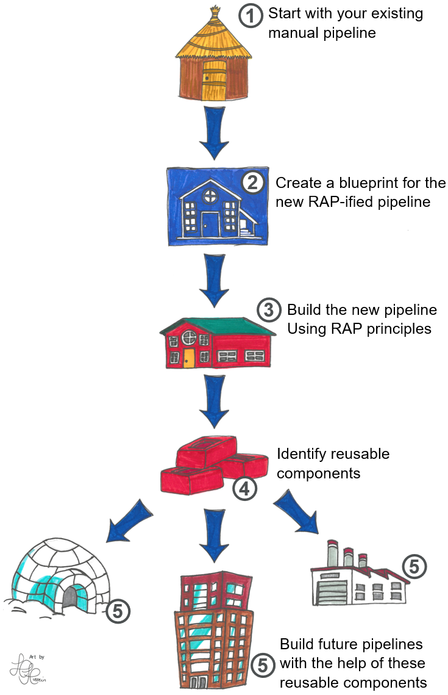
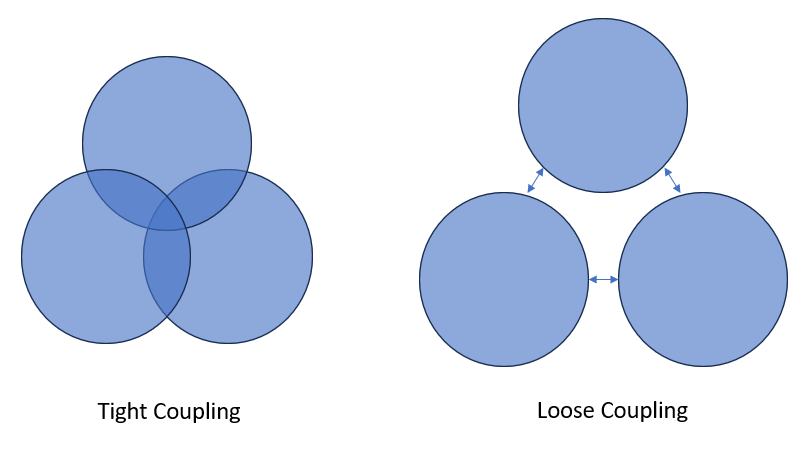
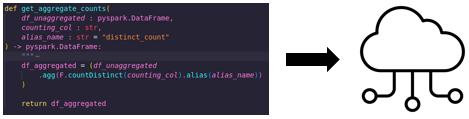
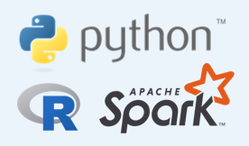

#

!!! tip "TLDR"

    RAP is a way of creating analytical processes that are:

      - More efficient
      - More robust
      - More transparent    

RAP (Reproducible Analytical Pipelines) is a set of principles and working practices that help you create faster, more robust, and more transparent analytical processes.

You can learn more about the history of RAP and why it was devised here: [The History of RAP](history_of_RAP.md).

With RAP, we automate and streamline the process of ingesting, processing, modelling, and reporting data.

## The RAP Journey

You can think of the implementing RAP like this:

Many teams reach Step 3 and stop there, but it's important to continue on to Steps 4 and 5 - sharing and reusing code - to gain the full benefits of RAP.

## RAP Principles

The RAP way of working isn't fixed and will evolve in line with new technologies and practices. Below are some of the core RAP principles at this time:

### Automation

Anything that you do manually is time consuming, costly and prone to human error. For example, say you have some data that you export from a database table into Excel, and then you use vlookups to pull some reference data into it from another file. In this case, why not upload the reference data to the database, and update your script to do this automatically? Then that's one job you'll never have to do again!

One of the first things you should do is identify any manual steps in your process, and automate them if possible. [Process mapping](../implementing_RAP/process_mapping.md) is a good way to do this.

**Advantages:**

- **Faster processes**: Much faster to get the computer to do all the work!
- **More resource**: Free up analyst time to work on other things
- **Accuracy**: Reduces the risk of human error

### Modular, re-usable code

Code should be written in modular blocks that are essentially independent of each other. 

A non-software example might help explain this concept - imagine that your mouse was hard-wired into your computer. If you wanted a new one, it'd be a lot of work to change it, and a lot could go wrong in the process! As it is, your computer and your mouse are separate components with a standardised interface, meaning you can easily chop and change them. 

It's possible to write code in a similar way. This is sometimes called "loose coupling". 

Say you have process that imports some data, generates some counts, applies a suppression rule, and then exports the output.

If you do this all in one script, we would say that these four processes are tightly coupled. They are not separate modules, and each part cannot run without the other parts.

A better way would be to move these four processes into separate [functions](../training_resources/python/python-functions.md), which would be contained and organised in a logical [project structure](../training_resources/python/project-structure-and-packaging.md):

* `import_data()`
* `generate_counts()`
* `apply_suppression()`
* `export_data()`

Note that each function just does one thing - this is called "separation of concerns".

Then we simply pass the output of each function to the next. None of the functions depend on any other to work. For example, the `generate_counts()` function doesn't depend on `import_data()`. It doesn't even know that it exists. We could use a completely different `import_data()` function, or just pass a static CSV file. As long as it receives the data, it will work. So we say these functions are loosely coupled.

**Advantages:**

- **Avoid repetition**: For example if you need to suppress counts in multiple places in your script, you can just call the function each time - no need to copy and paste the same code in several places
- **Re-usability**: Easier to re-use code in other work, speeding up the development of future projects
- **Integration**: Easier to "slot in" other people's functions - no need to reinvent the wheel if a solution already exists!
- **Faster on-boarding**: Code is easier to understand, so new users can get up to speed faster
- **Easier to test**: Testing is much easier to implement, improving the robustness and accuracy of the process
- **Load balancing**: In cloud architecture, it's easier to scale out computing resources for intensive modules and scale back in for the lighter ones

### Transparency

The Government's [Digital Service Standard](https://www.gov.uk/service-manual/service-standard) 12th principle states that all publicly funded code should be open, reusable and available under appropriate licences. To achieve this transparency, we can save our code to public-facing repositories like GitHub.

Learn more in our guide on [publishing your code](../implementing_RAP/how-to-publish-your-code-in-the-open.md).

**Advantages:**

- **Improve public trust**: through transparency of our processes
- **Identify mistakes**: More eyes on the code makes it more likely that mistakes will be spotted
- **Feedback**: Readers of the code are able to suggest and make improvements to it
- **Collaboration**: Increases collaboration and knowledge sharing
- **Faster on-boarding**: No time is wasted on requesting permissions or access to code repositories
- **Consistent standards**: Easier to share and align on standards across the health sector
- **Code quality**: Knowing that your code will be published, tends to improve the quality of the code that you write
- **Re-usability**: Help other teams, internal and external, improve their processes by re-using our code
- **Alignment with government policy**: A [number] of [government]  [policy]  [documents] and [reviews] are asking for this

### Use open-source tools

Rather than proprietary software packages, use open-source software and programming languages like Python and R. Open-source basically means it's freely available for anyone to use. 

**Advantages**:

- **Free**: open-source tools are completely free to use
- **Support**: they tend to have a very active community of helpful people to seek advice and support from
- **Reusability**: anyone can run open-source code, you don’t need to be a fellow user of a proprietary system. This makes it easier to share work across teams and organisations
- **Use other people's code**: Reusability goes both ways! We can take advantage of the libraries, packages, and other code made by others
- **Flexibility**: open-source programming languages can cover many bases – data connections, querying, processing, producing statistics, creating visualisations, building reports, and so on. This reduces the number of points where data is moved from one system to another

### Version control

When you're working with code, you'll often want to keep track of the changes you make. That way, you can always go back to your previous version if your current changes don't work out. Doing this manually can lead to situations like the following:

Version control software, such as Git, fixes this. It enables you to keep a detailed history of code changes, and easily roll back to previous versions. It also makes for easy collaboration, even when multiple people are working on the same file.

Version control systems have become essential to anyone who writes code as part of their job. If you need some help getting started, have a look at our [git guidance](../training_resources/git/introduction-to-git.md).

**Advantages:**

- **Auditability**: Create an audit trail of changes made, logging what changes were made when and by whom
- **Roll backs**: Enable users to revert changes, or roll back to previous versions
- **Enhanced collaboration**: Makes collaboration on coding projects much easier
- **Code quality**: Makes it easier to peer-review code for quality and reliability
- **Transparency**: Enables code to be shared more easily, using cloud services like GitHub or GitLab.
- **Automation**: Automate parts of the development workflow, for example, running tests or auto-formatting code

### Good coding practices

In RAP projects we should aim to write high-quality code that follows a logical structure, and is well-commented and documented. You can learn more about good coding practices in our [Python programming guide](../training_resources/python/intro-to-python.md) and our [refactoring guide](../training_resources/refactoring-guide.md).

**Advantages:**

- **Readability**: Easier to read and understand the code – not just for third parties but also new team members
- **Extensibility**: Easier to extend and modify the process
- **Integration**: Easier to integrate code written by other people

### Testing

Testing in a coding context means setting up automated procedures that check the code to find any mistakes, making sure it works well and does what it's supposed to do.

This is one reason we should write code in modular functions. Each function will have a singular purpose, so we can test them in isolation, and when working together as a whole. If you find it difficult to know where to start in writing tests for your project, that may be a sign that your code isn't modular enough (see the section above on [writing modular code](#modular-re-usable-code))

The key here is that the tests are automated. In one click we can test the entire codebase. It's like a safety net, helping us feel confident that changes to one area of the code haven't had a knock-on effect anywhere else.

To learn more, see our [guidance on testing](../training_resources/python/unit-testing.md).

**Advantages**:

- **Spotting mistakes**: Testing helps find and fix errors or bugs
- **Enhanced reliability**: Ensures that the process operates reliably under different conditions
- **Accuracy**: By reducing the risk of errors, we help ensure that the figures we release are accurate
- **Time saving**: It is usually easier to identify and fix issues early in development

### Peer Review

Peer review involves collaborative examination of code and outputs by team members to ensure quality, correctness, and adherence to best practices.

When changes are made to the code, these should almost always be reviewed by another team member - even if the new code is passing all the tests that have been created for it.

This is because even when code is working correctly, there may be a way to make the code more efficient, or to make it easier to read. Furthermore, the tests themselves should be checked to ensure that they are truly testing what they are supposed to.

This is another reason to use version control systems like Git and an accompanying cloud service like GitHub - they make the peer review and approval process much easier. 

Learn more in our page on [code reviews](../implementing_RAP/code-review.md). The page on [publishing your code](../implementing_RAP/how-to-publish-your-code-in-the-open.md) also describes a recommended code review process when making your code public.

**Advantages**:

- **Accuracy**: Increases accuracy and performance of code
- **Identify mistakes**: Reduces risk of error
- **Code quality**: Ensure code is written to a high standard
- **Training**: Useful development exercise to help team members learn good practices

## The non-RAP way

Let's compare this to the current state of play that we are trying to move beyond with RAP. Imagine a publication process that doesn’t use the principles above. It might involve:

1. Manually running queries against a data store to retrieve, join, and clean the data
2. Exporting the data and manually importing it into another statistical or analysis package
3. Creating some statistics/outputs
4. Manually copying these to an Excel/Word/PDF report

Of course, every publication will be different, and there will often be multiple strands of work going on that converge on the final report. But the gist is, a processes requiring a lot of manual steps, and usually using proprietary software.

This has several downsides such as:

1. **Time consuming**: manual steps are time consuming, not only to carry out, but because they introduce a point where further manual quality assurance (QA) is needed
2. **Potential for error**: Fiddly manual steps introduce the possibility of human error. Lack of tests mean we can't be completely sure how future changes affect the old code
3. **Scalability**: If you need to add a new table or statistic to the publication, the process will take longer to complete
4. **Difficult to extend**: Code written on in a non-modular way using proprietary systems is harder to extend when changes need to be made

## RAP solves these problems (and others!)

Imagine if the whole process described above, from retrieving data to creating the finished publication, could be completed in one click. That’s what RAP aims to do.

In many cases, a RAP approach can:

- Significantly speed up the process
- Reduce the risk of error by removing manual processing steps
- Increase robustness and improve QA through automated testing
- Increase transparency by making code public
- Create a modular, re-usable codebase that is easy to extend or modify
- Build a library of code that is easily shareable across projects

We'll go into more detail on the benefits of RAP on our [“Why RAP is important”](./why_RAP_is_important.md) page.

## It’s not all or nothing!

It’s not necessary to make all these changes at once!

You can move along the RAP journey in stages, and you’ll see benefits with each step. Start simple and build up over time.

We have a page on [Levels of RAP](./levels_of_RAP.md) which explains more about this, with three levels - Baseline, Silver, and Gold. Successful implementation of RAP often begins by starting with Baseline and building up from there.

In the beginning, you’ll probably be best focusing on areas that reduce manual work for your analysts, freeing up their time so they can focus on other things.

[number]: https://www.gov.uk/government/publications/data-saves-lives-reshaping-health-and-social-care-with-data/
[government]: https://www.gov.uk/government/publications/secure-data-environment-policy-guidelines/
[documents]: https://analysisfunction.civilservice.gov.uk/policy-store/reproducible-analytical-pipelines-strategy/
[reviews]: https://www.gov.uk/government/publications/better-broader-safer-using-health-data-for-research-and-analysis/better-broader-safer-using-health-data-for-research-and-analysis/
[policy]: https://www.gov.uk/government/publications/better-broader-safer-using-health-data-for-research-and-analysis/better-broader-safer-using-health-data-for-research-and-analysis/
