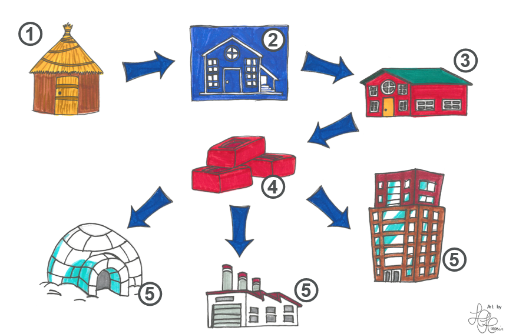

# What is RAP?

In a nutshell, a Reproducible Analytical Pipeline (RAP) is a system that automates the process of ingesting, processing, modelling, and reporting data.

But you’ll also hear the term “RAP” used to describe the principles and working practices that enable us to build pipelines in this way.

## The non-RAP way

To explain what RAP is, it might be useful to look at the current state of play that we are trying to move beyond with RAP.
Imagine a publication process that doesn’t fit the description in the section above. It might involve:

1. Running queries against a data store to retrieve, join, and clean the data
2. Exporting the data and importing it into another statistical or analysis package
3. Creating some statistics/outputs
4. Copying these to an Excel/Word/PDF report

Of course, every publication will be different, and there will often be multiple strands of work going on that converge on the final report. But the gist is, a processes requiring a lot of manual steps, and usually using proprietary software.

This has several downsides such as:

1. **Time**: manual steps are time consuming, not only to carry out, but because they introduce a point where further manual quality assurance (QA) is needed
2. **Potential for error**: manual steps introduce the possibility of human error
3. **Scalability**: If you need to add a new table or statistic to the publication, the process will take longer to complete

## RAP solves these problems (and others!)

Imagine if the whole process described above, from retrieving data to creating the finished publication, could be completed in one click. That’s what RAP aims to do.

In many cases, a RAP approach can:

- Significantly speed up the process
- Reduce the risk of error by removing manual processing steps
- Increase robustness and improve QA through automated testing
- Increase transparency by making code public
- Create a modular, re-usable codebase that is easy to extend or modify
- Build a library of code that is easily shareable across projects

We go into more detail on the benefits of RAP on our [“Why RAP is important”](./why_RAP_is_important.md) page.

Let’s now have a look at the tools, principles, and working practices used to achieve this.

## RAP Principles

The RAP way of working isn't fixed and will evolve in line with new technologies and practices. But here are some of the core RAP principles at this time:

## Modular, re-usable code

Code should be written in modular blocks that are essentially independent of each other. This is sometimes called "loose coupling".

There are many advantages of this:

- If a particular manipulation or calculation happens multiple times in a process, we can wrap it into a function and then call that function each time, rather than repeating the same bit of code in several places
- These blocks can then be re-used in other projects
- When processes are written in this way, it's much easier to "slot in" other people's code

## Transparency – publishing code

Publishing code is not appropriate in all situations (where it can affect a system’s security, for instance), and precautions must be taken to ensure that no sensitive information is published. But in many cases, there is no risk to publishing the code used to produce a publication.

By making our code public, we:

- Improve public trust through transparency of our processes
- Enable more people to check code, report mistakes, and offer suggestions
- Help other teams improve their own processes by re-using our code

## Use open-source tools

Rather than proprietary software packages, use open-source software and programming languages like Python and R. Open-source basically means it's freely available for anyone to use. This brings several advantages:

- **Free**: open-source tools are completely free to use
- **Support**: they tend to have a very active community of helpful people to seek advice and support from
- **Reusability**: anyone can run open-source code, you don’t need to be a fellow user of a proprietary system. This makes it easier to share work across teams and organisations
- **Other people's code**: Reusability goes both ways! We can take advantage of the libraries, packages, and other code made by others
- **Flexibility**: open-source programming languages can cover many bases – data connections, querying, processing, producing statistics, creating visualisations, building reports, and so on. This reduces the number of points where data is moved from one system to another

## Version control

Version control systems have become essential to anyone who writes code as part of their job. Where there’s code, there’s version control, and a program called “Git” is the most popular tool, although there are others.

Version control systems:

- Create an audit trail of changes made to the process, logging what changes were made when and by whom
- Enable users to revert changes, or roll back to previous versions, such as when a bug is found
- Make collaboration on coding projects much easier
- Make it easier to peer-review code for quality and reliability
- Enable code to be shared more easily, using cloud services like GitHub or GitLab.
- Enable us to automate certain parts of the development workflow, for example, auto-formatting code to make sure it is written in a consistent

## Good coding practices

In RAP projects we should aim to write high-quality code that follows a logical structure, and is well-commented and documented. This makes it easier to:

- Read and understand the code – not just for third parties but also new team members
- Extend and modify the process
- Share our work with other teams
- Integrate code written by other teams into ours, should they have a better way of doing something

## Testing

To help ensure the robustness and accuracy of the pipeline, we can set up automated tests within the code.

Each function within the code should have its own unit test, to make sure it does what we expect it to do. Our unit tests can include a range of different input values, including edge cases, and some things we might not expect it to receive (such as sending text to a function that processes numbers). This is another reason to write code in the modular blocks described earlier - they are easier to test.

Once we've completed the pipeline, we can also perform backtests. This is where we compare the results of the new pipeline with the known results from a previous run of the old process. In this way, we can make sure it's producing exactly the right output before we switch over.

## Peer Review

When changes are made to the code, these should almost always be reviewed by another team member, even if the new code is passing all the tests that have been created for it.

This is because even when code is working correctly, there may be a way to make the code more efficient, or to make it easier to read. Furthermore, the tests will need to be checked to ensure that they are truly testing what they are supposed to.

This is another reason to use version control systems like Git and an accompanying cloud service like GitHub - they make the peer review and approval process much easier.

## The RAP Journey

You can think of the implementing RAP like this:

These stages represent:

1. The existing manual pipeline
2. [Create a blueprint](../implementing_RAP/process_mapping.md) for the new RAP-ified pipeline
3. Build the new pipeline
4. Identify reusable components
5. Build future pipelines with the help of these reusable compenents

## It’s not all or nothing!

It’s not necessary to make all these changes at once, or at all!

You can move along the RAP journey in stages, and you’ll see benefits with each step. Start simple and build up over time.

We have a page on [Levels of RAP](./levels_of_RAP.md) which explains more about this, and some guides on the skills and training a team might need along the journey.

In the beginning, you’ll probably be best focusing on areas that reduce manual work for your analysts, freeing up their time so they can focus on other things.
