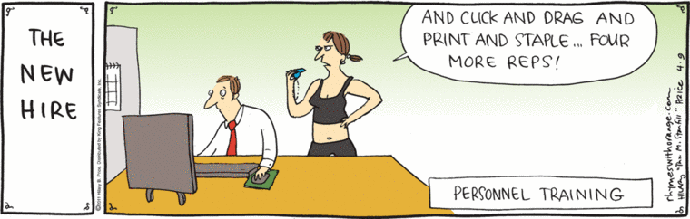

> Note: Any section tagged with `TBC` means it's still under construction.

# How to prepare my team for RAP

## What is this guide about?
This guide will go through the training approach, the RAP skills required and training considerations the RAP squad follows for a typical RAP engagement.

## What is this guide not about?
This guide will not explore what is RAP, when a project is considered RAP, how to implement RAP etc. For these topics see:
* [What is RAP](../what_is_RAP/README.md)
* [How to implement RAP](../implementing_RAP)

## RAP pre-engagement questionnaire
Analyst team assesses ability to carry out a RAP project end-to-end by completing a RAP pre-engagement questionnaire. Link
* [Link to questionnaire]() (TBC)

The questionnaire will contain a series of questions which will revolve around initial project considerations:
* Publication, state of the codebase
* Environment used for publication and RAP process
* Key pain points
* Team capability
* Issues with resources, time constraints, BAU

## RAP/Training Considerations
* The levels of RAP describe what must be done to reach baseline, silver and gold levels of RAP. If a RAP project team is not comfortable using Git and version control for instance then it will be difficult to reach Baseline RAP.
* We recommend for the RAP team to have up to 4 analysts of varying skill levels, ranging from beginner to experienced in programming. 
* Allow project time for training as a prerequisite as working on developing code and learning how to code at the same time can be demovating and consuming. This means that analysts in training might need to distance themselves from BAU work for a predetermened amount of time.

## What to consider before starting your RAP project
* [Skills required for a RAP project (beginners and Baseline RAP).](./building_team_capability.md#skills-required-for-a-rap-project-beginners-and-baseline-rap)
Which skills are considered prerequisite to start a RAP project for programming beginners.
* [Skills required for a RAP project (in general).](./building_team_capability.md#skills-required-for-a-rap-project-government-analysis-function) What you need for RAP.
* [How to select your RAP team.](./building_team_capability.md#how-to-select-your-rap-team)
What to consider when creating your RAP taskforce to undertake a RAP project.
* [Pair programming support](./building_team_capability.md#pair-programming-support). What is pair programming support.
* [When to start training.](./building_team_capability.md#when-to-start-training) When is the best time to start training, before or during a RAP project (definitely not after!).
* [Which training course should my team do?](./building_team_capability.md#which-training-courses-should-my-team-do) List of training resources.

### Skills required for a RAP project (beginners and Baseline RAP)
We recommend analysts to make themselves familiar with in order to achieve **baseline RAP**:
* An introduction to Git and version control 
* Python (or R, SQL depending on your project)
* Using Pandas (or PySpark or any R package, depending on your project)
* Code quality and style guides

### Skills required for a RAP project (Government Analysis Function).
As defined from the [Government Analysis Function](https://analysisfunction.civilservice.gov.uk/support/reproducible-analytical-pipelines/), there isn't a definite way to design a end-to-end RAP pipeline. Once baseline RAP has achieved the following are recommended as components to impoving a RAP pipeline:
* Be able to use Git and GitHub/Gitlab, creating/cloning a repo, commits, pushing to a repo, handling branches, merge requests, merge conflicts
* Python (or R, SQL) Pandas or PySpark dataframes, merging tables, filtering, aggregation, grouping by 
* Using code reviews
* Testing code (e.g. unit testing, backtesting etc.)
* Be able to create a repository with good project structure
* functions and/or code modularity
* error handling for functions
* documentation of functions
* project packaging
* code style, best coding practices
* input data validation
* logging of data and the analysis
* continuous integration (CI/CD)
* dependency management, environment management (yaml files, requirements.txt etc.)

### How to select your RAP team
Before selecting the RAP team, the typical workflow followed for setting up the foundations for a RAP engagement is:

* Identify a publication/product that needs taking through RAP process
* Identify people in the publication team who will learn RAP process (Product Owner and min 2 analysts)
* Identify people in the RAP team, or those familiar with RAP practices, to support the publication team through RAP transition
* Set up a Jira board for tracking work and confluence space for documenting learning, agreed decisions
* Teams meet and ice breaker session to get to know each other. Set out the plan for the engagement, review roles and responsibilities, lessons learned from previous projects, etc.

Before jumping into a RAP engagement, the project team's existing capability is recorded or, if you are creating a new team, the members the RAP taskforce will consist of. As per our recommendation mentioned above, it is advised to have **up to 4 analysts** working on a RAP project.

#### Existing team
Determine each team members ability to:

* Use Git (on either GitLab/GitHub)
* Python (or any other open source programming language)
* Code reviews

This is recorded based on the basis of how experienced and comfortable they are using the above. This will help determine how many analysts require training and/or the amount of training that is required. Depending on the team's size, it might be challenging to train up 6 analysts at once for example. 

#### Creating a new team
Instead of embedding an entire team on a Python training course, it is recommended to split out the team into a smaller RAP taskforce, which can work faster and more efficiently on a RAP project. This can be beneficial when there's a larger team as the starting point causing BAU work to mount up to unmanageable levels if the entire team fully commits to training. The team's selection will be based as before on the varying skill levels as result of the RAP pre-engagement questionnaire.

After the training and RAP project is completed, then analysts from the project team can carry over the new found RAP knowledge to other similar taskforces as RAP champions.

### Pair programming support
During a RAP project (e.g. at the start of the [thin slice](../our_RAP_service/thin-slice-strategy.md) it can be beneficial to set up coding buddy pairs, usually an experienced programmer with an inexpercienced one, to form a mentoring style collaboration and in additon to help with troubleshooting code, version control, code reviews and any programming related questions. 

The level of engagement is up to the programming pairs, daily catch-ups for instance is often observed as a workable standard.

We found this style of engagement beneficial to teams new to RAP and programming in general, as support from experienced programmers and experts on RAP can offer a significant impact on the success of RAP projects.

### When to start training
Training should start a few weeks at least before the RAP project's kick off date, depending on training requirements and modules to be taught. During this period, analysts who are new to Python or Git enroll on the respective course that introduces them to their topic of choice. If the RAP team is completely new to programming, we recommend to start training at least a month before the RAP engagement starts.

### Which training courses should my team do?
[List of training courses, to remain internal.]

## Training pathways
Depending on the analyst team's capability, there are different training pathways responsive to different needs. For example, not every person on the analyst team will require training on Git as they might already be knowledgeable. 

### Analysts new to programming and version control
We recommend before the RAP engagement (example for Python/Pandas) for analysts to enroll on courses on:
* Git/version control
* Introduction to Python and programming (data types etc)
* Functions
* Pandas
* Familiarity with software enginnering best practices, style guides (e.g. PEP8)

### Experienced users
* Object-oriented programming
* Unit tests
* Project structure
* Any from the beginner's training pathway

### Extra
* How to debug your code (VS Code)
* Thin slice (by RAP team)

## How to run training during RAP project
Once the RAP project commences, the first training session to carry out is:
* **the [Introduction to Git](../implementing_RAP/git/intro-to-git.md) and [Using Git Collaboretively](../implementing_RAP/git/using-git-collaboratively.md)**. Each training session requires a support drop in session where analysts from the project team join in case they are stuck on any exercises from the guides. A repository set up for the purposes of practicing Git is used and provided for practice. 

* **and basics of Python/Pandas.** Using the project's data, we recommend to use data from your project to create a tutorial script that produces a basic output using our [basics of Pandas guide](../implementing_RAP/python/basic-python-data-analysis-operations.md) and go over elementary Pandas operations that will beginners with their first coding steps. This could cover joins, group bys, filtering, selecting and renaming columns etc.

Other training to consider running depending on your team's requirements. We suggest to use your project to create examples for any training you follow to make training feel natural and applicable to your team:

* [Python functions](../implementing_RAP/python/python-functions.md). The thin slice refactoring stage offers a great opportunity to refactor reusable code into functions, and your team to be able to practice with writing functions. These functions can be used as example of an introduction to Python functions i.e. how to call functions, when to pass arguments, number of arguments, keyword arguments, return, pass, docstrings etc.

* [How to do code reviews](../implementing_RAP/general_guidance/code-review.md). Code reviews can be deceiving as someone who's new to code reviews understand that their work is being judged. It is recommended to hold a team code review session and review a few example scripts, using our guidelines and considerations to demonstrate how useful and invaluable code reviews can be in improving overall code quality while also developing your coding skills at the same time. 

* [Project structure session, how to package your code](../implementing_RAP/python/project-structure-and-packaging.md). A python package is a way to bundle your code into a single thing that can be shared and reused. Our goal is to be able to share and reuse code across NHS Digital as well as externally.

* **[PEP8](https://peps.python.org/pep-0008/) and Linting**. Linting is a tool that highlights programming errors, stylistic errors and bugs in your code. Each programming software has its own linting application, it is recommended to enable this feature as it helps avoiding this type of errors.

* [Session on the thin slice concept and design](../our_RAP_service/thin-slice-strategy.md). The thin slice concept can be hard to understand sometimes for inexperienced analysts so a session covering the thin slice approach is recommended.

* **Debugging code using an IDE**. Like linting, debugging using a programming software can be a feature of its own, it is recommended to help your team familiarise themselves with debugging to improve troubleshooting efficiency.

* **Session on refactoring the thin slice**. (TBC)

## How to measure progress
We recommend using the [RAP maturity levels](../what_is_RAP/levels_of_RAP.md) as performance indicators to best capture a team's progress.

These levels aim to offer teams a recommended maturity map for adopting RAP practices. We have seen that teams who skip the early capabilities struggle to make effective progress. These capabilities are independent and so you don't need to adopt all at once. Team leads should balance the BAU delivery, resourcing constraints, and RAP development as fits their agreed objectives.

For example, if all members of the RAP project team are comfortable using version control (i.e. merge requests, merge conflicts, Git commands workflow), then using Git and GitLab can be ticked off as a KPI.

**Reminder: In order for a publication to be considered a reproducible analytical pipeline, it must at least meet all of the requirements of baseline RAP. Typically teams will go beyond this minimum baseline and we encourage this. The baseline serves to describe the absolute minimum needed to be considered RAP.**