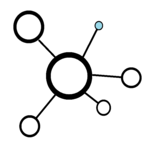

!!! tip "TLDR"
    The thin slice strategy consists of two stages, creating a version of the pipeline that outputs a single component and then expanding it to cover the entire product.

    - **Stage 1:**  mapping out the current pipeline, identifying the smallest output and working to replicate it using open source methods.
    - **Stage 2:** From that, the re-useable components are identified and the thin-slice is scaled out to cover the entire output. 
    - **Benefits:** This process allows your team to identify pipeline issues early in the project while progressing quickly on the project, obtaining small wins while building up comprehensive understanding of the pipeline

The RAP team at NHS England often adopts a 'thin-slice' strategy for migrating legacy pipelines. 

Inspired by DevOps practices in software development, the 'thin-slice' strategy involves building the smallest functional component end-to-end rather than tackling the whole project at once.

By building something end-to-end you get a lot of benefits such as:

- **Quick Progress Demonstration:** The approach allows for quick demonstration of progress, boosting morale and convincing leaders to support the ongoing project.

- **Early Issue Identification:** Building the end-to-end process helps identify major problems at the project's outset, such as database issues or the firewall blocking access, enabling timely solutions and preventing last-minute surprises.

- **Comprehensive Problem Understanding:** When working through the project in a linear sequence, you may not understand how all parts fit together until the very end, leading to poor pipeline design. Building end-to-end, you can identify re-usable parts, make radical improvements and iterations at very lost cost.

This strategy is particularly relevant for the work we are trying to do here. We are trying to achieve a number of competing goals and the thin-slice helps us to mediate between them. For example:

| Goal                                                  | Solution                                                                                         | Consequence                                                                                                                                                             |
| ----------------------------------------------------- | ------------------------------------------------------------------------------------------------ | ----------------------------------------------------------------------------------------------------------------------------------------------------------------------- |
| We want to build this pipeline as quickly as possible | Accept the most basic code that is functional despite lower code quality                         | Code will be more difficult to run and maintain. Risk that [tech debt](https://en.wikipedia.org/wiki/Technical_debt) may snowball until BAU delivery becomes impossible |
| We want to build the best possible pipeline           | Hire a team of external specialists to do it for us                                              | Risk that the team becomes demotivated or does not understand the code                                                                                                  |
| We want to train our analysts to write good code      | Give analysts lots of defended time away from their day job with high-quality in-person training | BAU delivery will slow down. May not be possible given resource constraints                                                                                             |

Depending on which of these you want to prioritise - do it quickly, do it well, or build capacity - you would take an entirely different approach. All three are valid but each entails negative consequences that need to be acknowledged.

---

## Thin-slice pipeline

In reality, we want some strategy that enables us to mediate between these competing demands to achieve all three outcomes - a high-quality pipeline that is developed quickly and with analysts feeling like they understand and own it.

The thin-slice strategy balances these outcomes and fits well with the support model the RAP team offers - where we work alongside a team who understand the data well. The typical workflow looks something like this:

### **Stage 1**
| Phases          | Description     |
| :------------: | ---------- |
| **Map out the processes** | Visually map out the current process by dissecting the existing code, identifying each step in the pipeline. Here we can pinpoint redundant elements of the process, obtaining quick wins when it comes to optimising our pipeline. Have a look at our [Process Mapping](../implementing_RAP/process_mapping.md) page for some guidance on how to achieve this.  |
| **Identify the minimal outputs**  | Identify the minimal outputs that we will be replicating for the thin-slice. For example, we will reproduce the national numerator and denominator for one measure. |
| **Replicate the target minimal output** | Replicate those outputs as quickly as possible, focusing more on obtaining the numerical output than writing the most optimal code, getting to grips with the logic of the process. Since we are only dealing with a small subset of the overall publication, we avoid getting overwhelmed with the nuances of the pipeline.   This phase forces us to grapple with a lot of the complexities of the process - e.g., funny joins, complex derivations, or logic that is spread across multiple sections of code. By grappling with the tough parts early, we pave the way for a more efficient and robust development process.|

!!! tip
    While replicating the minimal output we have regular talks with stakeholders to check this is following their needs and providing what is necessary.

### **Stage 2**
| Phases          | Description     |
| :------------: | ---------- |
| **Identify the re-useable components and improve the thin-slice**          |Once the target output has been achieved, we can turn our focus to improving how this is done. We do this with the principles described in our [Refactoring Guide](../training_resources/refactoring-guide.md).  As this is just a sliver of the overall project it does not take long, but provides an excellent baseline from which to build the rest of the project.   It is essential that this is done collaboratively between members of the RAP team and the publication team. The publication team bring an expert understanding of why the process works a certain way, while the RAP team bring experience of having worked with similar processes across multiple projects. Because the publication team are actively contributing to the decisions, they end up with a feeling of ownership over the code and an understanding of how it works. |
| **Scale out the thin slice**           |We now start tackling the rest of the outputs by expanding the thin-slice. This would be done strategically, perhaps tackling a breakdown first, then a complex derived field and then a field which requires joining some reference data.   The remaining fields and breakdowns are added to the backlog, and analysts pick up these tickets in turn. Tickets are considered done when the new field gives the same value as the historic output and the code has been peer-reviewed by another analyst.  This phase tends to go remarkably quickly. This is because we already tackled all the hard bits up front and everyone is working from the high quality thin-slice template that they helped to build. |

---

#

## FAQs
??? question "What is the difference between a 'thin-slice' and a minimal viable product (MVP)?"
    The thin-slice denotes the essential functionality required to construct a complete end-to-end pipeline. This initial development phase serves as a valuable training opportunity for the team and contributes to enhancing the overall code quality. It is driven by the goal of enabling the delivery team to work efficiently and is not intended as a deliverable for customers.

    By contrast, an MVP is the most basic thing that a team could deliver to customers. MVP has a really peculiar meaning in the context of a pipeline migration since the 'minimal' thing to be delivered will typically be the full publication.

??? question "What happens if rebuilding the pipeline uncovers errors in the existing pipeline (and hence published statistics)?"
    It is a near certainty that some minor errors will be discovered as part of any migration. This is particularly the case for building RAP pipelines since you are adding additional tests and safeguards to spot errors.

    We consider this a natural and important opportunity to improve the publication. We sit down with the team and discuss where the issue may have arisen and how we can prevent it in the future.

    Likewise, if there is an opportunity to make a substantial improvement to an existing publication we address that in collaboration with the team. We do not hold too tight to the idea of replicating historical outputs but instead aim for a pragmatic approach.

??? question "What happens if we discover more problems after we have moved out of the thin-slice phase?"
    You will almost certainly discover more problems after the thin-slice phase. However, the high code quality that comes from the thin-slice phase and the team understanding of how the code works will make it easier to resolve the problem, e.g., by refactoring the code.

??? question "How would this strategy work in a situation where you were working on a brand new project, rather than migrating a legacy pipeline?"
    The same logic would apply. By identifying a very small piece of functionality and trying to implement it end-to-end, you will get a better sense of the problem and how to fix it.
