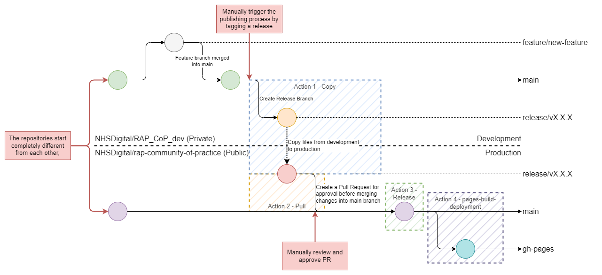
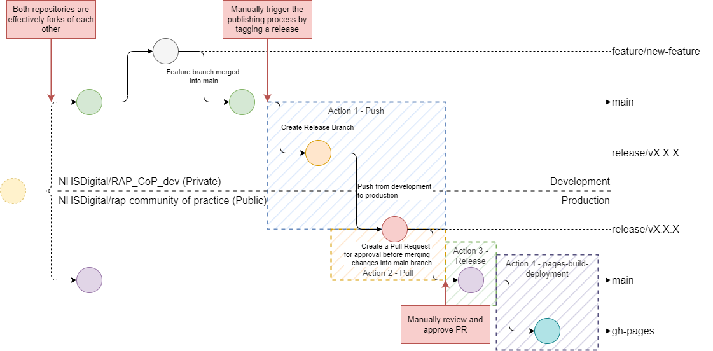

#

!!! tip "TLDR"

    - The RAP Community of Practice has embraced CI/CD by implementing an automated release process that uses GitHub Actions to move guidances written and reviewed in our private ([RAP_CoP_dev]) repository to the public ([rap-community-of-practice]) repository.
    - The RAP Release workflow ensures control, flexibility, and consistency in the RAP CoP's releases.
    - Key Steps:
        - The contents of the release are copied from the private to the public repository.
        - A pull request is created for the release for final merge approval to the main branch.
        - The website pages are deployed using MkDocs when the release is merged into the main branch.
    - Detailed YAML configurations and flowcharts explain each step in this RAP Release Workflow Guide.

The RAP Community of Practice exists on two repositories. The public [rap-community-of-practice], where anyone can view our guidance, and the private [RAP_CoP_dev], where guidance is written and reviewed before being published to the public repository. The public repository is then converted using [MkDocs] to HTML and hosted by [GitHub pages] as our [RAP Community of Practice website].

The RAP Release Workflow allows the RAP Team to:

- Automate a repetitive but simple process with manual intervention
- Control when the release process occurs
- Easily maintain and change the process if required

The release process uses GitHub Actions to execute. GitHub Actions is a continuous integration and continuous delivery (CI/CD) platform that allows automation of processes. A highly beneficial feature of GitHub Actions is the ability to automatically run workflows when events happen in your GitHub repository; in our case, when a release is published, a branch is pushed to, a pull request is closed and merged, and a directory is updated.

The GitHub Actions are written using the YAML markdown language to execute, in this case:

- Pre-defined GitHub Actions, such as [`actions/checkout@v3`] [actions/checkout@v3].
- Shell scripts that run Bash, git, and GitHub CLI commands.

Other functionality, like setting up and using Docker containers, can be explored in the [GitHub Actions documentation].

The process is made up of four distinct steps. One that runs on the private [RAP_CoP_dev] and the other three that run on the public [rap-community-of-practice]. The first figure below shows a Git Flow Overview of the deployment process and where the four actions are involved. The second figure below shows a flowchart of the release process, roughly summarising the steps within the actions.



!!! info

    For clarity and simplicity, the Git Process diagram shows Action 3 executing before Action 4. They will execute roughly simultaneously in practice, although slightly different events trigger them.

    The Release Process Flowchart (below) more accurately depicts the process flow.


## Action 1 - [Copy Release to Public RAP CoP Repo]


Action 1 is kicked off by creating and publishing a release to the private [RAP_CoP_dev]. The release tags the repository with the semantic version number, e.g. v1.2.3.

Action 1 can also be manually dispatched in GitHub (or via an API call) due to the addition of the `workflow_dispatch` event trigger.

```yml
on:
  release:
    types: [published]
  workflow_dispatch:
```

Action 1 executes one job, called `copy-release`. This job runs on the latest version of Ubuntu available through GitHub Actions, denoted by the `runs-on:` key. It is possible to run multiple jobs, some that run in parallel.

GitHub Actions provides the [conditional `if`][conditional if] key to control when a job executes. Here, we only want it to execute in the private [RAP_CoP_dev], so we check if the action is executing in it. If it weren't here, it would trigger this action again when we eventually publish a release in the public [rap-community-of-practice]. Instead, it will skip running this job when running in the wrong repository.

```yml
jobs:
  copy-release:
    runs-on: "ubuntu-latest"
    if: github.repository == 'NHSDigital/RAP_CoP_dev'
```

The `push-release` job contains nine steps.

### Step 1 - Checkout private

The first, `Checkout private`, uses the pre-existing [`actions/checkout@v3`][actions/checkout@v3] action provided by GitHub. This action clones a repository (by default, the repository the action is executing in) and configures git to be ready to use in the Action's running environment.

The `with:` key allows users to specify settings for executing the `actions/checkout@v3`. In this case, there are three, `token` and `path`.

`token` is used to set the [Personal Access Token] (PAT) that is used to configure git in the running environment. It is used not only to checkout the code but also in future git commands. By default, it uses `${{ github.token }}`, which is a [automatically generated PAT] with access scoped to the Action's current repository. We need to access another repository in later steps, so we use `${{ secrets.EXTERNAL_REPO_TOKEN }}`. This is stored in the [repositories' secrets].

`path` specifies the relative path to place the repository. Usually, it is the current directory (`path = ''`). However, we want to checkout two repositories, which means we will set it to `private` to put it in that folder.

```yml
steps:
  - name: Checkout private
    uses: actions/checkout@v3
    with:
      token: ${{ secrets.EXTERNAL_REPO_TOKEN }}
      path: private
```

### Step 2 - Checkout public

With the private [RAP_CoP_dev] repository checked out, we move on to the second step of the `push-release` job, which checks out the public [rap-community-of-practice] repository into the folder `public`. Like above, we set `token` and `path` to the `${{ secrets.EXTERNAL_REPO_TOKEN }}` and `public`, respectively. However, we also set `repository` to `NHSDigital/rap-community-of-practice`. This is the repository we want to checkout. By default is the current repository the action is running in, `${{ github.repository }}`, but in this step, we are checking out the public repository, so set the value as specified.

```yml
- name: Checkout public
  uses: actions/checkout@v3
  with:
    token: ${{ secrets.EXTERNAL_REPO_TOKEN }}
    repository: NHSDigital/rap-community-of-practice
    path: public
```

### Step 3 - Read the release name and save it to the environment

The third step of the `copy-release` job reads the latest release name for the private repository using the [GitHub CLI]. This is all done using the `run:` key that allows Bash shell code to be run. The `|` enables multiple lines of code to be executed together.

The second line does a number of things:

1. It uses the [GitHub CLI] command [`gh release view`][gh release view] without a specified release tag to read the latest release from the current GitHub repository. The `--json name` flag argument will result in the being a JSON object that only includes the release name.
2. The returned JSON object is then piped into the [jq] command-line JSON processor, which extracts the name key, with the `-r` flag returning it as a raw string with no quotation marks.
3. The name string is then assigned to the `RELEASE_NAME` variable and then echoed out to the action's environment, `$GITHUB_ENV`, where later steps can access it.

The second line builds the `RELEASE_BRANCH` variable by prefixing 'release/' to the `RELEASE_NAME`. This is standard practice to denote the branch type clearly.

Line three creates the release branch, with the following lines pushing the branch and setting the upstream to the private (alias `origin`) and public (alias `public`) remote repositories.

[GitHub CLI] can be configured to authenticate using the `gh auth login` command or will use the `GITHUB_TOKEN` environment variable. The environment variable is used and set with the `env:GITHUB_TOKEN` key to use the `EXTERNAL_REPO_TOKEN` PAT. The default `GITHUB_TOKEN` could also be used but is not used for consistency with earlier steps.

```yml
- name: Read the release name and create a branch. Push branch to private and public.
  run: |
    RELEASE_NAME=$(gh release view --json name | jq -r '.name')
    RELEASE_BRANCH=release/$RELEASE_NAME
    git branch $RELEASE_BRANCH
    git push -u origin $RELEASE_BRANCH
    git push -u public $RELEASE_BRANCH
  env:
    GITHUB_TOKEN: ${{ secrets.EXTERNAL_REPO_TOKEN }}
```

## Action 2 - [Create Pull Request for Release Branch]


Action 2 is kicked off manually with a `workflow_dispatch` event or a push to a branch matching the pattern `release/*`. Therefore, Action 1 should trigger Action 2.

```yml
on:
  push:
    branches:
      - release/*
  workflow_dispatch:
```

Action 2 has a single job, `create_pr`, which runs on the latest version of Ubuntu available, like Action 1.

It has a conditional `if` statement that checks that it is running in the public [rap-community-of-practice] repository. It does not need to run on the private [RAP_CoP_dev] repository, as the release branch is a snapshot of the current main repository.

```yml
jobs:
  create_pr:
    runs-on: ubuntu-latest
    if: github.repository == 'NHSDigital/rap-community-of-practice'
```

The `create_pr` job has two steps. The first step is to checkout the current repository using [`actions/checkout@v3`] [actions/checkout@v3]. As the event was triggered by a push to release the branch, that branch will be checked out by default. A `fetch-depth` of 0 is used to get the complete commit history and allow git to determine the differences between the release branch and the main branch on the public [rap-community-of-practice] repository.

```yml
steps:
  - uses: actions/checkout@v3
    with:
      fetch-depth: 0
```

The next step runs the [GitHub CLI] command [`gh pr create`][gh pr create] to create a pull request to merge the release branch into main. The `--fill` flag will prompt the command to use the commit info to populate the pull request's title or body. If there is one commit, the commit summary will be the title. If there are multiple commits, the branch name is used as the PR title.

Like in Action 1, the [GitHub CLI] commands use the `GITHUB_TOKEN` environment variable to authenticate; however, Action 2 does not need to access another repository at any point, so the automatically created `GITHUB_TOKEN` can be used.

```yml
- name: Create Pull Request
  run: |
    gh pr create --fill
  env:
    GITHUB_TOKEN: ${{ secrets.GITHUB_TOKEN }}
```

The pull request must be manually reviewed and approved before it is merged into the main branch. Approving the pull request will trigger Action 3, and updating the docs directory on the main branch will trigger Action 4.

## Action 3 - [Create a Release]


Action 3 is only triggered when a pull request is closed. This is because it requires the Pull Request's source branch to name the release branch.

```yml
on:
  pull_request:
    types:
      - closed
```

Action 3 has one job, `release-if-merged`, which runs on the latest version of Ubuntu. There are a number of conditions that all need to be met to ensure that the action executes:

- `github.event.pull_request.merged == true` ensures that the Pull Request was closed with a merge, not for another reason (e.g. the branch was deleted)
- `startsWith(github.head_ref, 'release/v')` ensures that the source branch for the Pull Request was a release branch.
- `github.repository == 'NHSDigital/rap-community-of-practice'` ensures that the release is being created in the correct repository, the public [rap-community-of-practice]. It should not execute in the private [RAP_CoP_dev] repository as it already has the release.

```yml
jobs:
  release-if-merged:
    if: |
      github.event.pull_request.merged == true && 
      startsWith(github.head_ref, 'release/v') &&
      github.repository == 'NHSDigital/rap-community-of-practice'
    runs-on: ubuntu-latest
```

The first step of `release-if-merged` uses the default `actions/checkout@v3` as the standard token can be used, as only the current repository is accessed, and a snapshot of the current repository state is needed (`fetch-depth: 1`) to create the release.

```yml
steps:
  - name: Checkout code
    uses: actions/checkout@v3
```

The next step of the `release-if-merged` repository extracts the version information from the source branch of the Pull Request, which is stored in the HEAD_REF environment variable `HEAD_REF`. It then assigns it to the locally scoped `RELEASE_NAME` variable. The [GitHub CLI] command [`gh release create`][gh release create] is then run, which creates a release. The `RELEASE_NAME` variable is then used to provide the `tag` value and the `title` of the release, with the rest of the release automatically populated.

Two environment variables are defined for this step:

- `GITHUB_TOKEN`, which uses the automatically generated PAT
- `HEAD_REF`, which captures the head_ref value that is assigned when a pull request triggers an action.

```yml
- name: Get Release Name from PR Branch Name and create a release
  run: |
    RELEASE_NAME=${HEAD_REF//release\//}
    gh release create $RELEASE_NAME -t $RELEASE_NAME
  env:
    GITHUB_TOKEN: ${{ secrets.GITHUB_TOKEN }}
    HEAD_REF: ${{ github.head_ref }}
```

A release with the matching version to the release on the private [RAP_CoP_dev] repository should now be published on the public [rap-community-of-practice] repository with the changes made since the last release.

## Action 4 - [Build and Deploy Website Pages]


Action 4, is triggered on a push to the main branch with changes to the docs directory. It can also be triggered manually via a workflow_dispatch.

```yml
on:
  push:
    branches:
      - "main"
    paths:
      - "docs/**"
  workflow_dispatch:
```

This action only has one job, `deploy`, which runs on the latest version of Ubuntu. No conditions are used, meaning the action can run on both the public [rap-community-of-practice] and private [RAP_CoP_dev] repositories. We don't mind if the action runs on the private repository; it is more of a nice-to-have, but the action must run on the public repository to ensure the [RAP Community of Practice website] is updated.

```yml
jobs:
  deploy:
    runs-on: ubuntu-latest
```

The repository is checked out with the `actions/checkout` command with the default settings as the first step of the `deploy` job.

```yml
steps:
  - uses: actions/checkout@v3
```

The second and third steps set up the Python environment. Step two, `actions/setup-python`, installs python into the GitHub Action environment. The version specified by the `python-version` key, with the `3.X` specification, which is the latest stable major version of Python 3.

Step three calls pip, the in-built Python package manager. Pip is instructed to install the packages listed in the requirements.txt file. This file includes the packages required to run [MkDocs] in the next step.

```yml
- uses: actions/setup-python@v2
  with:
    python-version: 3.x
- run: pip install -r requirements.txt
```

The final step runs `mkdocs gh-deploy`, which commands MkDocs to build the [RAP Community of Practice website] from the markdown pages in the public [rap-community-of-practice] repository and then push to the `gh-pages` branch. This branch is then used to display the website via [GitHub pages].

Three flags are parsed with the command:

- `--force`: Forces the push
- `--clean`: Removes old files from the website that are no longer in the `mkdocs.yml` file.
- `--verbose`: Provides a more verbose command output for debugging.

```yml
- run: mkdocs gh-deploy --force --clean --verbose
```

## Alternative RAP Release Workflow

!!! info

    This section of the documentation outlines a previous attempt at implementing an automated release process. This process relied on adding the target public repository as a temporary additional remote to the source private repository.
    Unfortunately, this process failed to work as the git histories were incompatibly different and weren't like forks of each other.
    This led to the current process detailed above being developed, which bypasses this issue completely.

    While it is not used in the RAP Community of Practice, it is still a viable deployment method for repositories with a common git history. Therefore, we have provided the documentation for this process.

The process is made up of 4 distinct steps. One that runs on the private [RAP_CoP_dev] and the other three that run on the public [rap-community-of-practice]. The first figure below shows a Git Flow Overview of the deployment process and where the four actions are involved. The second figure below shows a flowchart of the release process, roughly summarising the steps within the actions.



!!! info

    For clarity and simplicity, the Git Process diagram shows Action 3 executing before Action 4. They will execute roughly simultaneously in practice, although slightly different events trigger them.

    The Release Process Flowchart (below) more accurately depicts the process flow.


### Action 1 - [Push Release to Public RAP CoP Repo]


Action 1 is kicked off by creating and publishing a release to the private [RAP_CoP_dev]. The release tags the repository with the semantic version number, e.g. v1.2.3.

Action 1 can also be manually dispatched in GitHub (or via an API call) due to the addition of the `workflow_dispatch` event trigger.

```yml
on:
  release:
    types: [published]
  workflow_dispatch:
```

Action 1 executes one job called `push-release`. This job runs on the latest version of Ubuntu available through GitHub Actions, denoted by the `runs-on:` key. It is possible to run multiple jobs, some of which run in parallel.

GitHub Actions provides the [conditional `if`][conditional if] key to control when a job executes. Here, we only want it to execute in the private [RAP_CoP_dev], so we check if the action is executing in it. If it weren't here, it would trigger this action again when we eventually publish a release in the public [rap-community-of-practice]. Instead, it will skip running this job when running in the wrong repository.

```yml
jobs:
  push-release:
    runs-on: "ubuntu-latest"
    if: github.repository == 'NHSDigital/RAP_CoP_dev'
```

The `push-release` job contains three steps. The first, `Checkout code`, uses the pre-existing [`actions/checkout@v3`] [actions/checkout@v3] action provided by GitHub. This action clones a repository (by default, the repository the action is executing in) and configures git to be ready to use in the Action's running environment.

The `with:` key allows users to specify settings for executing the `actions/checkout@v3`. In this case, there are two, `token` and `fetch-depth`

`token` is used to set the [Personal Access Token] that is used to configure git in the running environment. It is used not only to checkout the code but also in future git commands. By default, it uses `${{ github.token }}`, which is a [automatically generated PAT] with access scoped to the Action's current repository. We need to access another repository in later steps, so we use `${{ secrets.EXTERNAL_REPO_TOKEN }}`. This is stored in the [repositories' secrets].

`fetch-depth` specifies the number of previous commits to fetch, which by default is 1. This is called a shallow fetch and is normally perfectly fine as it provides a lightweight snapshot of the current repository state. However, a shallow fetch is undesirable here because when we push the release branch to the public [rap-community-of-practice] repository, git will not have sufficient commit history to compare differences between the incoming release branch and the current state of the main branch.

```yml
steps:
  - name: Checkout code
    uses: actions/checkout@v3
    with:
      token: ${{ secrets.EXTERNAL_REPO_TOKEN }}
      fetch-depth: 0
```

With the private [RAP_CoP_dev] repository checked out, we move on to the second step of the `push-release` job, which adds the public [rap-community-of-practice] repository as a new remote with the alias `public`. This will allow us to push (and fetch) from both repositories.

`git remote -v` provides debugging information by printing the currently set remote repositories. It should show the private and public repository URLs with fetch and push permissions using the `origin` and `public` aliases, respectively.

```yml
- name: Add the public repository as a remote
  run: |
    git remote add public https://github.com/NHSDigital/rap-community-of-practice.git
    git remote -v
```

The final step of the `push-release` job reads the latest release name, creates a branch named after the release, and pushes that branch to both repositories. This is all done using the `run:` key that allows Bash shell code to be run. The `|` enables multiple lines of code to be executed together.

The first line does a number of things:

1. It uses the [GitHub CLI] command [`gh release view`][gh release view] without a specified release tag to read the latest release from the current GitHub repository. The `--json name` flag argument will result in the being a JSON object that includes the release name.
2. The returned JSON object is then piped into the [jq] command-line JSON processor, which extracts the name key, with the `-r` flag returning it as a raw string with no quotation marks.
3. The name string is then assigned to the `RELEASE_NAME` variable, which is available in the environment locally within this step. Other methods of assignments must be used if assigned to the broader Action environment

The second line builds the `RELEASE_BRANCH` variable by prefixing 'release/' to the `RELEASE_NAME`. This is standard practice to denote the branch type clearly.

Line three creates the release branch, with the following lines pushing the branch and setting the upstream to the private (alias `origin`) and public (alias `public`) remote repositories.

[GitHub CLI] can be configured to authenticate using the `gh auth login` command or will use the `GITHUB_TOKEN` environment variable. In this case, the environment variable is used and set with the `env:GITHUB_TOKEN` key to use the `EXTERNAL_REPO_TOKEN` PAT. The default `GITHUB_TOKEN` could also be used but is not used for consistency with earlier steps.

```yml
- name: Read the release name and create a branch. Push branch to private and public.
  run: |
    RELEASE_NAME=$(gh release view --json name | jq -r '.name')
    RELEASE_BRANCH=release/$RELEASE_NAME
    git branch $RELEASE_BRANCH
    git push -u origin $RELEASE_BRANCH
    git push -u public $RELEASE_BRANCH
  env:
    GITHUB_TOKEN: ${{ secrets.EXTERNAL_REPO_TOKEN }}
```

### Action 2 to 4

Actions 2 to 4 are the same between the current and alternative processes. You can read how they function above:

- Action 2 - [Create Pull Request for Release Branch]
- Action 3 - [Create a Release]
- Action 4 - [Build and Deploy Website Pages]

[rap-community-of-practice]: https://github.com/NHSDigital/rap-community-of-practice
[rap_cop_dev]: https://github.com/NHSDigital/RAP_CoP_dev
[Push Release to Public RAP CoP Repo]: https://github.com/NHSDigital/rap-community-of-practice/blob/main/.github/workflows/push-release-to-public.yml
[github cli]: https://cli.github.com/manual/
[actions/checkout@v3]: https://github.com/marketplace/actions/checkout
[conditional if]: https://docs.github.com/en/actions/using-jobs/using-conditions-to-control-job-execution
[personal access token]: https://docs.github.com/en/authentication/keeping-your-account-and-data-secure/creating-a-personal-access-token
[automatically generated pat]: https://docs.github.com/en/actions/security-guides/automatic-token-authentication
[repositories' secrets]: https://docs.github.com/en/actions/security-guides/encrypted-secrets
[gh release view]: https://cli.github.com/manual/gh_release_view
[jq]: https://stedolan.github.io/jq/
[mkdocs]: https://www.mkdocs.org/
[rap community of practice website]: https://nhsdigital.github.io/rap-community-of-practice/
[Copy Release to Public RAP CoP Repo]: https://github.com/NHSDigital/rap-community-of-practice/blob/main/.github/workflows/copy-release-to-public.yml
[Create Pull Request for Release Branch]: https://github.com/NHSDigital/rap-community-of-practice/blob/main/.github/workflows/create-release-pr.yml
[Create a Release]: https://github.com/NHSDigital/rap-community-of-practice/blob/main/.github/workflows/create-release.yml
[Build and Deploy Website Pages]: https://github.com/NHSDigital/rap-community-of-practice/blob/main/.github/workflows/pages-build-deployment.yml
[github actions documentation]: https://docs.github.com/en/actions
[gh pr create]: https://cli.github.com/manual/gh_pr_create
[github pages]: https://pages.github.com/
[gh release create]: https://cli.github.com/manual/gh_release_create
