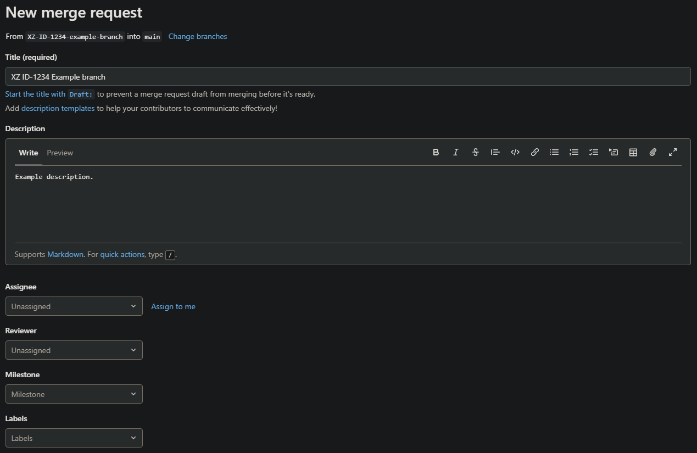

#

!!! tip "TLDR"

    - This is a beginner friendly guide on how to make a pull request using Git for the first time!
    - A pull or merge request starts the process of integrating new code with a project's main branch.
    - [Checkout] an existing local branch with `git checkout`, an existing remote branch with `git switch`, or a new branch with `git checkout -b <branch-name>`.
    - [Stage and commit] your work with `git add <file-name>` followed by `git commit -m "Commit message"`. Use `git add .` to commit **all** modified/untracked files.
    - [Push] your commits to the remote repository with `git push`.
    - [Create a new pull request] on GitHub or GitLab.

??? success "Pre-requisites"

    | Pre-requisite | Importance | Note |
    |---------------|------------|------|
    |[Intro to Git]|Necessary|This guide assumes you are using Git to version control|
    |[Using Git collaboratively]|Necessary|Get started using Git as a team|
    |[Committing Work]|Necessary|A beginner friendly commit walkthrough|
    |[Working with Branches]|Necessary|A beginner friendly branch walkthrough|

## What is covered in this walkthrough?

!!! info inline end "Pull Requests vs Merge Requests"

    Pull Requests and Merge Requests are two different names referring to the same feature on different platforms. On GitHub they are called Pull Requests and GitLab they are called Merge Requests.

    In this guide, we will refer to them as pull requests.

A pull request starts the process of merging new code with a project's main branch.

In this guide we go through the process of merging new code with a project's main branch. We will do this by opening a new pull request, then show you how you can discuss and review the changes with team members, adding new commits in response to comments, before finally merging into the project main branch.

This guide won't show you how to resolve conflicting changes your branch might have when comparing to the main branch.

Using Pull Request assist in the collaborative coding process by providing an easy platform for code review, checking and discussing new code before it goes into the main branch. This can help issues and errors to be caught earlier in an isolated environment where it is easier to resolve them.

## How to make a pull request

The first step of making a pull request is to change the branch you are working on. You can do this by either "checking out" an existing branch or a new one. To learn more about branches see our [Working with Branches] walkthrough.

=== "Checkout an existing branch"

    To checkout an existing branch, open a terminal (e.g. [Bash Terminal]) and enter:

    ```bash
    git switch <branch-name>
    ```

    ??? question "What if I want to checkout a remote branch?"

        To update your local repository with all remote branch changes, in the terminal enter:

        ```bash
        git fetch
        ```

        To checkout a remote branch, in the terminal enter:

        ```bash
        git switch <branch-name>
        ```

=== "Checkout a new branch"

    To create and checkout a new branch, open a terminal (e.g. [Bash Terminal]) and enter:

    ```bash
    git checkout -b <branch-name>
    ```

    !!! note

        The naming convention of your branch names should follow a consistent style. We advise something like `<branch type>/<project id>-<initials>-<ticket number>-<brief description>`, but you can add and drop different parts where it suits you, for example:

        ```
        <initials>_<ticket-id>_<description>
        ```

        See our guidance on [branch naming schemes](../using-git-collaboratively.md#branch-naming-schemes) for more details.

### Make changes and commit work

To commit your work see our [Committing Work][committing work from make changes] walkthrough.

### Push commits

To push your commits to the remote repository, in the terminal enter:

```bash
git push origin <branch-name>
```

### Create a new pull request

=== "GitHub"

    1.  Click on the "Pull requests" button at the top of your repository. This will take you to a new page containing the list of open pull requests available to review:

        

    2.  Click on the "New pull request" button. This will take you to a new page comparing pull request changes:

        

    3.  Check that you are **merging to the correct base branch** and fill in the pull request details:

        === "Required"

            - Write a title
            - Write a description

        === "Recommended"

            - Select reviewers
            - Select assignees

        === "Optional"

            - Add labels

    4.  Once you are happy with the pull, click on the "Create pull request" button!

        ??? question "What if my pull request is not ready for review?"

            To make a draft pull request, click on the drop-down arrow on the "Create pull request" button instead and select "Create draft pull request". You might want to do this if you want feedback and review, but the work isn't ready to merge.

=== "GitLab"

    1.  Click on the "Merge requests" button on the left sidebar of your repository. This will take you to a new page containing the list of open merge requests available for review:

        

    2.  Click on the "New merge request" button. This will take you to a new page:

        

    3.  Check that you are **merging to the correct base branch** and fill in the merge request details:

        === "Required"

            - Write a title
            - Write a description

        === "Recommended"

            - Select reviewers
            - Select assignees

        === "Optional"

            - Add labels

    4.  Once you are happy with the merge request, click on the "Create merge request" button!

        ??? question "What if my merge request is not ready for review?"

            To make a draft merge request, append "Draft: " to the title of your merge request.

## Useful Git Command Line commands

`git status`

: **Check whether any files have changed in a repository**  
 Displays the state of the working directory and the staging area. See which changes have been staged, which haven't, and which files aren't being tracked by Git. The status output does not show you any information regarding the committed project history.


`git log`

: **Check the history of commits**

!!! info
    
    You can escape from `git log` by pressing `q`

`git branch -a`

: **Display a list of all branches in the repository**

`git fetch`

: **Downloads the online/remote repository information, including commits, files, and branches**  
 Unlike the more aggressive `git pull`, your local development work is unchanged. However, your local repository is aware of any changes that can be later integrated into your local work.  
 `git fetch` is a great way to safely check what everybody else has been working on in the shared repository.

!!! info "More useful commands"

    See our [Introduction to Git] for more useful commands.

## Further Reading

- [Atlassian - Making a Pull Request]
- [Git fetch]

[checkout]: #how-to-make-a-pull-request
[stage and commit]: #make-changes-and-commit-work
[push]: #push-commits
[create a new pull request]: #create-a-new-pull-request
[intro to git]: ../introduction-to-git.md
[using git collaboratively]: ../using-git-collaboratively.md
[committing work]: ./committing_work_walkthrough.md
[working with branches]: ./working_with_branches_walkthrough.md
[bash terminal]: ../introduction-to-git.md#how-do-i-use-git
[committing work from make changes]: ./committing_work_walkthrough.md#make-changes
[introduction to git]: ../introduction-to-git.md#common-git-commands
[atlassian - making a pull request]: https://www.atlassian.com/git/tutorials/making-a-pull-request
[git fetch]: https://git-scm.com/docs/git-fetch
[rap community of practice github]: https://github.com/NHSDigital/rap-community-of-practice/issues
