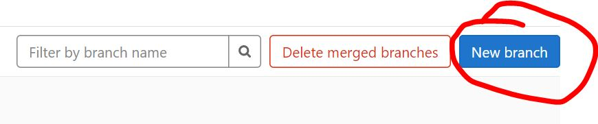
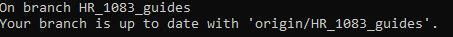
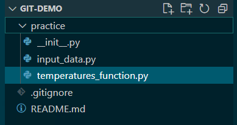
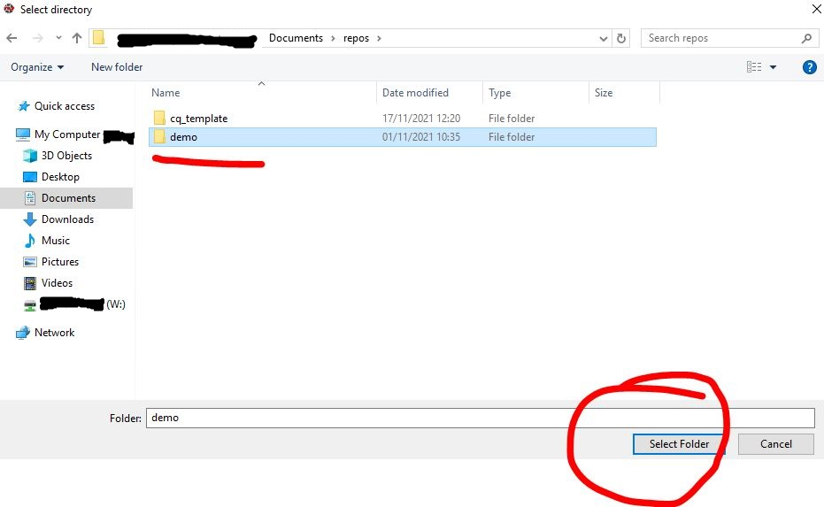
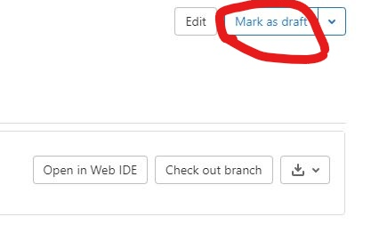

# Intro to Git

## Overview

This page is intended as a starting point for someone who is new to using git. It shows you the basic commands and the workflow to use git on your own.

To use git as a team you should complete this section and the following section on [using Git collaboratively][1].

## What is version control?

Version control is the practice of tracking and managing any changes on project's code, files or folders over time. This allows you to observe a detailed history of the changes made and enables your team members to collaborate on the same project.

In Git, each user has the entire repository (project's working directory) on their computer (offline), hence, they can work separately offline until they opt to push their updated version of the code to the remote (online) central repository.

Remote repositories are versions of your project that are hosted on an online Version Control System. In NHS Digital, we store that in GitLab site for internal users (GitHub site for the public).

### Why should I care?

Using version control is one of the fundamental skills needed by analysts to produce high-quality analytical outputs. Git is **the standard** for tracking code over time and is the way that NHS Digital has chosen. While git has a steep initial learning curve, the payoff is huge and so we strongly recommend taking the time to learn this as a team.

The benefits of using version control include:

- Understanding what happened in the past. E.g., what did we change last time we ran this code
- Restoring previous versions
- Tracking changes - avoid accidentally breaking code
- The ability to review someone's changes and to leave comments
- The ability to plan development work more effectively through being able to assign small, discrete changes
- Avoid code being hidden away on someone's machine
- The ability to set up an approval process for changes
- The ability to make changes without breaking anything - through running automated tests
- The ability to try out experiments without the risk of breaking your main code

## Glossary of terms

Here's a list of commonly used Git terms, that will help you understand the technical jargon mentioned in the next sections:

- [Git terminology](https://www.javatpoint.com/git-terminology)

## Video showing Git workflow and commands

This short video tutorial walks you through how to create a repository and use basic Git commands:

[Link to video tutorial](https://vimeo.com/678267338)

We have also produced a short video that gives some more theoretical explanation of how version control works:

[Link to video](https://vimeo.com/678169794)

## Common basic commands

Below is a list of common commands for reference. We only list basic commands here. This is just to flag to you that these commands exist. You can google for more detail on any of them.

- [Git commands cheat-sheet](https://training.github.com/downloads/github-git-cheat-sheet/)

- Create a new git repo locally: `git init`. The init command is short for "initialise", it's the command that will do all of the initial setup of a repository. The folder needs to actually exist before we can create a new repository with Git.

- Clone an existing Git Repository: `git clone <url>`. Happens only once, when you need to create a local copy of a GitLab repository.

- Check whether any files have changed in a repository: `git status`. It lists the files you've changed and those you still need to add or commit. It displays the state of the working directory and the staging area. It lets you see which changes have been staged, which haven't, and which files aren't being tracked by Git. Status output does not show you any information regarding the committed project history.

- Create and switch to a new branch: `git checkout -b <your branch name>`.

- Check out a branch: `git checkout <your branch name.`. Check out an existing new branch.

- Add file contents/stages changes from the working directory to the index: `git add <filename>` or `git add .`

- Commit staged files with a message: `git commit -m "<message>"`. Committing changes in this way captures a snapshot of the project's currently staged changes. Committed snapshots can be thought of as “safe” versions of a project

- Update your branch with the online/remote branch info: `git pull`. Pulls the latest changes from the repository, only affects the current active branch you’re in.

- Check the history of commits: `git log`.

- Show unstaged changes between your index and working directory: `git diff`. Press `Q` to exit the diff log.

- Ignore files: `.git-ignore file`. This file specifies untracked files that git should ignore such as the sensitive information related to security or the data itself. Files already tracked by git are not affected.

- Display a list of all branches in the repository: `git branch -a`.

- Delete a local branch: `git branch -D <your branch name>`.

### Undoing changes via Git commands

GitLab has a guide covering various cases on undoing any changes: [undo possibilities in Git](https://docs.gitlab.com/ee/topics/git/numerous_undo_possibilities_in_git/).

## What is a terminal?

A terminal acts like a mediator, takes text input (a command) and returns an output (a process, a result, an action) that depends on the command input's process. Command line terminals can be used to input commands that refer to file directories, list of directories and/or moving folder and files but also for version control (Git) and creating isolated environments (conda, venv etc).

Anaconda prompt is very similar to other command line terminals (e.g. Windows Command Prompt), but allows you to use Anaconda commands, which do not work in other terminals on Windows.

Different terminals use slightly different languages, and so you may find that if you're used to the terminal on a Mac, you need different commands when working on a Windows machine. Some terminals allow you to workaround this- such as [Git Bash](https://www.atlassian.com/git/tutorials/git-bash#:~:text=What%20is%20Git%20Bash%3F,operating%20system%20through%20written%20commands.). Git Bash works on Windows, but emulates the most common terminal experience on a Mac or Linux, allowing to use the same commands.

### Useful commands

- Anaconda Prompt takes most or all of the commands that Windows Command Prompt takes, but also includes Conda-specific commands: [Command reference](https://docs.conda.io/projects/conda/en/latest/commands.html).
- For new starters and for the purposes of this guide, `dir` (list of files within the directory) and `cd` (change directory) are the major terminal commands required for Anaconda Prompt.

Example of Windows vs Linux commands differences:

- list files - `dir` (Windows, incl. Anaconda Prompt) - `ls` (mac, linux)
- change directory - `cd`
- display current directory - `pwd` (mac, linux) - `chpwd` or `%cd%` (Windows)
- List of other [command differences](https://www.geeksforgeeks.org/linux-vs-windows-commands/)

For more info on conda virtual environments see [here](../python/virtual-environments.md).

## Setup for Git Basics exercise

### Creating your access token

When cloning a Git repository from a web-hosted repository platform such as GitHub or GitLab for the first time, you will be prompted to input your credentials, which is usually your username and password. Where two-factor authentication is enabled, and for internal repository platforms, you will need to generate an access token which you use as your password.

> For NHS Digital employees using our internal GitLab, your username is your GitLab username and your password is your access token.

- In Gitlab, navigate to Preferences by clicking the top right profile picture:


- On the left hand side menu select Access token. You should see this page after clicking:


- Add a token name, select all boxes for the scope, leave the date blank (token will never expire) and select Create Access Token. The access token that will appear at the top of the page needs to saved in a text document (Notepad etc).

### Troubleshooting credentials

You might see something like this at any point:

```text
remote: HTTP Basic: Access denied
remote: You must use a personal access with 'read_repository or 'write_repository' scope for Git over HTTP.
remote: You can generate one at https:// etc etc...
remote: Authentication failed for 'repository address you're attempting to git clone'
```

This can mean a number of things: either your access token has expired or you have entered the wrong access token for your password (or username even). If your access token has expired or about to expire, you can check by going to GitLab Profile -> Preferences -> Access Tokens then scroll all the way down and see if there’s an Active Access Token and check the expiration date.

- These steps will help you fix your access to the repository:

1. To fix this we need to create a new access token (don’t assign a date this time, so it will never expire).

2. In the command terminal type `git pull -v` (v stands for verification). This should prompt a new git credentials window.

- If you don't have an existing repository, and can't do step 2, then:

1. In the terminal type `git clone <git repo copied clone url>` but with the new credentials included in the URL, so:

```text
C:\My_documents>git clone https://<username>:<password>@<domain>/example.git
```

So, in my case it would be:

```text
C:\My_documents>git clone https://<username>:<MY_NEW_ACCESS_TOKEN>@<domain>/example.git
```

## Intro Exercises

Complete tasks 1 - 6: Accessing a git repository, creating a branch, adding a new file, uploading your changes to GitLab

**Getting started** - tasks 1 and 2 will be relevant only when accessing a repository for the **first time**.

- If stuck at any point feel free to go through the video tutorials mentioned in the previous sections of this guide).

!!! Info "Internal to NHS Digital"

    If stuck on **creating an access token**, there is a video which can be found internal to NHS Digital within the RAP community of practice MS Teams page under:

    Files > COP video tutorials > Create GitLab access token

### 1. Creating your local git repository folder

i. Open a Command terminal. This can be any terminal, Anaconda Prompt or Git Bash etc. To access the terminal, click the Search option on the Windows toolbar and type "Anaconda Prompt" and open it. The file directory address that's displayed in the terminal will usually be the default top level C drive address or something similar.

```text
(base) C:\Windows\system32>
```

ii. Create a folder in your local directory, this is where the GitLab (remote) repository will be copied/downloaded to. In the Anaconda Prompt terminal type `cd <windows explorer repo folder address you just created>`, `cd` stands for Change Directory, and what this means is that the default terminal address will be directed to the new directory, the new folder address. Any git commands applied in the terminal will apply to the current directory.

```text
(base) C:\Windows\system32>cd C:\Users\<username>\Documents\my_project_folder\RAP
(base) C:\Users\<username>\Documents\my_project_folder\RAP>
```

### 2. Git clone (copy/download a GitLab repository)

i. The repository's clone URL will be on the GitLab repository's main page (see image below).

[Git demo repo with practice exercises]


ii. Type `git clone <repository's clone url>` the git-demo repository using your local terminal (Anaconda Prompt). Enter your credentials when prompted (GitLab username and access token for the password.)

```text
(base) C:\Users\<username>\Documents\my_project_folder\RAP>git clone <paste the repo url address from the image above>
```

iii. Type `cd <windows explorer repo folder address>` (open the newly downloaded git folder) in the Anaconda Prompt to assign the root level of the directory to the top level of the repository. This because the terminal is assigned to the folder containing the git repository, not the folder that IS the git repository.

iv. Type `git status` in the terminal. You should see the this message:


### 3. Create and switch to a new branch

Notice how in the image above, the first line says "On branch master". In Git, **"master"** is a naming convention for a branch. After cloning (downloading) a project from a remote server, the resulting local repository has a single local branch: the so-called "master" branch. This means that "master" can be seen as a repository's "default" branch. The master should always be locked, to protect the main build of your working code and/or documentation. To add new code/documentation/make any edits to the master branch, you need to submit a [merge request](#how-to-submit-a-merge-request).

**"Branch"** is another word for "version". Usually when developing a document or slides for a presentation, we could have numerous versions of the same slides, with small or major differences. By using different branches (or versions) of the same code, we can safely work and test without breaking the publication code, that resides in the default master branch of the repository.

i. To create a **new branch**, head over to GitLab, on the repository's main page, same webpage we used to find the git clone repository's URL. On the left hand side menu select Repository -> Branches.


ii. Once in the branches list page, select New Branch (big blue button) on the right hand side.



iii. In the New Branch page, type your branch name and select the branch you want to copy from. On most cases it will be the master branch so GitLab has this option select by default. Once happy with your choices, select Create branch.


iv. Back to the terminal (e.g. Anaconda Prompt etc), type `git branch -a` to view a list of all available branches existing in the repository. The branches that contain the `remote/` path are the branches online, on GitLab. Have a look at the list. You will notice your new branch is not there yet. To update your local master branch with all the latest updates on GitLab, type `git pull`. Type `git branch -a` and you should see your branch available in the list now.

v. To start working on your branch and select, type in the terminal `git checkout <your branch name>`.

vi. Type `git status` and this way you can confirm that you are in a new branch. Git will display a message showing the current branch name and the current branch's information.



_**Reminder:** any changes you make while in the master branch won't be uploaded to GitLab, as the master branch is protected and locked, so make sure you are in your own working branch! You can confirm this with step vi. above._

#### Branch naming strategy

Following an agreed naming convention will make it much easier to keep the team's work organised. We follow use this approach:

    <project_id>_<initials>_<ticket_number>_<brief-description>

Here the project_id refers to our project ID in confluence (DS218). The initials are from my name. The ticket number refers to the jira ticket number.
E.g.:

    DS218_CQ_167_Add-field-definitions

Naming branches in this way helps to make it very clear what change should be happening in the branch. Sometimes code review will reveal that a branch that was intended to make one specific change in fact makes several changes. This should be avoided and the code review should reject the additional changes.

### 4. Add a new file

By adding a new file to the project, you can avoid conflicts as each analyst will create and upload their own file.

There are many ways to add a new file to your branch. One way is to upload a file directly to your branch on GitLab.

The easiest way is to simply create the file (any type of file) in your working directory, while in your branch. You can also copy a file from another directory. The file you create or copy can be any type of file.

### For VS Code users

1. To open VS Code from the terminal (this will save you a few extra clicks) simply type in the Command Prompt of your choice (e.g. Anaconda Prompt/Git Bash/Powershell):

   

2. Once VS Code loads, you will notice the on the left hand side panel the folder structure of the cloned repository:

   

   You can continue using the Command Prompt or you can continue with using the VS Code built in terminal. To add a new file in your repository right click in the folder structure, in this case we want to add a file in the practice folder of the repository:

   

3. Name the file, add a file format in the name, for example `.py` for a python file, `.md` for a markdown file etc.

4. Type something in the new file!

5. Save your changes within VS Code, either from the top toolbar File -> Save or by `Ctrl + S`.

### For Spyder users

For this exercise, create a file while in Spyder, with simply right-clicking on the repository's folder and then selecting the Create New File option:

To view and edit the repository's folders and files in Spyder:

  1. Open Spyder
  2. On the top toolbar go Projects -> New Project, this will open a Create New Project dialogue.

      

  3. In the Create New Project dialogue, select existing directory (since we have already cloned the GitLab repository to your local machine and have a folder) and in Location select the Open Folder icon to select the existing folder repository:

      

  4. In the Select directory dialogue, select the folder that contains your repository's contents. In this example, I have a repository called "demo":

      

  5. You should be able to see the project structure on the left hand side menu as it is displayed on GitLab, in the image above.
  6. Right-click on the Practice folder and select New and New File.

      

  7. Name the file.
  8. Add something into that file.
  9. Save it on Spyder.

### 5. Commit your changes (follow basic git command workflow)

In the Anaconda Prompt (or any terminal of your choice) type the following. I suggest you read through the git messages displayed after each command entered in the terminal, to familiarise yourself with the logic.

i. Type `git status` to see the modifications that haven't been staged yet (in red colour).

ii. Type `git add <filename>` to stage your changes. Or `git add .` to simply stage all changes automatically (use with caution).

iii. Type `git status` to see the file modifications now have a green colour. This means that git add was successful.

iv. Type `git commit -m "your commit message here"` to commit these changes.

v. Type `git status` to view the status of your repo. There should be no modifications visible (or colours!).

vi. Type `git push`. This command will upload all your committed changes to GitLab.

### 6. Check the repository on GitLab to view the changes updated

Simply head over to GitLab, and the repository page on GitLab, select your branch and compare the changes between your branch and the master branch.


## How to submit a merge request

To submit a merge request:

1. Simply head over to GitLab and to the respective repository

2. Select Merge requests on the menu on the left hand side.

3. On the right select New Merge Request (big blue button).

4. Target branch will always (in most cases) be the master branch. Source branch is your working branch.

5. Click Compare branches and Continue

6. Fill out any information related to the Merge request, title, description, any comments. Assign yourself as the Assignee, assign someone in your team to be the Reviewer. Then, select Create Merge Request.

## Mark your merge request as a draft on GitLab

After submitting a merge/pull request, you can block the request from being merged if you opt for the "Mark as draft option":



This will assign your request as a draft merge request, blocking it from being merged. Once the development work is completed then you can unassign the "Mark as draft" option and the merge request can be accepted.

## How to accept a merge request on GitLab

Once you are assigned the merge request's reviewer, you should receive an email notification from GitLab with a link to the merge request's webpage.

You can also view any active merge requests by clicking on the left hand side menu, once in the repository's page.


In the merge request page, there are three tabs: Overview, Commits and Changes.

**Overview** is the main merge request page. It contains the merge request's description, timeline and comments left by the assignee or reviewer. The approve button does not impact the merge request itself. Not selecting the Approve button won't affect the status or progress of the merge request. GitLab has made this available for teams that are interested in 2-step review processes where one analyst submits a merge request, another approves the request and the reviewer confirms the merge.

- Deleting the Source branch: this will automatically delete the branch created for the merge request. Untick this option to keep the source branch.
- Squash commits: ticking this will merge the history of commits for the source branch into one commit. This can be useful when the merge request is not a major update and you don't want your repository's history of commits to contain commits with messages such as "fixed typo" "replaced incorrectly placed image".

**Commits** tab displays a history of the merge request's commits. So for example, if the reviewer decides that minor adjustments are required and the assignee pushes these changes to GitLab, then these commits will be captured in this tab.

**Changes** tab, here you can see all the new changes in the merge request's source branch. You can also opt for a side-by-side comparison, and see line-by-line how the master version and new branch version compare. You can also leave comments on each file's line, which will also be recorded in the Overview tab's timeline.

If you are happy with the new changes, then select Merge and the merge request should be completed in a few seconds.

## How to update your local master branch to the latest remote master version on GitLab/Github

1. Open the Anaconda Prompt terminal or Git Bash or any other terminal you wish to use. This can be accessed by typing, for example Anaconda Prompt, in the search bar, after opening the search icon on your Windows toolbar.

2. Type `cd <paste your work directory address>` in the terminal to switch to your working directory. This is where the Git repository is cloned/copied/downloaded to, on your local machine (or RDS environment or any environment you're using). This will cause the default terminal address to be directed at the new directory. (see [Git Clone instructions above](#2-git-clone-copydownload-a-gitlab-repository) for more info)

3. Type `git status` in the terminal to ensure that `ii` happened successfully and you are on the default master branch. You should see this message:

    

4. Type `git pull` to update your local master branch with the latest version of the remote/online/GitLab master branch. This might take a few seconds.

## The .gitignore file

.gitignore is a text file that contains file extensions and directories' paths that we wish git to ignore. For example, we have created a repository on GitLab that should never contain data. To ensure this, in the repository's .gitignore file will include `.csv`, `.xlsx` etc.

Github has a .gitignore [template](https://github.com/github/gitignore/blob/master/Python.gitignore) available for analysts and developers to use for their own projects. Notice how in the template, lines 117-118 contain Spyder project settings, which are configuration files created by Spyder when you first open your repository as a Spyder project. Sometimes these configuration files can contain information you don't want to publish on Github/GitLab, thus by including them in the .gitignore file you are ensuring that these files will never leave your local machine.

[1]: ./using-git-collaboratively.md
