#

!!! tip "TLDR"

    * Make sure you have a GitHub account, by [signing up] or [signing in].
    * [Generate a Personal Access Token (PAT)]. Give it a name, expiry date, and a scope. Copy the PAT. More detailed steps [here][generating a PAT].
    * Use the PAT in place of a password when interacting with GitHub for the first-time. Learn more [here][using a PAT].
    * Once all setup, you should be able to [create a repository and clone it to your local machine].

??? success "Pre-requisites"

    |Pre-requisite | Importance | Note |
    |--------------|------------|------|
    |[Introduction to Git]|Necessary|It is important to get an understanding of Git before starting to use it|
    |[Git Quick Start Guide]|Necessary|Git must be set up on your machine|

!!! note "Note on the Method Used"

    There a number of different, valid methods for Git to be able to access your remote repositories stored on GitHub. 
    
    For example, you can [create an SSH key] on your local machine and [add it to your GitHub account], allowing you to communicate to GitHub via the Secure Shell Protocol (SSH). 
    
    Alternatively, you can install the [GitHub CLI] and authenticate using [`gh auth login`][gh auth login] to authenticate with your GitHub Account.

    The method used in this guide will be generating a Personal Access Token (PAT) on GitHub and using the Git Credential Manager to store it. This is a widely reliable method.

## Creating a GitHub Account

!!! info inline end

    You don't have to use the same email you used to [configure your installation of Git]. Another email can be used if you wish.

Creating a personal GitHub account is free and easy. Simply, got to the GitHub website and click the [Sign Up] button in the top-right corner (or follow the link provided).

Once signed up, validate the email address you signed up with. Some of the next steps are not possible without a validated email address.

If you have any issues with email verification, consult the GitHub Docs on [verifying you email address].

## Generating a Personal Access Token (PAT)
Here we give a cut down guide to making your own PAT. See the full [Github docs](https://docs.github.com/en/authentication/keeping-your-account-and-data-secure/creating-a-personal-access-token) for more details
!!! warning

    **Treat Personal Access Tokens like passwords.** 
    
    Store them securely and do not share them.

    If you are worried that a PAT might be compromised (or you haven't used one in a while) consider [revoking] it.

1. In the upper-right corner of any page on the [GitHub website], click your profile picture, then click **Settings**

    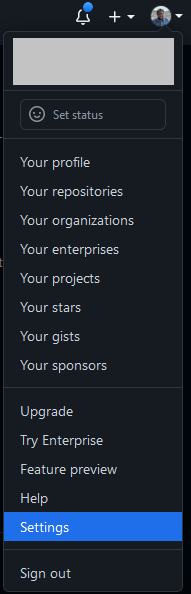

2. Towards the bottom of the left sidebar, click **<> Developer Settings**

3. In the left sidebar, under **Personal access tokens**, click **Tokens (classic)**.

4. Select **Generate new token**, then click **Generate new token (classic)**.

5. Give your token a descriptive name under **Token name**, e.g. "Git Desktop Token".

6. To give your token an expiration, select the **Expiration** drop-down menu, then select a default, use the calendar picker, or select 'No expiration' so the token will never expire.

!!! danger "tokens without expiration dates"

    It can be tempting to make tokens without expiration for convenience, but when you have a lot of them, its easy to leave old unused tokens laying around, potentially acting as security holes into our systems. 
    
    It's usually more secure to set an expiry date (e.g. 6 months) so any old tokens become useless after a period.

7. Select a scope for the token. For this guide, only the `repo` scope will be selected, but [other scopes] are available if you intend to do other things with the PAT.

!!! warning "PAT Token Scope"
    **It is advised to give a PAT only the scope required for it's use.**

    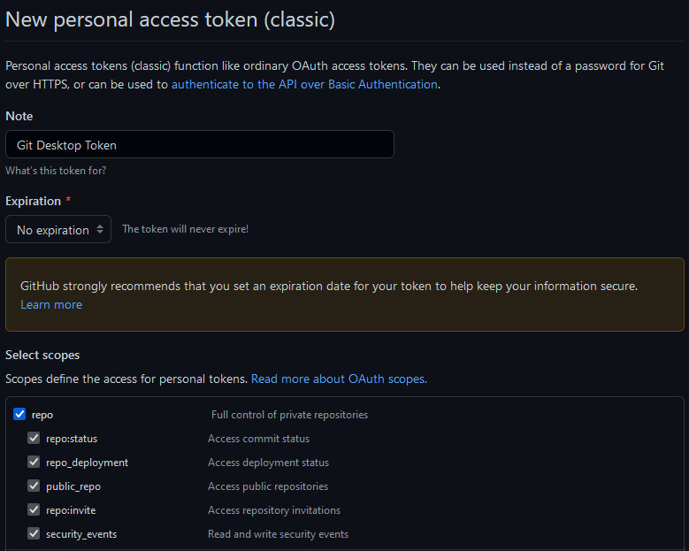

8. At the bottom of the page, under the scope table, click **Generate Token**.

    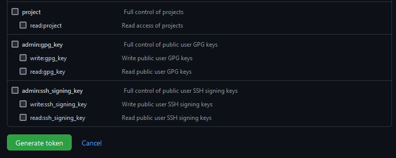

    Copy your new PAT and store it in a secure location for later use. You won't be able to see it again.

    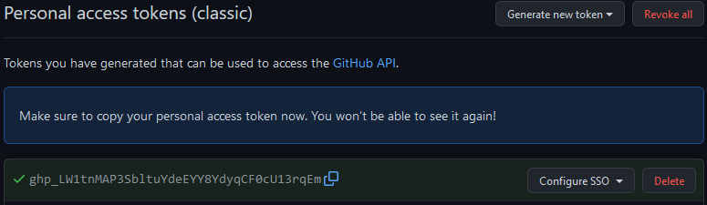

9. To use your token to access resources owned by an organization that uses SAML single sign-on, authorise the token. Click **Configure SSO** and select the organisation you wish to authorise.

    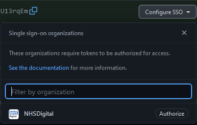

## Using your PAT on your local Git installation

When you go to clone or otherwise access a GitHub repository, you will be prompted for your username and password. You can use your PAT instead of your password. In the command line:

``` bash
$ git clone https://github.com/USERNAME/REPO.git
Username: YOUR_USERNAME
Password: YOUR_TOKEN
```

??? note "HTTPS vs SSH keys"

    You might come across SSH protocol keys, as it is essentially another option to create a password and verify your credentials. This section on [HTTPS vs SSH](https://happygitwithr.com/https-pat.html#https-vs-ssh) protocol options explains the differences between these two options. There are pros and cons for both, we would recommend the HTTPS option for Git beginners.

    PATs will only allow you use HTTPs Git operation. If your repository uses an SSH remote URL, you will need to switch the remote from SSH to HTTPs. See [this guide](https://docs.github.com/en/get-started/getting-started-with-git/managing-remote-repositories#switching-remote-urls-from-ssh-to-https) from GitHub for more details.

When you go to access a Git repository in the future, you should not be prompted for your username and password as your credentials will be cached on your computer. Read [this guide on caching credentials] from GitHub for more details.

### Troubleshooting credentials

You might see something like this at any point:

```text
remote: HTTP Basic: Access denied
remote: You must use a personal access with 'read_repository or 'write_repository' scope for Git over HTTP.
remote: You can generate one at https:// etc etc...
remote: Authentication failed for 'repository address you're attempting to git clone'
```

This can mean a number of things: either your access token has expired or you have entered the wrong access token for your password (or username even). If your access token has expired or is about to expire, you can check by going to the [GitHub Personal Access Tokens (Classic)] page to check the expiration date.

To fix this we need to [create a new access token][generating a PAT].

=== "If you have an existing repository"

    Next, in the command terminal type `git pull -v` (v stands for verification). This should prompt a new git credentials window.

=== "If you don't have an existing repository"

    In the terminal type `git clone <url>` but with the new credentials included in the URL, so:

    ```bash
    git clone https://<username>:<NEW_ACCESS_TOKEN>@<domain>/example.git
    ```

## Try it out

In this section, we will run through the steps of creating a new repository on GitHub, before cloning it to your local machine using Git.

??? Example "Try It Out"

    1. [Log into GitHub]

        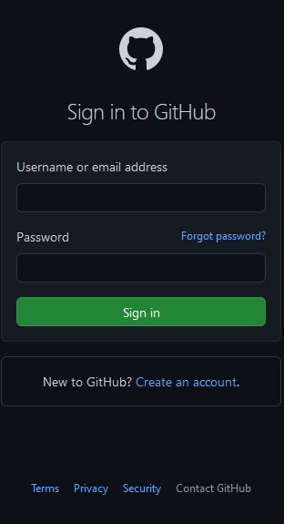

    2. Create a new repository

        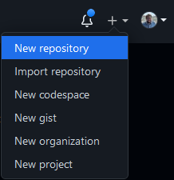

    3. Select the **owner** of the repository. If you are a part of an organisation then this will be available. However, in this instance just select your own account.
    4. Give the repository a descriptive but short **name**, for example "my_first_repository".
    5. Give the repository a short **description**, for example "This is my first repository".
    6. Set the privacy of the repository. In this case, **Private** is selected.
    7. Select **Add a README file** so there is something in the repository when we create it. This is not necessary for repositories, you can create them empty.

        ??? question "What is the README?"

            The `README.md` file is a markdown file that is used to tell other people about your project. It should communicate important information about your project, including:

            * What you project does
            * Why the project is useful
            * How users can get started with the project
            * Where uses can get help with your project
            * Who maintains and contributes to the project

    8. Click the green **Create Repository** button at the bottom to create the repository.

        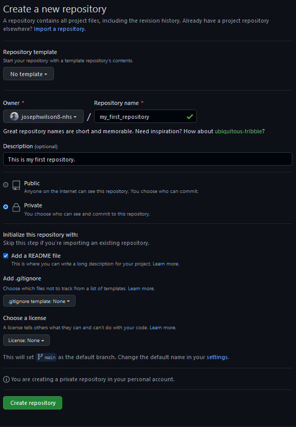

    9. Once created, the repository will be shown. Select the green `<> Code` menu to the right and copy the HTTPS URL shown.

        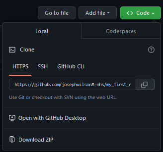

    10. To clone the new repository onto your local machine, open Git Bash. In a suitable directory, here the \$HOME (C:/Users/\$USER) directory is used, run the `git clone` command with the copied repository URL.

        ```bash
        git clone https://github.com/josephwilson8-nhs/my_first_repository
        ```

        If you have already configured your Git installation with a Personal Access Token (PAT) then this should run. However, if it prompts you for your username and password, complete the above sections on [generating a PAT] and [using a PAT].

    11. You can move into this repository with the `cd`, change directories, command.

        ```bash
        cd my_first_repository/
        ```

    12. Now in this repository, we can examine the currently set remotes for the repository, which will be the address of our repository that we created on GitHub.

        ```bash
        git remote -v
        ```

    13. Finally, we can inspect the repository in Windows File Explorer. 


        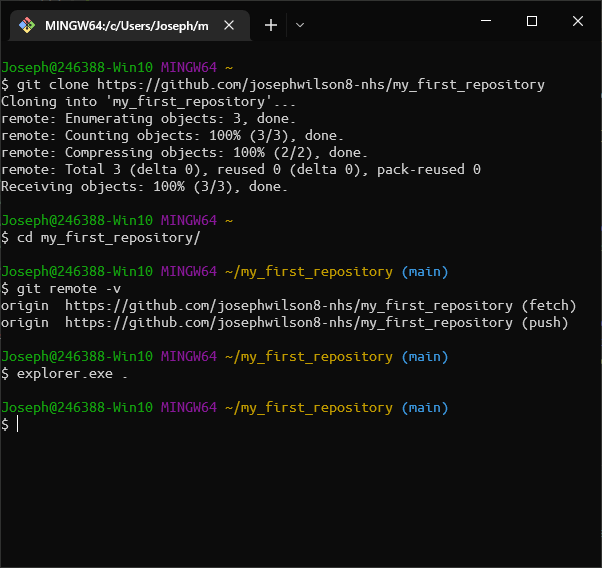

        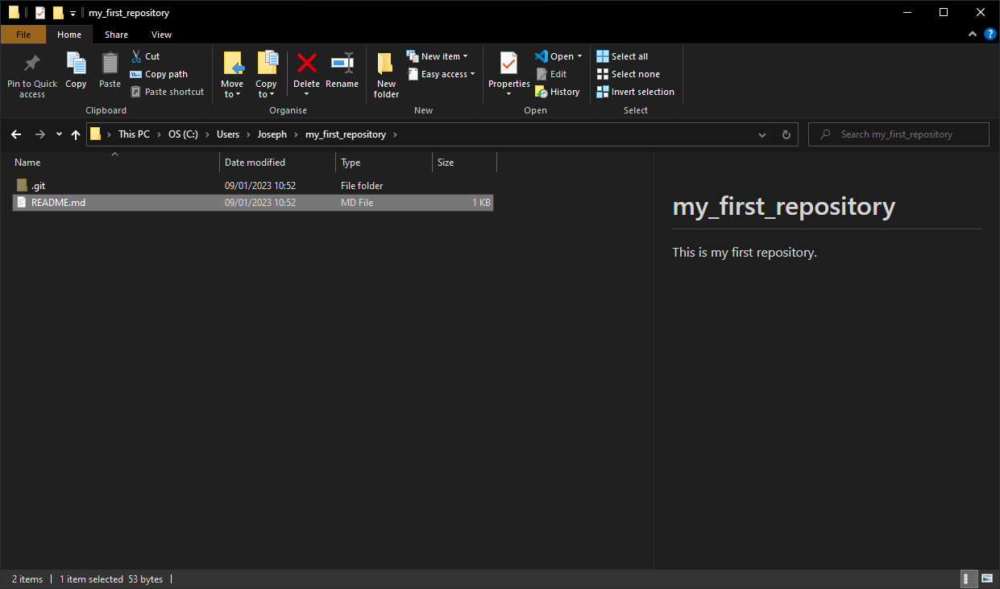

        !!! note

            Due to some settings and extensions used, there might be some small differences in what you see when viewing the repository in Windows File Explorer.

            In the picture above, hidden files have been made visible through a setting change, and an extension to Windows Explorer is being used to render the README markdown for the preview.

## Accessing the NHS Digital Organisation

If you work in NHS England then your team or directorate will likely have their own processes and ways of working on GitHub, including onboarding processes.

If you work within the Data Science Skill Team, there is a onboarding guide on [confluence].

## Next Steps

Now that you have set up your GitHub account to communicate with your local Git installation, you might also want to set up your access to [GitLab].

Alternatively, you can start learning about how to [use git to collaborate with others]; learning about branches, pull and merge requests, and how to deal with conflicting changes.

Finally, you might want to start practising using Git with our [Committing Work Walkthrough] walkthrough guide.

[signing up]: https://github.com/signup
[signing in]: https://github.com/login
[Generate a Personal Access Token (PAT]: https://github.com/settings/tokens/new
[generating a PAT]: #generating-a-personal-access-token-pat
[using a PAT]: #using-your-pat-on-your-local-git-installation
[create a repository and clone it to your local machine]: #try-it-out
[Introduction to Git]: ../introduction-to-git.md
[Git Quick Start Guide]: ./git_quick_start_guide.md
[create an SSH key]: https://docs.github.com/en/authentication/connecting-to-github-with-ssh/generating-a-new-ssh-key-and-adding-it-to-the-ssh-agent
[add it to your GitHub account]: https://docs.github.com/en/authentication/connecting-to-github-with-ssh/adding-a-new-ssh-key-to-your-github-account
[GitHub CLI]: https://cli.github.com/
[gh auth login]: https://cli.github.com/manual/gh_auth_login
[configure your installation of Git]: ./git_quick_start_guide.md#first-time-configuration
[Sign Up]: https://github.com/signup
[verifying you email address]: https://docs.github.com/en/get-started/signing-up-for-github/verifying-your-email-address
[revoking]: https://docs.github.com/en/authentication/keeping-your-account-and-data-secure/token-expiration-and-revocation
[GitHub website]: https://github.com/
[other scopes]: https://docs.github.com/apps/building-oauth-apps/scopes-for-oauth-apps/
[this guide]: https://docs.github.com/en/github/getting-started-with-github/managing-remote-repositories/#switching-remote-urls-from-ssh-to-https
[this guide on caching credentials]: https://docs.github.com/en/get-started/getting-started-with-git/caching-your-github-credentials-in-git
[GitHub Personal Access Tokens (Classic]: https://github.com/settings/tokens
[Log into GitHub]: https://github.com/login
[confluence]: https://nhsd-confluence.digital.nhs.uk/display/DAT/NHSD+GitHub+Organisation%3A+Adding+users
[GitLab]: gitlab_quick_start_guide.md
[use git to collaborate with others]: ../using-git-collaboratively.md
[Committing Work Walkthrough]: ../git_walkthroughs/committing_work_walkthrough.md
[RAP Community of Practice GitHub]: https://github.com/NHSDigital/rap-community-of-practice/issues
