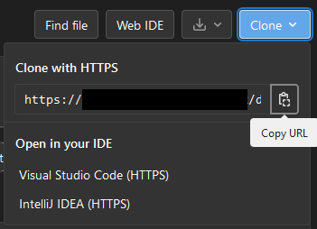

#

!!! info

    **This guide is tailored towards internal NHS England users with access to the internal instance of GitLab.** If you do not have an existing account check your team's internal processes for onboarding new GitLab users. NHS England users should also see our Confluence guidance on our internal implementation of Gitlab, Github and Git.

    If you have access to a different instance of GitLab then these steps should be mostly the same.

!!! tip "TLDR"

    * Sign-in to GitLab.
    * Generate a Personal Access Token (PAT). Give it a name, expiry date, and a scope. Copy the PAT. More detailed steps [here][generating a PAT].
    * Use the PAT in place of a password when interacting with GitLab for the first-time. Learn more [here][using a PAT].
    * Once all setup, you should be able to [create a repository and clone it to your local machine].

??? success "Pre-requisites"

    |Pre-requisite | Importance | Note |
    |--------------|------------|------|
    |[Introduction to Git]|Necessary|It is important to get an understanding of Git before starting to use it|
    |[Git Quick Start Guide]|Necessary|Git must be set up on your machine|
    |GitLab Account|Necessary|This guide assumes that you have an account for GitLab|

## Generating a Personal Access Token (PAT)

!!! warning

    **Treat Personal Access Tokens like passwords.**

    Store them securely and do not share them.

    If you are worried that a PAT might be compromised (or you haven't used one in a while) consider [revoking it].

1. In the upper-right corner of any page on the GitLab website, click your profile picture, then click **Preferences**

   

2. On the left sidebar, click **Access Tokens**

   

3. This will bring up the Personal Access Tokens page with the 'Add a personal access token' form at the top. Give your token a descriptive name under **Token name**, e.g. "Git Desktop Token".

4. To give your token an expiration, select a date in **Expiration date** field, using the calendar picker, or clear the field so the token will never expire.

!!! danger "tokens without expiration dates"

    It can be tempting to make tokens without expiration for convenience, but when you have a lot of them, its easy to leave old unused tokens laying around, potentially acting as security holes into our systems.

    It's usually more secure to set an expiry date (e.g. 6 months) so any old tokens become useless after a period.

5. Select a scope for the token. For this guide, only the `read_repository` and `write_repository` scopes will be selected, but [other scopes] are available if you intend to do other things with the PAT.

!!! warning "PAT Token Scope"

    **It is advised to give a PAT only the scope required for its use.**

6. At the bottom of the form, under the scopes, click the blue **Create personal access token**.

   

   Copy your new PAT and store it in a secure location for later use. You won't be able to see it again.

   

## Using your PAT on your local Git installation

When you go to clone or otherwise access a GitLab repository, you will be prompted for your username and password. You can use your PAT instead of your password. In the command line:

```bash
$ git clone <repository's clone url>
Username: YOUR_USERNAME
Password: YOUR_TOKEN
```

When you go to access a Git repository in the future, you should not be prompted for your username and password as your credentials will be cached on your computer. Read [this guide on caching credentials] from GitHub for more details.

### Troubleshooting credentials

You might see something like this at any point:

```text
remote: HTTP Basic: Access denied
remote: You must use a personal access with 'read_repository' or 'write_repository' scope for Git over HTTP.
remote: You can generate one at https:// etc etc...
remote: Authentication failed for 'repository address you're attempting to git clone'
```

This can mean a number of things: either your access token has expired or you have entered the wrong access token for your password (or username even). If your access token has expired or is about to expire, you can check by going to GitLab Profile > Preferences > Access Tokens then scroll all the way down and see if there’s an Active Access Token and check the expiration date.

To fix this we need to [create a new access token][generating a PAT].

=== "If you have an existing repository"

    Next, in the command terminal type `git pull -v` (v stands for verification). This should prompt a new git credentials window.

=== "If you don't have an existing repository"

    In the terminal type `git clone <url>` but with the new credentials included in the URL, so:

    ```bash
    git clone https://<username>:<NEW_ACCESS_TOKEN>@<domain>/example.git
    ```

## Try it out

In this section, we will run through the steps of cloning a repository on GitLab to your local machine using Git.

??? Example "Try It Out"

    1. Log into GitLab

    2. Navigate to the repository you want to clone. Select the blue `Clone` menu to the right and copy the HTTPs URL shown.

        

    3. To clone the new repository onto your local machine, open Git Bash. In a suitable directory, here the \$HOME (C:/Users/\$USER) directory is used, run the `git clone` command with the copied repository URL.

        ```bash
        git clone <gitlab clone url>
        ```

        If you have already configured your Git installation with a Personal Access Token (PAT) then this should run. However, if it prompts you for your username and password, complete the above sections on [generating a PAT] and [using a PAT].

    4. You can move into this repository with the `cd`, change directories, command.

        ```bash
        cd <repository directory>
        ```

    5. Now in this repository, we can examine the currently set remotes for the repository, which will be the address of our repository that we created on GitLab.

        ```bash
        git remote -v
        ```

    6. Finally, we can inspect the repository in Windows File Explorer.


        

        

        !!! note

            Due some settings and extensions used, there might be some small differences in what you see when viewing the repository in Windows File Explorer.

            In the picture above, hidden files have been made visible through a setting change, and an extension to Windows Explorer is being used to render the README markdown for the preview.

## Next Steps

Now that you have set up your GitLab account to communicate with your local Git installation, you might also want to set up your access to [GitHub], if you have haven't already.

Alternatively, you can start learning about how to [use git to collaborate with others]; learning about branches, pull and merge requests, and how to deal with conflicting changes.

Finally, you might want to start practising using Git with our [Committing Work Walkthrough] walkthrough guide.

[generating a PAT]: #generating-a-personal-access-token-pat
[using a PAT]: #using-your-pat-on-your-local-git-installation
[create a repository and clone it to your local machine]: #try-it-out
[Introduction to Git]: ../introduction-to-git.md
[Git Quick Start Guide]: ./git_quick_start_guide.md
[revoking it]: https://docs.gitlab.com/ee/user/profile/personal_access_tokens.html#revoke-a-personal-access-token
[other scopes]: https://docs.gitlab.com/ee/user/profile/personal_access_tokens.html#personal-access-token-scopes
[this guide on caching credentials]: https://docs.github.com/en/get-started/getting-started-with-git/caching-your-github-credentials-in-git
[GitHub]: github_quick_start_guide.md
[use git to collaborate with others]: ../using-git-collaboratively.md
[Committing Work Walkthrough]: ../git_walkthroughs/committing_work_walkthrough.md
[RAP Community of Practice GitLab]: https://github.com/NHSDigital/rap-community-of-practice/issues
