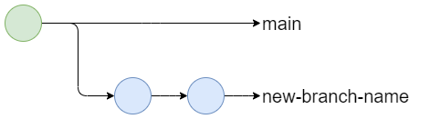

#

!!! tip "TLDR"

    * Collaborating on a project can sometimes get messy with hard work and important changes sometimes being overwritten and lost.
    * [Branches] allow you to create a parallel version of the repository and safely work on a new feature isolated from the rest of the repository.
    * Your default branch is called the main branch and should remain [stable and protected] with completed, reviewed changes being merged in from feature branches.
    * You can [change to an existing branch][change] with `git checkout other-branch-name`
    * [New branches can be created][create] with `git checkout --branch new-branch-name` command and then published with `git push --set-upstream origin new-branch-name`. 
    * [Branches can be deleted][delete] locally with `git branch --delete branch-name` and remotely with `git push origin --delete branch-name`.
    * You can [merge changes from a different branch into your current branch][merge] 
    with `git merge source-branch-name`
    * [Pull Requests][pull request] allows you to assign reviewers to check your changes before you make a merge via GitHub. Merge Requests are GitLabs implementation of this.
    * Sometimes Git needs help [resolving conflicting changes][merge conflicts] when making a merge. It will clearly tell you where the conflicts are in the code so you can go through them and choose what to keep.

???+ question "Why should I care?"

    The benefits of using branches are:

    * It allows multiple changes to be worked on in parallel and conflicting changes to be resolved.
    * It allows a clean, stable version of code to be maintained on your main branch.
    * It encourages peer review of code.

??? success "Pre-requisites"

    |Pre-requisite | Importance | Note |
    |--------------|------------|------|
    |[Introduction to Git]|Necessary|It is important to get an understanding of Git before starting to use it to collaborate|

## Introduction to Collaborating

When working with others (or even just yourself), it is good to divide and conquer the project, breaking it down into more manageable chunks of different features. Some of those features might be nice and discrete, with minimal interaction; however, some might be more entwined and blurred together.

This is where collaborating on a project can sometimes get messy. Changes can be tangled together, and hard work might be overwritten accidentally and lost. In addition, changes will take a differing amount of time to implement, meaning some might be done, while some might still be messy work in progress.

Git allows you to create [**branches**][branches] and separate out those changes. Branches can be thought of as different parallel versions of the repository, with changes being made separately from each other. Meanwhile, a stable main branch of the code is kept clean from incomplete changes. Any new changes are first made to the branches.

Once the changes have been made, a [**pull request**][pull request] can be created for them to be reviewed and approved before being merged safely into the main branch, with any overlapping changes being highlighted as [**merge conflicts**][merge conflicts] to be resolved.

This model of using branches with a shared repository is called the [**Shared Repository Model**].

## Branches

Working with branches is straightforward and powerful. There are four core operations you can do to a branch; [change], [create], [delete], and [merge].

### Changing your branch

!!! "Viewing your current branches"

    You can view your current branches with the command `git branch`; this will display a list of branches local to your environment. Add the `-r` command to see remote branches only or `-a` to see both local and remote branches.

You can change your branch with the `git checkout` command:

```bash
git checkout other-branch-name
```

If the branch doesn't yet exist locally to your system and only on the remote repository, then it will be downloaded and checked out.

!!! info "Local and Remote Branches"

    When you are working with a repository with a remote version stored online, there are two versions of it, the **local** version and the **remote** version.
    
    These won't automatically be kept in sync; we have to tell Git when to `push` local changes to the remote and `pull` remote changes to the local. This applies for branches as well, and we have to manually tell Git when to send or receive and then apply updates. 

    In fact, it is very common to have whole branches that are only local to your systems (usually, when you first create them, then you'll want to [publish them] to have a backup) and branches that are only remote to your systems (usually branches created by others that you don't need to use).

!!! example "Try it out!"

    Have a go at [changing branches in our working with branches walkthrough].

### Creating a Branch



You can create a branch with the `git branch` command:

```bash
git branch new-branch-name
```

However, this does not automatically checkout the command and put you on this new branch. Any new commits will be applied to the old branch. Therefore, it is better to use the `git checkout` command with the `--branch` flag to tell it first to create the branch and THEN change it.

```bash
git checkout --branch new-branch-name #(1)!
```

1. This command actually does two things.  
    1. It creates a new branch: `git branch new-branch-name`  
    2. Then it checks it out: `git checkout new-branch-name`  

Typically, we will create new branches from whichever branch we are currently on. However, there are times when you might want to specify the source branch from which you are creating the new branch. To do this, simply specify the source branch after the new branch name:

```bash
git checkout --branch new-branch-name source-branch-name #(1)!
```

1. Again, this command actually does two things.  
    1. It creates a new branch: `git branch new-branch-name`  
    2. Then it checks it out: `git checkout new-branch-name`  

!!! example "Try it out!"

    Have a go at [creating a branch in our working with branches walkthrough].

#### Branch Naming Schemes

It is good to have an agreed scheme in your team and your repositories when naming branches. This will allow you to communicate important aspects of the branch.

We advise something like `<branch type>/<project id>-<initials>-<ticket number>-<brief description>`, but you can use, add, and drop different parts of this where it suits you.

For example, this guide could be added to this repository under the branch `feature/DS_218-JW-NV-1476-Update-the-Using-Git-Collaboratively-Guide` with:

* `feature/`, the branch type
* `DS_218`, the internal project id for RAP
* `JW`, the branch author's initials
* `NV-1476`, the JIRA ticket number
* `Update-the-Using-Git-Collaboratively-Guide`, a short description of the branch.

There are a number of branch types a repository might have:

* `feature/` - for adding new features
* `release/` - for preparing or preserving a batch of changes for delivery
* `hotfix/` - for emergency fixes to your main branch (if it is [protected])

#### Publishing a branch

If you have created a branch locally on your system, then you will need to publish it to the remote repository. This can be done using the `git push` with the `--set-upstream` flag (`-u` for short) and specifying the remote alias, which is almost always `origin`:

??? "Why do we write `origin`?"

    `origin` is the default alias we give to the remote repository we clone from. This alias can be changed and can be checked using the `git remote` command to show the alias. 

    Use `git remote -v` to also see the URLs associated with the remote alias. There will always be two, the **fetch** (download) and **push** (upload). Note that these two URLs will often be the same.

```bash
git push --set-upstream origin new-branch-name
```

This only needs to be done once for a new branch. After that, Git will know which remote branch to work with.

!!! Note "Remote Branches"

    If the new branch was created remotely, e.g. on GitHub or GitLab, and then checked out to the local environment, then it does not need to be published. Git will already know which remote branch to track.

### Deleting your branch


When deleting our branches, we must remember that there are two copies of a branch, one local and one remote (assuming that the branch has been previously checked out to your system). Therefore there are two separate commands for deleting the branch locally and remotely.

1. Delete the local version of the branch

    ```bash
    git branch --delete branch-name
    ```

2. Delete the remote version of the branch

    ```bash
    git push origin --delete branch-name
    ```

!!! info

    While this deletes the versions of the branch that you can reach, collaborators that have also checked out that branch will still have a copy of that branch, communicate with them that you have deleted the remote for the branch so that they know to [prune] their repository.

!!! example "Try it out!"

    Have a go at [deleting your branch in our working with branches walkthrough].

#### Pruning your local repository

As development on your repository goes on, branches will be deleted remotely but might still exist on your local system. Therefore it is good to periodically prune any local branches that no longer have a counterpart on the remote. This can be done with a `git fetch` with the `--prune` flag:

```bash
git fetch --prune
```

!!! info "Fetch dry run"

    If you want to check what will happen when you run the `git fetch` command (in this example, what branches will be pruned), then add the `--dry-run --verbose` to get an output of what would be done without making changes.

### Merging your branch

As you complete work on your feature branches, you will want to move those changes back into the main branch, although hopefully after a [review] and resolving any [conflicting changes]. To move these changes in, we are going to use the `git merge` command.

``` bash
git merge source-branch-name
```

!!! warning "Ensuring the branches are updated with changes"

    Before we merge, it is important to ensure that both the local version's source branch (the one we are merging from) and target branch (the one we are merging to) are both up to date with changes from the remote repository.

    ```bash
    git checkout source-branch-name
    git pull
    git checkout target-branch-name
    git pull
    ```

!!! example "Try it out!"

    Have a go at [merging branches in our working with branches walkthrough].

#### Updating your branch

As you collaborate and work on multiple branches in your project’s repository, you might want to ensure that your branch is updated with changes from other branches, usually the main branch. This allows us to prevent future conflicts or [resolve current conflicts].

## Pull Requests

A **Pull request (PR)** is how you announce to other collaborators that you've finished your changes, and you're ready to merge them - usually into the main branch of the repository. Then, either your collaborators or someone you assign will review your changes to ensure they are ready to be merged. The equivalent term for GitLab users is Merge Request (MR).

On the Pull request page, there are four tabs:


=== "Conversation"

    **Conversation** is the main pull request page. It contains the pull request's description, timeline, and comments the assignee or reviewer left. To merge a pull request, you have three options:

    * Merge pull request: this will keep the entire commit history of the source branch and add it to the target branch. Creates a symbolic commit.
    * Squash and merge: ticking this will merge the history of commits for the source branch into one commit. This can be useful when the pull request is not a major update, and you don't want your repository's history of commits to contain commits with messages such as "fixed typo" or "replaced incorrectly placed image". Creates a merged commit.
    * Rebase and merge: add all source branch commits in front of the target branch's commits. Does not create a symbolic commit.

=== "Commits"

    The **Commits** tab displays a history of the pull request's commits. So, for example, if the reviewer decides that minor adjustments are required, and the assignee pushes these changes to Gitlab, then these commits will be captured in this tab.

=== "Files changed"

    In the **Files changed** tab, can you see all the new changes in the pull request's source branch. You can also opt for a side-by-side comparison and see line-by-line how the master version and new branch version compare. You can also leave comments on any line of any file, which will also be recorded in the Conversation tab's timeline.

=== "Checks"

    **Checks** is part of the GitHub Actions functionality, which enhances your code review processes with apps and automated reviewing checks. This is inactive by default.

If you are happy to merge the two branches, then select the type of pull request you wish to apply, and the pull request should be completed in a few seconds.

!!! example "Try it out!"

    Have a go at raising a pull request and conducting a review with our [pull request walkthrough].

## Merge Conflicts

While Git is an extremely powerful tool, it needs human intervention to resolve situations where there are conflicting changes.


Conflicts are usually caused by the same lines being changed on both branches. Git will attempt to automatically merge the branches like it did when we updated our branches, but when it encounters a conflict, it will stop auto merging and show a CONFLICT error, highlighting the files in which conflicts are occurring.

``` title="Example merge conflict message"
Auto merging practice/temperatures_function.py
CONFLICT (content): Merge Conflict in practice/temperatures_function.py
Automatic merge failed; fix conflicts and then commit the result.
```

Git will clearly mark the conflicting changes in the files and still automatically merge non-conflicting changes.

Different editors give us different tools for handling these merge conflicts, though the principles remain the same. Open the file(s) listed in the CONFLICT error and scroll to find the conflict. The conflict will be marked by these strange lines:

``` title="Example of a merge conflict in a file"
<<<<<<< HEAD
Changes in the current checked-out branch.
======
Incoming changes from the source branch
>>>>>>> source-branch-name
```

The top bit above the double line is what we have in our branch, represented by the `<<<<<<< HEAD` statement. The bottom bit is the same line but saved in the branch we are merging from, represented by the `>>>>>>> source-branch-name` statement.

To resolve the merge conflict, delete the line which you do not wish to keep, as well as anything to do with marking the conflict. So if we wanted to keep only what we had on the source branch, we would delete everything until we had just the line we wanted:

```
Changes in the current checked-out branch.
```

Then once all conflicts are resolved, we can stage and commit our merge.


If we wanted to cancel the merge, we can do so simply with the following command:

```
git merge --abort
```

!!! example "Try it out!"

    Have a go at [resolving a merge conflict in our working with branches walkthrough].

### Resolving Merge Conflicts in VS Code

There are many tools and integrations that make finding and resolving merge conflicts easier. This includes most IDEs with Git integrations, with one particularly feature-rich IDE integration in VSCode.

!!! note
    Visual Studio Code has introduced a new method of resolving conflicts, the three-way Merge Editor. There are instructions below on how to use the Merge Editor. To check which instructions you need to use, check if Settings > Git > Merge Editor is enabled or disabled. If enabled, read the [Merge Editor] instructions. Otherwise, continue reading the instructions below.

**In Visual Studio Code**, you can open your file browser in the tools tab. Any files which have a merge conflict will have a little 'C' next to them here. Open the files which have these conflicts (in this case, temperatures_function.py).

Scroll in the document to find the conflict. You will notice these strange lines where conflict has occurred:

```text
<<<<<< HEAD
This line is the line in my branch.
=======
This line is the line in main.
>>>>>> main
```

The top bit above the double line is what we have in our branch (our branch is represented by the `<<<<<<< HEAD` statement). This will be called the _current change_. The bottom bit is the same line but it's saved in the main branch (symbolised as `>>>>>>> main`). This will be called the _incoming change_.

Above the conflict, you'll see some options for what you can do. You can click `accept current changes`, `accept incoming changes`, or `accept both changes`. Picking one of these options will resolve the conflict.

Alternatively, you can go ahead and simply edit the conflicted file directly. Edit the area of conflict until you're satisfied -- making sure to remove the `===` line, the `>>>>>` line, and any duplicated code.

So, for example, if you wish to keep `This line is the line in my branch`, delete everything that's connected to the conflict so that it also shows this in your text editor:
When you're done, simply save the file.

```text
This line is the line in my branch.
```

#### Merge Editor

Like before with VS Code, you can open your file browser in the tools tab and find any files which have a merge conflict with a little 'C' next to them here. Open the files which have these conflicts.

Scroll in any of the three views to find the highlighted conflict. In the top two _Theirs_ (incoming) and _Yours_ (current) views, checkboxes are available to accept and combine changes in the incoming and current branches.

The _Results_ view can be edited directly, with the other views updated accordingly.

Once complete, close the editor or click the _Accept Merge_ button in the bottom right corner. If not all conflicts have been addressed, a warning will show.

## Best Practices for Branches and Pull Requests

* The main branch should be kept in a good stable state (always deployable with a relevant README file).
* Developers create feature branches from the main branch (main trunk) and work on them.
* The developer only creates a short-lived feature branch (a branch from the trunk) to prevent the challenge of merging later on. Once they are done, they create pull requests in GitHub.
* The request gets reviewed by a team member or a group of developers (if it is a refactor or large changes). The comments on changes stay directly on the GitHub page, and there may be discussions about the changes.
* Once these are done and all compiling and testing is complete, the reviewer will complete the merge.

### Protecting your main branch

It is good to keep your main branch stable and working. That way, new branches can be made without worrying about pollution from unfinished or unchecked work, and stakeholders/clients can easily see progress currently made. To keep it that way, you can protect the main branch, which will ensure no unauthorised changes are made to  it.

Protecting a branch is not a feature built into Git, but instead a feature provided by remote repository hosts. Both [GitHub] and [GitLab] (as well as other remote repository providers) have the ability to restrict who and when a branch can be pushed to, merged into, locked, or deleted.

## What Next?

As mentioned several times throughout this guide, there are a number of valuable walkthroughs that will guide you through using the powerful collaboration features we've discussed here:

* [Working with Branches Walkthrough]
* [Pull and Merge Requests Walkthrough]

[Introduction to Git]: ./introduction-to-git.md
[stable and protected]: #protecting-your-main-branch
[branches]: #branches
[pull request]: #pull-requests
[merge conflicts]: #merge-conflicts
[**Shared Repository Model**]: https://docs.github.com/en/pull-requests/collaborating-with-pull-requests/getting-started/about-collaborative-development-models#shared-repository-model
[change]: #changing-your-branch
[create]: #creating-a-branch
[delete]: #deleting-your-branch
[merge]: #merging-your-branch
[publish them]: #publishing-a-branch
[changing branches in our working with branches walkthrough]: ./git_walkthroughs/working_with_branches_walkthrough.md#changing-branch
[protected]: #protecting-your-main-branch
[creating a branch in our working with branches walkthrough]: ./git_walkthroughs/working_with_branches_walkthrough.md#creating-a-branch
[prune]: #pruning-your-local-repository
[deleting your branch in our working with branches walkthrough]: ./git_walkthroughs/working_with_branches_walkthrough.md#deleting-a-branch
[review]: #pull-requests
[conflicting changes]: #merge-conflicts
[merging branches in our working with branches walkthrough]: ./git_walkthroughs/working_with_branches_walkthrough.md#merging-branches
[resolve current conflicts]: #merge-conflicts
[pull request walkthrough]: ./git_walkthroughs/pull_and_merge_requests_walkthrough.md
[resolving a merge conflict in our working with branches walkthrough]: ./git_walkthroughs/working_with_branches_walkthrough.md#resolving-merge-conflicts
[Merge Editor]: #merge-editor
[GitHub]: https://docs.github.com/en/repositories/configuring-branches-and-merges-in-your-repository/defining-the-mergeability-of-pull-requests/about-protected-branches
[GitLab]: https://docs.gitlab.com/ee/user/project/protected_branches.html
[Working with Branches Walkthrough]: ./git_walkthroughs/working_with_branches_walkthrough.md
[Pull and Merge Requests Walkthrough]: ./git_walkthroughs/pull_and_merge_requests_walkthrough.md
