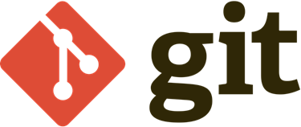
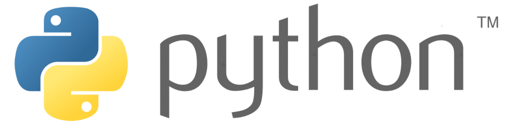
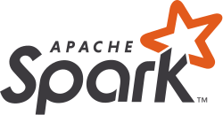

#

In this section you'll find beginner-friendly guides that will help you develop the skills you'll need for RAP.

## Git

Git is a version control tool that helps you keep track of changes to your code, and makes it possible for multiple people to collaborate on a coding project.

There is a learning curve, but once you get the hang of Git, you'll wonder how you ever lived without it!

<a href="git/introduction-to-git">Introduction to Git</a>

## Python

Python is a powerful and flexible programming language that's commonly used in the data world. You can use it for whole range of tasks that you'd otherwise need multiple software packages to do, including data querying/manipulation, statistical analysis, auto-populating Excel and Word reports, visualisation, and more.

<a href="python/intro-to-python">Introduction to Python</a>

## PySpark

Spark is an open-source analytics engine developed by Apache. It leverages the power of parallel computing - getting a cluster of machines to do your analysis, rather than a single server. This makes it an ideal choice when dealing with big data, as we often do in the NHS.

PySpark is an API for Spark which enables you to use Python code with Spark. If you have some SQL experience you should find it very comfortable to pick up as the commands are very similar.

<a href="pyspark">Introduction to PySpark</a>

## R

R is another open-source programming language that's commonly used when working with data. It's often considered the language of choice for complex statistical work, and it has a huge range of packages available for data manipulation and visualisation too.

<a href="R">Introduction to R</a>

## Coding Tips

In this section we'll compile some general advice and good practices that apply no matter what programming language you use. Start here:

<a href="coding_tips/when-to-stop-coding">When to stop coding</a>