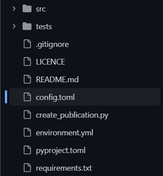
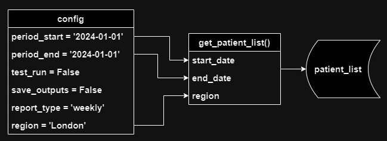
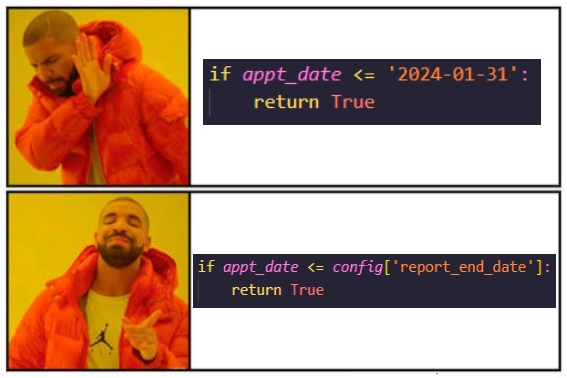

#

!!! tip "TLDR"

    - Using code to generate analytical output often involves changing settings and parameters
    - Best practice is to use a config file, acting as a centralised place to change these settings
    - Benefits include time-saving, error reduction, reusability, auditability, and reproducibility
    - We recommend using a config.toml file in the root folder of your project

??? success "Pre-requisites"
    |Pre-requisite |  Importance |  Note |
    |--------------|-----------|------------|
    |[Coding best practice](../../implementing_RAP/coding-best-practice.md)| Helpful |Some basic coding skills will help|
    |[Intro to Python](./intro-to-python.md)| Helpful |Some basic Python skills will help|




When you have some code that produces an analytical output, it's common to have some settings and parameters you can change.

For example:

* You change a date in your code to create a report for a different time period
* You produce different reports with the same pipeline (e.g., monthly and weekly reports), and depending on which report you're creating, you run different queries or functions
* You're doing machine learning and you have some parameters that you adjust and tweak
* You comment out some sections of code for a test run, but uncomment when running it “for real”.

What's the best way to deal with this?

Generally, you should avoid situations where you need to go into your files and modify your code to change parameters.

A better approach is to replace these values with variables, and define all of them in one place – a config file.

## Your control panel


Your config file is a bit like the control panel on a machine. To change how a machine works, you shouldn't have to open it up and fiddle with the circuits and machinery inside. You should be able to do all that from the control panel. 

Same goes for your code. If you need to change how your pipeline runs, you shouldn't need to edit your actual code to do that – you should be able to do this from the config.

This brings many advantages:

* **Saves time**: Having all your parameters in one place makes it quicker and easier to set them
* **Reduces risk of error**: It minimises the number of places that manual changes need to be made
* **Increases reusability**: Parameterised code is easier to re-use in other projects
* **Auditability**: You can export your config settings to a table or file, so you know how any particular set of results was obtained 
* **Reproducibility**: By saving your config settings, you make it easy to reproduce previous results

## How to implement a config file in your project

So that's the “What” and “Why” of config files - now let's move on to the “How”. Below we'll give a few steps you can follow to implement a config file in an existing Python project.

## 1) Identify your parameters


First, think about which parts of your pipeline you want to parameterise. Any bit of your code that you have to edit manually to get a particular set of data, is a candidate for parameterisation.

Don't worry about creating a full and perfect list right now. If you manage to catch 'em all, that's great, but you can always add more later if needed.

## 2) Create your config file


There are different formats you can use for your config file, but they all boil down to a list of key-value pairs. 
We recommend .toml files because:

* They allow comments
* The syntax is clean and easy to work with
* The syntax is similar (though not identical) to Python so it's an easier learning curve

But, there are other formats: XML, YAML, JSON, etc. They each have their advantages and disadvantages, but toml will do nicely for our purposes.
So, make yourself a `config.toml` file in the root folder of your pipeline.

## 3) Add your parameters to the config file

Add the parameters you identified in Step 1 to your config file, and give them appropriate and descriptive variable names. As noted above, the syntax is similar to python:

```py
report_type = 'monthly'
period_end_date = '2025-12-25'
max_records = 1000
```

You can see an example of a config.toml file in our [Example Pipeline config file](https://github.com/NHSDigital/RAP_example_pipeline_python/blob/main/config.toml)

## 4) Import your config parameters

Somewhere in your code, you need to import the parameters in your config file into a python dictionary. To do that, you can use the [toml library]( https://pypi.org/project/toml/).

The toml library does not come pre-packaged with Python, so you'll need to install it into your virtual environment, and add it to your requirements.txt file. If that last sentence was confusing, check out our guide on [virtual environments](../virtual-environments/why-use-virtual-environments/).

To import the toml library, just use the following in the file you want to load your config parameters into:

```py
import toml
```

Then you can load your parameters into a python dictionary like this:

```py
config = toml.load('config.toml')
```

You'll need to replace the `'config.toml'` bit with the path to your config file. This example assumes that the `config.toml` and the file you're putting this code into are in the same folder.

Usually you'd import your config into the entry point of your pipeline, which will probably be called `create_publication.py`, `pipeline.py`, `main.py`, or something similar. 

## 5) Pass the parameters where they are needed



Once you've done that, just pass your config parameters to whatever functions need them, for example:

```py
df_hes_data = reading_data.load_csv_into_spark_data_frame(
    spark, 
    config['path_to_downloaded_data']
)
```

If a function requires more than one parameter from the config, you can reduce the number of function parameters by just passing the whole config dictionary to the function. 

For example, instead of this:

```py
df_patients_by_region = get_patient_count(
	config['region'],
	config['start_date'],
	config['end_date'],
	config['report_type']
) 
```

You could do this:

```py
df_patients_by_region = get_patient_count(config)
```

## 6) Replace hard-coded values with the parameters in the config



OK, so you've created your config file, you've defined your parameters, you've imported them into your project, and you've passed them to the functions where they are needed.

The final step is to integrate these parameters into your code.

### Replacing hard-coded values

Replace any hard-coded parameter values that appear in your code with the equivalent variable from your config. So:

```py 
df_patient_data['in_sample'] = np.where(
    df_patient_data['ccg'].isin(['07L', '07M', '07N']).all(axis=1), 1, None
)
```

...becomes:

```py 
df_patient_data['in_sample'] = np.where(
    df_patient_data['ccg'].isin([config['region_list']).all(axis=1), 1, None
)
```

Now if you want to change the regions you're filtering by, you can just update the values in your config.toml file - you don't need to edit your code at all.

### Changing functionality

If you have different bits of code that you want to run/not run depending on your config settings, just wrap those bits into functions, and use an `if` statement to determine which function to run. For example:

```py
if config['report_type'] == 'weekly':
    df_report_data = get_weekly_data(config)
elif config['report_type'] == 'monthly':
    df_report_data = get_monthly_data(config)
```

As you were reading through this, did any ideas pop into your head about your own projects? Any values you keep having (or forgetting!) to change? Any bits of code you sometimes need to comment out? If so, you've got a prime candidate for using a config file! So give it a try - implement the above steps in your project and see what you think.

Good luck!


