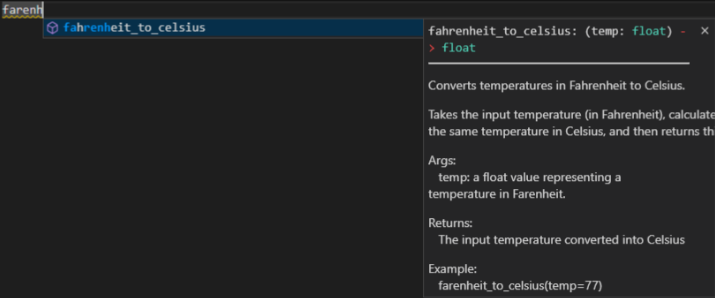

# Python functions

> We are currently updating our minimal Python RAP package template, which is freely available to use via Github: [RAP package template](https://github.com/NHSDigital/rap-package-template).

A function is a block of organised code that is reusable, and is used to perform a single defined action. Functions can take in multiple values (arguments) and can also return a value after executing. The code of the function only runs when it is called.

## Features of a function

In Python, the standard library provides many useful built-in function such as len(), print(), str(), int(), however the programmer can define their own function to suit their particular needs and requirements.

Python functions are defined by using the `def` keyword. Here is an example of a python function which converts the argument `temp` which is a value representing a temperature in Fahrenheit, into Celsius:

```python
    # Define the function
    def fahrenheit_to_celsius(temp):
        new_temp = (temp - 32) * (5/9)
        return new_temp

    # Use the function
    fahrenheit_to_celsius(77)
    >>> 25.0
```

It's also a common convention to return a Python expression directly, instead of assigning it to a variable. In previous example, we can re-write the same function to be more concise:

```python
    def fahrenheit_to_celsius(temp):
        return (temp - 32) * (5/9)
```

If you don't specify anything to be returned, your function will return None.

In this example we can see all the features of a function:

- The name of the function is `fahrenheit_to_celsius()` (you should use snake_case here)
- The function has one argument`temp`. Function arguments in python are listed between the parentheses after the function name. Additional function arguments are separated by commas.
- The code body calculates the value of the input Fahrenheit temperature in Celsius.
- The function returns the result of this calculation. This is done using the return keyword in python. When the program hits the return keyword it immediately returns the value specified after the keyword and exits the function. If the function doesn't return anything (which it does not need to) then the function is exited when all the code in the function body has been executed.
- When calling a function, you need to supply argument inputs for all parameters, otherwise, the Python interpreter will raise a TypeError. Remember to supply the arguments in the same order that the parameters are appeared so that it can be assigned correctly.

## Why use functions?

There are several benefits to using functions, we will discuss the following here:

- They cut down on repetitive code by allowing you to call previously written blocks of code.
- They allow you to break down a process into steps making code more readable.
- The use of variable arguments allows functions to adapt better to changing needs.
- They make testing easier.
- They provide additional means of documentation.

### Re-usability

Functions allow us to cut down on code repetition, which makes code harder to read and understand. In general, if you need to write the same code pattern more than twice then you should put some time into writing a function for later usage. When you need to change part of this code chunks, it will be more convenience to do it once inside a function instead of changing many places in your code base.

For example, we take the following function to implement bubble sort. A sorting algorithm aims to take in an array of numbers and sort them in increasing order. The bubble sort compares each pair of adjacent elements in the input array and swaps them if they are not in the right order.

```python
    def bubblesort(arr):
        n = len(arr)
        for i in range(n-1):
            for j in range(0, n-i-1):
                if arr[j] > arr[j + 1] :
                    arr[j], arr[j + 1] = arr[j + 1], arr[j]
```

If we had three arrays we wanted to sort (arr1, arr2, arr3) and we didn't use a function we would have to repeat our code three times. This produces messy code that is hard to read. Can you spot the errors in the code below?

```python
    # Sort array 1
    n = len(arr1)
    for i in range(n-1):
        for j in range(0, n-i-1):
            if arr1[j] > arr1[j + 1] :
                arr1[j], arr1[j + 1] = arr1[j + 1], arr1[j]
    # Sort array 2
    n = len(arr2)
    for i in range(m-1):
        for j in range(0, n-i-1):
            if arr2[j] > arr2[j + 1] :
                arr2[i], arr2[j + 1] = arr2[j + 1], arr2[j]
    # Sort array 3
    n = len(arr3)
    for j in range(n-1):
        for i in range(0, n-i-1):
            if arr3[j] > arr3[j + 1] :
                arr3[j], arr3[j + 1] = arr3[j + 1], arr3[i]
```

Writing repetitive non-functional code is bad practice. Copy pasting processes like this and changing variable names can result in mistakes and will make a project excessively verbose. By using the defined function before, all of these issues are fixed with no functionality lost:

```python
    # Sort array 1
    bubblesort(arr=arr1)
    # Sort array 2
    bubblesort(arr=arr2)
    # Sort array 3
    bubblesort(arr=arr3)
```

Re-usability is not the only benefit of functions, and just because a process is only done once does not mean that it should not be placed inside the body of a function instead.

In the SQL code for computing "Cholesterol Numerator", the code chunk below was repeated multiple times. When transforming to RAP, we define a PySpark function once and reuse the code many times.

```sql
    CASU_DIABETES.[dbo].[fnc_suppression_rm](SUM(CASE
        WHEN CHOLESTEROL_CP = 1 AND AGE >=12 THEN 1
        ELSE 0 END), 'count') AS [Cholesterol Numerator]
```

transform to:

```python
cholesterol_numerator = (
    F.when((F.col('AGE') >= 12) & (F.col('CHOL_DATE_FLAG') == 1), 1).otherwise(0)
)
```

### Breaking down a process into logical steps

Using functions can better elucidate the steps of a process. A long process typically has several logical steps to it each of which can be delivered by a block of code. If we attempt to write out all the steps of the process in a long sequence of code this will be very difficult to read, and identifying the separate steps of the process is difficult. Below is an example from the diabetes RAP that uses functions, functions aren't being used here to cut down on code re-use but rather to make the steps of the delivered process more clear:

```python
    # Step 3: Identify the best record for each person
    best_record = identify_best_record(record_scores=record_scores)
    # Step 4: Use the best record to cut down the record_scores table, creating the golden record
    golden_record = create_golden_record_table(record_scores=record_scores,
                                                best_record=best_record)
    # Step 5: Derive additional fields for the golden record table
    enriched_golden_record = enrich_golden_record(golden_record=golden_record,
                                        hes_diabetes=hes_diabetes,
                                        imd_scores=imd_scores)
    # Step 6: Output the golden record table to SQL so we can avoid recalculating next time
    write_df_to_SQL(df_to_write = enriched_golden_record,
                    target_table = golden_record_sql,
                    mode = 'overwrite',
                    database = params['work_db'])
    # Step 7: after attain the golden_record (either by saved table or generate new one), we build final table
    final_table = produce_aggregates(golden_record)
```

It is important to note that overuse of functions like this can be a bad thing. Breaking down a process into too many functions will make code harder to read. An extreme example can demonstrate this:

```python
    def sort_each_element(arr, n):
        for i in range(n-1):
            do_swaps(arr=arr, i=i, n=n)

    def do_swaps(arr, i, n):
        for j in range(0, n-i-1):
            if arr[j] > arr[j + 1]:
                swap(arr=arr, j=j)

    def swap(arr, j):
        arr[j], arr[j + 1] = arr[j + 1], arr[j]

    def bubblesort(arr):
        n = len(arr)
        sort_each_element(arr, n)
```

This code delivers a function bubblesort which has the same functionality as the previous bubblesort example. The difference is that in this example the logical steps of a bubble sort have been broken down into far too many functions, and instead of having a positive effect the code is now harder to read as each function needs to be understood.

### Arguments

Another benefit is that using functions allows us to adapt to new changes through the use of arguments. For example lets say in our initial bubble sort example it was decided that calling the arrays `arr1`, `arr2`, and `arr3` was not descriptive enough. The lead on the project decides that instead these arrays should be renamed to `array1`, `array2`, and `array3`. Without using a function we would have to change every occurrence of these variables in our long messy code:

```python
# Sort array 1
n = len(array1)
for i in range(n-1):
    for j in range(0, n-i-1):
        if array1[j] > array1[j + 1] :
            array1[j], array1[j + 1] = array1[j + 1], array1[j]
# Sort array 2
n = len(array2)
for i in range(n-1):
    for j in range(0, n-i-1):
        if array2[j] > array2[j + 1] :
            array2[j], array2[j + 1] = array2[j + 1], array2[j]
# Sort array 3
n = len(array3)
for i in range(n-1):
    for j in range(0, n-i-1):
        if array3[j] > array3[j + 1] :
            array3[j], array3[j + 1] = array3[j + 1], array3[j]
```

This is bad practice. It is time consuming and could also result in mistakes. If instead we used a defined function we would only have to change the name of the variable passed as an argument:

```python
# Sort array 1
bubblesort(arr=array1)
# Sort array 2
bubblesort(arr=array2)
# Sort array 3
bubblesort(arr=array3)
```

Another example could be seen in the diabetes RAP. Lets say that in step 5 we instead want to use some `new_hes_diabetes` data, we can simply update that one argument without having to rewrite the whole logical step of the process:

```python
# OLD Step 5: Derive additional fields for the golden record table
golden_record = enrich_golden_record(golden_record=golden_record,
                                    hes_diabetes=hes_diabetes,
                                    imd_scores=imd_scores)

# NEW Step 5: Derive additional fields for the golden record table
golden_record = enrich_golden_record(golden_record=golden_record,
                                    # change:
                                    hes_diabetes=new_hes_diabetes,
                                    imd_scores=imd_scores)
```

So another benefit of functions is that it makes code more maintainable and future-proofed. Without using functions a change in project requirements could mean changing hundreds of lines of code. However, if we use functions and setup our arguments correctly we can simply change what is passed to the functions in the process.

### Testing

Another benefit of using functions is that they aid in testing the project. Functions typically deliver a small unit of functionality that the program needs, for example the program might need to be able to convert Fahrenheit to Celsius. By putting this in a function we can test that function with different input values to see if it produces an expected output. If the function succeeds then we know the program has that unit of functionality; this is called unit testing.

### Documentation

By breaking down processing steps into functions we can individually document each of these functions, whereas if we instead had a long sequence of code the best documentation that is possible are simple code comments throughout. The next section goes into detail on documenting functions and the benefits of doing so.

Python docstrings make it possible to document your defined python functions, and describe their functionality. Here is an example of a well-documented python function:

```python
def fahrenheit_to_celsius(temp: float) -> float:
   """
   Converts temperatures in Fahrenheit to Celsius.

   Takes the input temperature (in Fahrenheit), calculates the value of
   the same temperature in Celsius, and then returns this value.

   Args:
      temp: a float value representing a temperature in Fahrenheit.

   Returns:
      The input temperature converted into Celsius

   Example:
      fahrenheit_to_celsius(temp=77)
      >>> 25.0
   """
   new_temp = (temp - 32) * (5/9)
   return new_temp
```

The docstring occurs underneath the initial definition of the function. The docstring occurs between a set of two triple quotation marks (`"""`). The first thing that occurs in the docstring should be a description of what the function does when invoked, it may also contain additional documentation/notes about the design of the function, considerations that had to be made, use case of the function etc. Try and describe the function in one short line (80 characters), any other details about the function description should be written after a blank line.

After the general goal of the function has been described, a section should be given to describe what each of the input arguments are, what the return value is (if there is one), and also an example use-case of the calling the function. There are several styles for docstrings, the example above uses the Google style.

There are several key benefits to this kind of documentation that make it worthwhile:
It allows you to return to code that you have written previously and be quickly reminded what the function does.
It makes it easy for team members to understand the purpose of the function. While they can read through the code to understand the logical steps, the docstring can provide additional context and considerations.
It makes it easy for new team members to come on board. Reading through many lines of code can be exhausting, reading docstrings very quickly conveys the intended functionality that the function delivers.
When using an IDE with coding hints team members can quickly see a description of what the function does, which saves them from having to read through all the code of the function in order to understand what it delivers. Example:


There are also some additional kinds of documentation that can be done on functions which will not be discussed here, such as type hints and annotations.

Once you have multiple function in your project, you will need to organise them. This can be done by creating their own module so that the functions can be imported into other part of your code. You can also generate methods for classes, these topics are beyond the scope of this wiki for now but it is worth to learn more when you are getting used to Python language.

## Coding challenge

Here are some questions to help you practice writing functions.

### Challenge 1. Multiplier

We are designing a function which returns the result of multiplying 5 by 5.

1.  What is the missing keyword below to define a function:
    ```python
    ... multiply():
    ```
2.  In the code body we need to calculate the value of our calculation. Can you fill in the calculation:
    ```python
    def multiply():
        value = ...
    ```
3.  Currently our function only calculates this value, but we have no way of obtaining the result, fill out the last line of the function body so if we call the function we can get the result:
    ```python
    def multiply():
        value = 5 * 5
        ...
    ```
    Our function only serves a very simply basic purpose. It would be better if our function could return the result of the multiplication of any two values.
4.  Fill in the gaps so our function now uses arguments:
    ```python
    def multiply(..., ...):
        value = a * b
        return value
    ```
    Our function now serves its purpose, but we may want to document it so in future other programmers can understand it.
5.  Add in a docstring with a single line describing the function:
    ```python
    def multiply(a, b):
        ...
        value = a * b
        return value
    ```
6.  Expand on the docstring by describing its parameters:
    ```python
    def multiply(a, b):
        """
        Multiplies two values.
        ...
        """
        value = a * b
        return value
    ```
7.  Expand on the docstring by describing the return value:
    ```python
    def multiply(a, b):
        """
        Multiplies two values.
        Args:
            a: first value in the calculation.
            b: second value in the calculation
        ...
        """
        value = a * b
        return value
    ```
8.  Expand on the docstring by giving an example use of calling the function:
    ```python
    def multiply(a, b):
        """
        Multiplies two values.
        Args:
            a: first value in the calculation.
            b: second value in the calculation
        Returns:
            The result of multiplying a by b
        ...
        """
        value = a * b
        return value
    ```

### Challenge 2. Interest Calculator

The following function returns the amount of money you have after 10 years with 5% interest applied once a year with an initial amount of £1000:

```python
def interest():
    return math.pow(1000 * (1 + (0.005/1)), 10)
```

We can change the number of times the interest applied each year to be an argument in the function called n:

```python
def interest(n):
    return math.pow(1000 * (1 + (0.005/n)), 10)
```

1. Adapt the function by filling in the gaps to allow the interest rate (r) to be changed:
   ```python
   def interest(n, ...):
       return math.pow(1000 * (1 + (.../n)), 10)
   ```
2. Adapt the function to allow the years (t) to be changed:
   ```python
   def interest(n, ...):
       return math.pow(1000 * (1 + (0.005/n)), ...)
   ```
3. Adapt the function to allow the initial amount of money (p) to be changed:
   ```python
   def interest(n, ...):
       return math.pow(... * (1 + (0.005/n)), 10)
   ```
4. Combine all these steps the define a function which calculates interest:
   ```python
   def interest(n, ...):
       return math.pow(...)
   ```

## External links

This wiki page is focused on the use cases for functions rather than a general guide on writing python functions. For more general information on writing functions in python see the following:

- [General guide which also discusses recursion](https://www.w3schools.com/python/python_functions.asp)
- [General guide which also discusses scope](https://www.programiz.com/python-programming/function)
