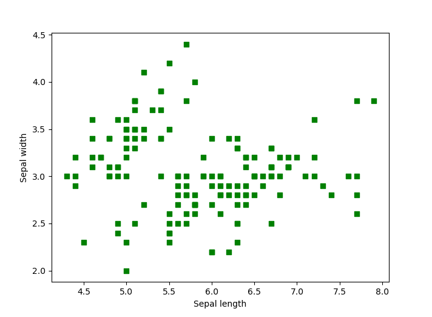
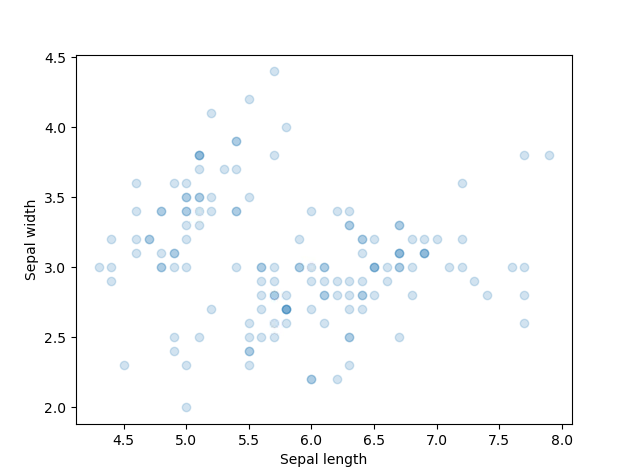
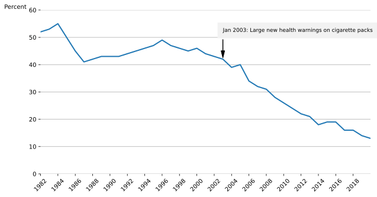
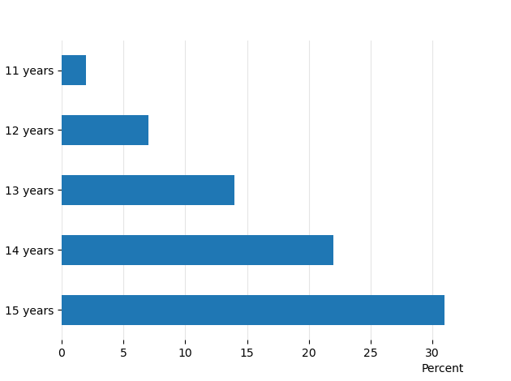

# Visualisations in Python

Creating visualisations can require a lot of effort.

See Matplotlib Examples Gallery:

- [Matplotlib Examples gallery](https://matplotlib.org/stable/gallery/index.html)

There are many python packages that provide different features in order to create all kinds of plots. We will present one of the most commonly used packages in this guide: Matplotlib.

## Basic plots

Using Matplotlib you can plot all kinds of charts such as histograms, barplots, scatterplots, pie charts etc. For example, if we import the matplotlib module:

```
from matplotlib import pyplot as plt

plt.plot(df['My value 1'], df['My value 2']) # this will produce a basic line chart for two selected columns from dataframe df
plt.show() # this command is required to display the plot
```

Using the famous iris dataset we can produce a scatter plot of the sepal length and the sepal width: We load the Seaborn package to import the iris dataset:

```
from matplotlib import pyplot as plt
import seaborn as sns

# View a list of pre-loaded Seaborn datasets
for dataset in sns.get_dataset_names():
    print(dataset)

df = sns.load_dataset("iris") # we import iris data
print(df.head(3)) # view first 3 rows of the data

# Create a scatter plot
plt.scatter(df['sepal_length'], df['sepal_width'], color='green', marker='s')
plt.xlabel('Sepal length') # x axis title/label
plt.ylabel('Sepal width') # y axis title/label
plt.show()
```



Notice how we set the colour of the data points (color parameter) and the shape (marker parameter = square). To edit the transparency degree (alpha parameter) of the points:

```
# Edit data points transparency with the parameter alpha
plt.scatter(df['sepal_length'], df['sepal_width'], alpha=0.2)
plt.xlabel('Sepal length')
plt.ylabel('Sepal width')
plt.show()
```



## Applications

Using the [Smoking, Drinking and Drug Use among Young People in England 2018 [NS]](https://digital.nhs.uk/data-and-information/publications/statistical/smoking-drinking-and-drug-use-among-young-people-in-england/2018/part-1-smoking-prevalence-and-consumption) plots displayed on the webpage, we attempt to recreate them using Matplotlib. To create the first plot (line chart):

### Plot 1 - Pupils who have ever smoked, by year [Line chart]

```
import pandas as pd
import numpy as np
from matplotlib import pyplot as plt
import seaborn as sns

path_1 = "python\data\csv_v1.csv" # load the dummy data csv we created
df1 = pd.read_csv(path_1) # Create a Pandas dataframe
```

After loading our Python packages and dummy data we can start working on producing the first plot:

```
# Create a line chart (Plot 1)
plt.figure(figsize=(10, 5)) # set the figure size
plt.plot(df1['Year'], df1['Percent'], label="Sepal", linewidth=2, linestyle='-') # create the plot

# Define labels and ticks
plt.ylabel("Percent", loc='top', rotation="horizontal") # y label title and location
plt.xticks(np.arange(1982, 2020, step=2)) # x axis ticks range
plt.yticks(np.arange(0, 70, step=10)) # y axis ticks range
plt.grid(axis='y') # opting for y axis gridlines

# Create annotations (done here for one annotation to avoid redundancy)
plt.annotate('Jan 2003: Large new health warnings on cigarette packs', xy=(2003, 42), xytext=(2003, 52), size=9,
                                                                        bbox=dict(boxstyle="square", fc='0.95', pad=1, ec="none"),
                                                                        arrowprops=dict(facecolor='black', shrink=0.05, width=0.5, headwidth=6))
plt.box(False) # remove outer borders
plt.savefig('SDD_YP_England_2018_plot1.pdf', bbox_inches='tight') # save plot as .pdf file
plt.savefig('SDD_YP_England_2018_plot1.png', bbox_inches='tight') # save as .png
plt.savefig('SDD_YP_England_2018_plot1.svg', bbox_inches='tight') # save as .svg
```

Notice how `plt.show()` which displays the plot is not included in this code as it's not necessary as we are saving our plots with the `plt.savefig()` function. The three plots will be saved in the local folder your code is also stored or in a folder of your choice. Presenting the .svg image:



The advantages of a .svg file compared to using a .png file is better outlined through reading [Benefits of using SVG (scalable vector graphics)](https://blog.tbhcreative.com/2017/06/benefits-of-using-svg.html#:~:text=Scalability,size%20they%20are%20being%20at.&text=The%20SVG%20image%20is%20clear,version%20starts%20to%20appear%20pixelated.).

### Plot 3 - Pupils who have ever smoked, by age [Horizontal bar chart]

Similarly, to create the third plot (horizontal bar chart) on the publication webpage:

```
# Create the Pandas dataframe
percent_y = [2, 7, 14, 22, 31]
index = ['11 years', '12 years', '13 years', '14 years', '15 years']
df = pd.DataFrame({'Percent': percent_y}, index = index)

# Plot the horizontal bar chart
ax = df.plot.barh() # plot the chart
ax.invert_yaxis() # invert the y axis
plt.xlabel("Percent", loc='right', rotation="horizontal") # place the x label
ax.get_legend().remove() # remove the unnecessary legend
ax.set_axisbelow(True)
ax.grid(color='gray', which='major', axis='x', linestyle='-', alpha=0.2) # last 2 commands create and style the x axis gridlines
plt.box(False) # remove plot borders
plt.show()
```

In this case we opted to display the chart, if you wish to save it then `plt.savefig()` function should be added at the end of the code.



## Further reading

- [An Intuitive Guide to Data Visualisation in Python](https://www.analyticsvidhya.com/blog/2021/02/an-intuitive-guide-to-visualization-in-python/)
- [Top 6 Python Libraries for Visualisation](https://towardsdatascience.com/top-6-python-libraries-for-visualization-which-one-to-use-fe43381cd658)
- [Matplotlib Examples gallery](https://matplotlib.org/stable/gallery/index.html)
- [Matplotlib functions summary](https://matplotlib.org/stable/api/pyplot_summary.html)
