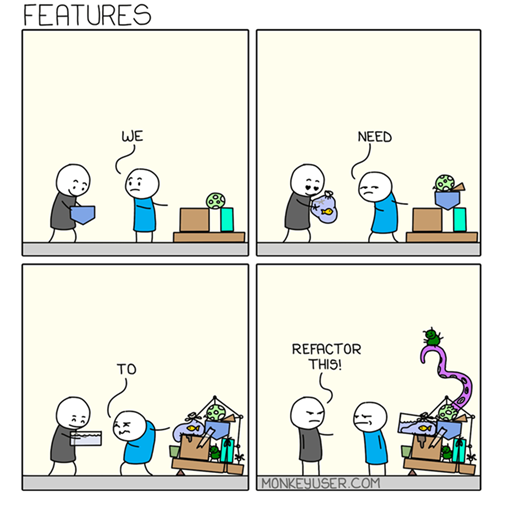

#

Note: this is temporarily sitting here until we decide on its future home

!!! tip "TLDR"

    - Refactoring means improving your code without changing what it does.
    - Your aim is to make the code more readable, more maintainable, more reusable, and more efficient.
    - If you don't refactor your code, it can become increasingly more difficult and time-consuming to maintain over time.
    - In this article you will learn golden rules on what good code looks like, and examples of "code smells" which indicate when code might need refactoring.

??? success "Pre-requisites"

    |Pre-requisite | Importance | Note |
    |--------------|------------|------|
    |[Coding Best Practice][coding-best-practice]| Helpful |Some basic coding skills will help|

Refactoring is the art of rewriting your code in a way that improves it, without changing what it does.

In RAP terms, that means improving our code without changing the output of the pipeline.

## Why refactor?

Why would you bother re-writing existing code? If it works, it works, right? 

In the coding world, getting something to work is often considered just the first step in the development process. Then we make it better, and faster. Here’s why:

* **Readability**: we spend more time reading code than writing it, so make it easy to read
* **Easier to modify and test**: well written, modular code is easier to modify and easier to write tests for, saving time in future development efforts
* **Quicker on-boarding**: when code it well-written, new team members will get up to speed more quickly
* **Improve performance**: finding ways to make our code run faster and use less computing resource (e.g., memory, disk space)
* **Save the NHS money**: cloud computing is charged on a pay-as-you-go basis – efficient code is cheaper
* **Switch platforms**: in RAP we aim to move from proprietary platforms to open-source tools



Image source: [Monkey User](https://www.monkeyuser.com/2020/features/)

## Refactoring Golden Rules

Whole books have been written on refactoring, so we can’t cover everything here. However, here are some refactoring “golden rules” that should serve you well.

Some of these are python specific, but most are universal no matter what language you’re using.

### Filter and select early

When you read data from CSV files or database tables, be sure to take only the rows and columns that you need. Superfluous rows and columns will slow down your processing.

### Don’t Repeat Yourself (DRY)

If you have the same code pattern repeated in multiple places, extract it into a function. Then simply call the function in the places where the repeated code used to be.

This way, if you need to change this bit of code, you only need to change it in one place.

### Modularise your code

Going further, even parts of your code that are only used once can be wrapped into functions! This has several advantages:

* It is easier to test
* It helps you organise your code, as related functions can be grouped into files or moved into classes
* You can reuse your code in other projects more easily

### Avoid long files

Once you've got your code into functions and grouped into files, check that they are not too long. 

How long is "too long", is a bit subjective. Pylint recommend 1000 lines, which is OK as a starting point but sometimes you won't be able to avoid going longer, and that's OK.

But when your files start to reach this length, see if the content might be better organised if it were broken into separate files.

### Improve your functions

Functions should:

* **Do one thing** aka have a “single responsibility”
* **Be small**
    * Small functions are easier to test and maintain. 
* **Have as few parameters as possible**
    * Functions with lots of parameters are harder to understand and exponentially harder to test.

If your functions don’t meet these criteria, see if you can split them up.

To help others understand your functions, you should also:

* **Add docstrings**
* **Add type hints**

### Use loose coupling where possible

Tight coupling means that different components depend on each other, such that a change in one will often mean you need to make a change somewhere else. This can make it slower and more difficult to make changes to your code, and makes your code less reusable.

Loose coupling means that the different functions, modules, and components can work essentially independently of each other.

For example, say you have two functions.

- `get_patient_data()` gets patient data from a database and stores it in a dataframe.
- `rename_patient_data()` takes that dataframe, renames some columns, and returns it.

These functions are tightly coupled because `rename_patient_data()` will only work on the dataframe created by `get_patient_data()`.

But imagine you had another function called `rename_df_columns()`, which takes a dataframe and a dictionary mapping old to new column names. 

This is more flexible - you could use this on any dataframe, not just your patient data one. You could use it in other projects, and other teams could use it in their projects! That's loose coupling.

Of course in the real world, sometimes things do have to be tightly coupled. That's OK! Just decouple where you can.


### Organise your code

In an analytical pipeline, you’ll typically have an entry point file to run the pipeline, e.g., create_publication.py. Store all your functions in separate files, and organise similar functions into in the same folders/files/classes.

We find that four folders will cover most bases:

  - data_in
  - data_processing
  - data_out
  - utils

There's no need to start from scratch either - we have a [Package Template](https://github.com/NHSDigital/rap-package-template) you can use that follows this structure.

### Improve your variable and function names 

Variable names should indicate what the variable is. Function names should indicate what the function does. A good rule of thumb is to start variable names with nouns and function names with verbs.

| Not so good | Better |
| -------- | ------- |
| `df1` | `df_gp_code` |
| `df2` | `df_patient_data` |
| `df3` | `df_patient_data_with_gp_code` |
| `value` | `prescription_value` |
| `import()` | `import_csv_to_df()` |
| `month_list()` | `get_month_list()` |


Look up the general naming conventions within the language you're using. For example in python, it's conventional to use:

- `snake_case` rather than `camelCase` for functions and variables
- Capitalised class names, e.g. `class DatabaseConnection()`
- `ALL_CAPS` for global variables and constants

### Keep variables in their own scope

Define variables within the scope that they will be used (e.g., in the relevant function, class, or module).
If there are global variables needed throughout the code, group them into a config/params dictionary so you know where they are defined.

### Minimise nesting

Code with multiple nested levels is hard to read. Try using guard clauses in functions, which will return early if a given condition is met. For example the below function:

```py
def can_drink_alcohol(age, country):

    if age is not None:
        if age < 18:
            can_drink = False
        elif age < 21:
            if country == "United States":
                can_drink = False
            elif country == "United Kingdom":
                can_drink = True
        else:
            can_drink = True
    else:
        can_drink = False

    return can_drink
```

...could become...

```py
def can_drink_alcohol(age, country):

    if age == None:
        return False
    
    if age < 18:
        return False

    if age < 21 and country == "United States":
        return False
    
    return True
```

### Extract complex expressions into variables

If you have a complex expression (perhaps a complex join clause), extract it into a variable with a descriptive name explaining what it does.

### Use a linter

A linter is a tool that will scan your code for errors and give you formatting suggestions. Linters give you a quick and easy way to ensure consistent formatting across your project, and some can even reformat all your files for you automatically!

If you're using an editor like VS Code you'll be able to install linters as extensions, but you can also install and run them via the command line.  

Popular linters include [black](https://github.com/psf/black) and [pylint](https://pylint.readthedocs.io/en/stable/) for Python and [lintr](https://lintr.r-lib.org/) for R.

### Code smells

A "code smell" is an indication that something is "off" in your code. It's a surface indication of what may be a deeper problem, especially if not resolved.

If you don't fix issues with your code early, then when you add more code to your project you'll be building on a poor foundation. A bad code smell can soon become rotten!

Here are a few examples of code smells, and which of the refactoring rules you can employ to fix them:

- Seeing the same sorts of code / patterns multiple times (wrap into functions)
- Long functions with multiple arguments (break into multiple functions)
- Very long python files (break into multiple files)
- Constantly passing a lot of stuff between functions (might mean you need a class)
- Difficult to know where the code "starts" (you need a clear "main" file - entrypoint)
- I've got no idea what this function does (add doc strings)
- I've got no idea what this variable holds (improve naming conventions)
- The number of `if` statements in this function is giving me a headache (reduce nesting)

## Your turn

Thinking about your pipelines, did any of the above rules jump out to you as something you could implement? If so, why not try refactoring your code and putting these into practice?

If you have any other refactoring golden rules that we haven't covered here, do get in touch and let us know!

[coding-best-practice]:../implementing_RAP/coding-best-practice.md
