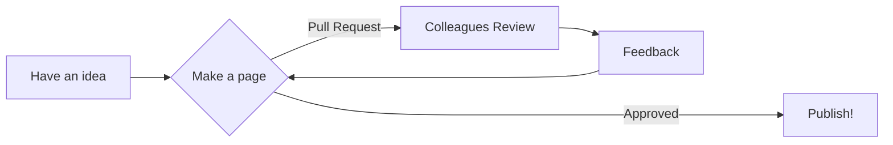

#

## Some introductory subtitle

!!! tip "TLDR"
    - **very brief** summary of the main findings
    - any key links i.e. to forms or other things people need fill in
    - try to keep it to just three

??? question "Why should we care?"
    - Brief summary of why this is important
    - any key links of background
    - We can have a bigger section on this below

??? success "Pre-requisites"
    * Some information on what someone might need to be familiar with before they can use this page

    |Pre-requisite | Importance | Note |
    |--------------|------------|------|
    |[Some link to some other guide we have](https://nhsdigital.github.io/rap-community-of-practice/)|Necessary/Helpful|Any comment we have on this|
    |some other guide|Helpful|another note|

!!! info inline end
    XKCD comics can also be great at grabbing attention:

    

**Don't forget to update the `mkdocs.yml` file to add this page, so it appears in the nav bar!**

Here we need some bit explaining the background of the thing the page is talking about

- keep it brief
- make it clear what it is and what the benefit is
- don't go into details of the methods, but perhaps highlight some of the key approaches described below

## First subtitle of the main content

Talk about the issue  break it down into steps.

We might even include a little diagram:



Consider linking to other pages and try and extract the general concept from language specific implementations, i.e. we could have a pager about "functions", and then link to specific pages on how to do functions in Python and R.

Also, have a look on the following pages to see if they have guidance we could link to, or adapt
- [Quality Assurance of Code for Analytics](https://best-practice-and-impact.github.io/qa-of-code-guidance/intro.html)
- [Turing Way](https://the-turing-way.netlify.app/welcome.html)
- [Central RAP Guidance from GSS](https://analysisfunction.civilservice.gov.uk/support/reproducible-analytical-pipelines/)

## General subsection template

Write some content here

### General subsubsection template

This might be on some specific aspect of the subsection

#### General subsubsubsection template

We might need to get even more specific, but probably wont use this as much!

## Further subtitles

You can include code snippets `inline` or in blocks:

```Python
    print("hello world")
```

You might also want to hide large code snippets:

??? example "Some big code snippet"
    ```Python
    print("HA, I lied, it's only a small code snippet")
    ```

!!! note
    Admonition blocks can be helpful to bring out key points

    See [mkdocs guidance]()

## Further subsections

Continue to work through the subject, but we don't have to make the pages long -  a short page can be just as useful!

You can include pictures, however referencing them requires a few steps back in the directory tree (see below):


You can also have tabs:

=== "Tab 1"
    We can put whatever we want in here
    ```Python
        def somefunc(a):
            return None
    ```

=== "Tab 2"
    And in here something completely different, such as a diagram
    

## Further Reading

- Provide any useful links people might need to further their learning
