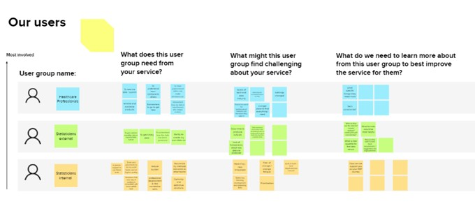
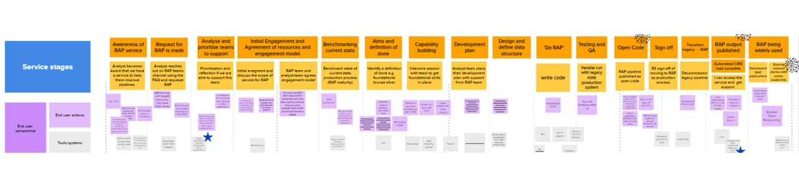

# Designing a RAP service

As the roll-out of RAP has progressed in NHSD, we have come to recognise that we are offering a service. This is quite a change in direction for a team that previously was focussed on development. We've had to quickly reframe our approach to rolling out RAP in NHSD to reflect this change. 

The RAP service aims to support teams in adopting RAP practices through setting standards, providing resusable training and code, and through directly supporting teams as they progress along the RAP journey. 

This page discusses some of the tools and considerations we have used in trying to establish this new service. It has two main sections: service design and user research.

## Why treat RAP as a service?
Many of the technical challenges around RAP are now largely solved. Version control, automated testing, peer review are all practices that are well understood and well documented. Nevertheless, adoption of these RAP practices across the public sector has been very slow. 

[Barriers to RAP adoption](https://osr.statisticsauthority.gov.uk/publication/reproducible-analytical-pipelines-overcoming-barriers-to-adoption/) are therefore likely to be caused by challenges and constraints faced by analytical teams themselves. It is vital for us to understand and address these barriers in order to achieve the RAP team's goal of supporting adoption of RAP practices.

If we want to advance RAP across a large, resource-constrained organisation then we need a systematic way to tackle these barriers. The RAP service allows us to support teams to adopt RAP while also helping to prevent our work from being derailed by shifting scope or unrealistic expectations.

# Service design
The government digital service has really nice [guidance](https://www.gov.uk/service-manual/service-standard) on how to design and establish a service.

To start formalising the RAP service, we ran a series of guided workshops where we tackled these questions in sequence:

- What problem do we think our service is trying to solve?
- Who would be the users of the service?
- What are the needs of different users?

*A screenshot from the board where we tried to identify user needs. I've deliberately not made these images high-resolution enough to see the detail*

Once we reached a consensus on these users and their needs, we sketched out a service map for how the RAP team could meet the needs of these users. This service map runs from the first time users hear about our service all the way through to the point that we disengage from them. 

*A screenshot from the board where we mapped out the service map including user experiences, pain-points, and our processes. I've deliberately not made these images high-resolution enough to see the detail*

At each stage in the journey, we set out the questions and feelings that the users might experience and we considered what tools or processes we might put in place to improve their experience. 

At the outset this was only a map - a proposed state of what we wanted to reach as a team. There was too much to implement all at once so we prioritised which elements of the service map were most important to tackle first. 

Critically, we do not treat the service map as a static artefact. After each engagement we conduct user research to identify which elements of the journey should be prioritised for improvement next. This iterative approach allows us to meet the immediate demand while also making progress towards our intended destination. The section below talks in more depth about the user research. 

 

# User research

The goal of our user research is to understand our users' challenges and needs. This discussion guide is intended to support that goal by enabling conversations engage with your participant and their interaction with the service.

We have shared our template for user research below. The discussion guide is only a guide and conversations will often take their own course. More - the discussion guide should be adapted and improved to suit your own purposes. 

We usually have two people from the RAP team join the call. One person to lead the discussion and another to take notes. We also record the sessions so we can review it later as a team.

Once we have gathered this user research, we review it as a team and revisit our service design map above. We think about the whole service journey in light of the findings and we consider what we need to improve for our next iteration. 

### User research guides iterative improvements to the service

So far, we have been able to make very substantial improvements after every single engagement. It feels very important that we continue to give ourselves the time and space to effectively concentrate on service improvement between engagements.

We've included the discussion guide used for the user research sessions below. 

### Are users of the RAP service the NHSD teams producing the publications or the end-users of the publications? 

This is a really tricky question that we've grappled with extensively. Where we've landed is that we are focussing on users of the RAP service - internal analysts. This decision is partly pragmatic - since we work with internal analysts everyday and can just ask them. Partly it reflects how NHSD is organised. We are part of an internal analytics function so other people have responsibility for the external user research. 

Nevertheless, the lack of user research is a failing of our approach currently. It would be extremely helpful to get more external user research as it motivates so much of the RAP work. The Department for Education led a very strong example of using research from the end users to motivate RAP adoption and drive development of their [Explore Education Statistics tool](https://explore-education-statistics.service.gov.uk/)

---

 

 

## Discussion guide (40 min)

Day: 		

Time:

Interviewer: 	

Note-taker: 	

Interviewee: 	

### INTRODUCTION 
(2 minutes)

Give some details about the purpose of the conversation and make sure your participant is comfortable with the set up, this will mainly be you talking at this stage. For example:
- Explain the purpose of the session: we want their input on how to improve the RAP service
- Let the participants know who is taking notes and who is leading the interview
- Let the participants know you are recording the session (if applicable) and make sure they consent

### Warm-up questions 
(5 minutes)

Some straightforward questions to put the participant (and you) at ease and to make the conversation seem more natural; this section will establish the level of engagement your user has had with your service. For example:
- How long have you been in your role?
- Describe your role within the wider team/tribe?

### Questions about the RAP function 
(30 minutes)

The main body of the conversation, where you will learn about your user’s experience of working with your service, their needs, their pain points and where things work well.
 

- **How did you first hear about RAP?** 
    
    - Do you think this is something that we need to improve?
    - What could we do to make it easier for people to find out?

 

- **At the start of the project, did you have a clear understanding of what would happen during the engagement with the RAP team?** 

    - What would help to give people a better understanding of the process in future?

 

- **During the engagement, we used a mix of different training approaches: off-the-shelf interactive coding, videos and guides on the community of practice, in-person teaching sessions, and pair-coding. Could you tell me about how you made use of these and which was the most valuable for you?** 
    
    - Was there anything that prevented you from making best use of these support options?
    - Do you think the training would work better all delivered at the start of the engagement or staggered throughout the project?
    - What could we do in future to improve this offering even futher?

 

- **Different teams choose different engagement models, with more or less support provided by the RAP team on technical design and working practices. Which model did you use in your recent engagement and how well did it work for you?**
    
    - If the RAP team were leading, did you feel like you retained ownership of the code or did you feel like the RAP team did it for you?
    - If the analyst team was leading, did you feel like you would have benefitted from more support on technical design decisions?
    - Do you think you would benefit from more support around ways of working with code, e.g. identifying features sized appropriately for a short-lived branch? Or do you think it works better for the team to figure this out internally?

### Wrap up 
(3 minutes)

Thank your participant for sharing their experience, knowledge, and time with you, making sure they are comfortable with what they have told you and that they can follow up with you at any time. Ask them if they are able to ask further questions by email, if there is anything you might have missed. If applicable, offer your participant the opportunity to be involved in later stages of the user-design process (e.g. prototyping).

----
**Note-taking tips**

It is important to make a record of the conversation that takes place. 

You should use a document that has plenty of space to take note of both the questions asked and the responses from your participant. 

You should try to record the exact words that your participant uses and try not to paraphrase or infer meaning into what they have said. 

It is important for the richness and value of your research that you take note of direct quotes from your participant.

